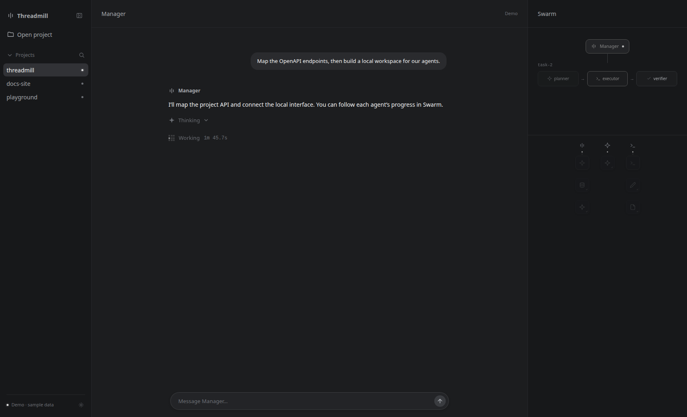

# Threadmill

**把任务交给 Manager，在真实工作目录里验收结果。**

Threadmill 是运行在个人电脑上的轻量级 Agent OS。你描述目标，Manager 组织任务；Planner 调查与规划，Executor 实施，Verifier 独立验收。文件版本、记忆和命令执行由运行时管理，你可以在 WebUI 中查看进展，也可以通过终端使用。



*WebUI 内置演示场景截图：左侧切换项目，中间与 Manager 对话，右侧查看任务和工具活动。*

## 开始使用

在 Linux 项目目录执行这一条命令：

```sh
curl -fsSL https://kdzzzzzz.github.io/threadmill/install.sh | sh
```

安装器先验证文件系统与权限，申请所需管理员权限，准备并验证命令沙箱，检查通过后再安装 Threadmill。无需预装 Go。打开新终端后运行：

```sh
threadmill
```

首次启动会引导设置模型 API 地址、模型名和凭据，并用无回显输入读取 API key。之后直接向 Manager 描述目标，例如：

> 为这个项目实现文件上传功能，补充验证，并在当前工作目录启动服务供我验收。

<details>
<summary>备用安装地址与自定义安装位置</summary>

```sh
curl -fsSL https://raw.githubusercontent.com/KDZZZZZZ/threadmill/main/scripts/install.sh | sh
```

默认安装到 `~/.threadmill/bin`，自动配置 shell 的 PATH。`THREADMILL_INSTALL_DIR` 可以调整程序安装位置，`THREADMILL_PROJECT_DIR` 可以指定预检项目；它们不改变运行时默认的 VFS 状态目录。日常安装无需设置这些变量。

</details>

## 产品特性

| 特性 | 你可以得到什么 |
| --- | --- |
| Manager 统一协调 | 用自然语言提出目标、补充约束、查看报告，由 Manager 编排后续工作。 |
| 规划、执行、独立验收 | 每个任务经过 Planner、Executor、Verifier，保留计划、工具证据和验收结论。 |
| 显式依赖与并行任务 | 有依赖的任务等待输入，无关任务可以并行推进；逻辑任务数量与实际执行槽位分开管理。 |
| 隔离文件版本 | 普通任务使用 VFS 快照与增量，按共同状态和差异合入，避免多个 Agent 直接争写同一个工作目录。 |
| 在真实目录交付 | 新阶段可由一个任务持有真实目录，在其中运行、调试和验收；Manager 与持有者在运行中双向交流。 |
| 持久任务与记忆 | 任务可以跨多轮激活保留身份与检查点；记忆图按当前任务组织和提供相关上下文。 |
| 可见的工作过程 | WebUI 展示项目、Manager 对话、任务图和 Agent 活动；TUI 与无交互命令复用同一运行时。 |
| 受控的命令执行 | Agent 的文件和命令操作经过统一 Tool 层，命令按槽位排队，在所选隔离边界内运行。 |

用户要求“运行当前工作区”时，Manager 会创建新的真实目录任务。已有任务不能临时切换成真实目录持有者；同一时间只有一个任务拥有真实目录，其他任务继续隔离。

## 系统与权限要求

Threadmill **不提供普通复制降级**。支持条件由实际操作验证，不能仅凭文件系统名称或拥有 sudo 判断。

| 项目 | 要求与用途 |
| --- | --- |
| 操作系统 | 一键安装支持 Linux x86-64 / ARM64。 |
| 文件系统 | 项目到 VFS 存储必须支持 reflink（CoW）克隆；通常要求同一个启用 reflink 的 Btrfs / XFS 文件系统。普通 ext4、tmpfs 和跨文件系统克隆不满足要求。 |
| 安装权限 | 普通用户需要 sudo，安装器提前请求，用于安装依赖和必要的发行版 AppArmor 配置。以日后实际运行程序的用户执行安装命令，不要给整条命令加 sudo。 |
| 目录权限 | 当前用户须能读写项目、创建项目旁的私有命令目录，并写入状态、安装、缓存目录和 shell 启动文件；项目与运行目录须允许执行文件。 |
| 命令沙箱 | 默认使用 bwrap，需要系统允许其创建用户、挂载和 PID namespace。安装会真实运行沙箱命令，不能运行则拒绝安装。 |
| 网络 | 安装需要访问 GitHub 和所需依赖源；运行需要访问配置的模型 API。默认 bwrap 共享宿主网络，不提供域名或端口白名单。 |
| 模型凭据 | 需要可用的模型接口与 API key；密钥保存在 `~/.threadmill/credentials.yaml`，权限必须为 `0600`。 |

文件快照默认存放在 `~/.threadmill/projects/<项目路径哈希>/vfs`。自定义 `vfs.live_root` 或打开新项目时，会对实际路径重新检查准入。Docker 或外部沙箱也不能绕过 reflink 要求。

安装时的 sudo 用于系统准备；正常运行不要求始终以 root 身份执行。更严格的出站网络策略由宿主防火墙、代理或外层沙箱实施。

## 使用方法

### WebUI

WebUI 由 React 前端和本地 Go 网关组成，可以实际打开项目、向 Manager 发送任务，并通过事件流实时展示执行进展。前端已内置到程序中，安装后直接启动：

```sh
threadmill -web
```

浏览器打开 **http://127.0.0.1:8787**，点击 **Open project**，输入项目绝对路径，然后向 Manager 发送任务。先通过 `threadmill` 完成模型配置；WebUI 不负责首次凭据配置。

左侧切换项目，中间查看对话和发送补充要求，右侧跟踪各 Agent 的执行状态。默认只监听本机；网关不是面向公网的多用户服务。

正常访问连接真实运行时；地址加上 `?demo=1` 才会使用内置示例数据展示界面。

### 终端与脚本

```sh
# 当前项目，交互式 TUI
threadmill

# 指定项目
threadmill -C /path/to/project

# 发送一条任务，完成后退出
threadmill -C /path/to/project -p "检查失败的测试，修复问题并验证"

# 使用额外的配置覆盖
threadmill -C /path/to/project -config /path/to/override.yaml
```

`-p` 不会启动首次配置向导，使用前先完成模型与凭据设置。

### 阶段交付与验收

1. 向 Manager 说明目标、约束和验收方式。
2. Manager 创建阶段任务，现有真实目录内容与上游成果按文件优先、记忆随后处理。
3. 持有真实目录的任务在当前工作区推进和验证；你可以继续通过 Manager 补充运行要求。
4. 查看 Verifier 的结论、执行证据与真实目录结果，再提出下一阶段目标。

真实目录的修改即时可见，任务失败不会自动回滚。文件可见、任务完成与 Verifier 的 `PASS` 是不同的事实。

## 配置与运行边界

默认提示词和工具配置已内置，普通项目无需携带 `threadmill.yaml`。模型配置保存在 `~/.threadmill/config.yaml`，与密钥文件分开；项目和命令行配置可以覆盖默认值。

完整说明见 [配置与隔离](docs/configuration.md) 和 [权限与容器运行模式](docs/permissions-and-container-modes.md)，包括配置优先级、凭据权限、Docker / 外部沙箱与角色提示词。

目前变更文件吸收有单文件 50 MiB、总量 200 MiB 的限制；持久快照与旧基线没有自动垃圾回收。统一边状态格式不自动迁移旧 root/Join 状态，升级前应保留需要接续的旧状态和匹配程序。详见 [统一边设计](docs/unified-edge-design.md)。

## 开发与文档

`main` 是唯一集成与发布分支，所有修改通过 PR 合入。

```sh
go build -o threadmill ./cmd/threadmill

# 修改前端后，重新生成内置资源（需要 Node.js 24）
npm --prefix web ci
npm --prefix web run build

# 将 TMPDIR 指向可写、支持 reflink 的测试卷
TMPDIR=/path/to/reflink-volume/tmp go test ./...

# 安装器验收
sh scripts/install_test.sh
```

- [架构与模块边界](docs/architecture-governance.md)
- [任务依赖、输入合入与持久激活](docs/unified-edge-design.md)
- [WebUI API](docs/openapi.yaml)
- [前端开发、构建与回归](web/README.md)
- [评测入口与环境条件](benchmarks/README.md)
- [贡献与 PR 规则](AGENTS.md)
