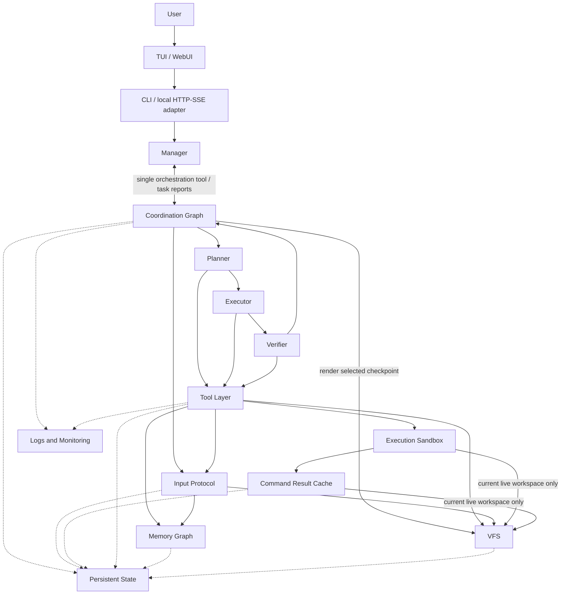

# Threadmill Architecture Governance

> 2026-09-09：按人类要求实现 [统一边与文件优先合入](unified-edge-design.md)。协调图只有普通 task 和 `From`/`To` 边；全部完整来源的交集直接使用，文件差异处理完成后才整理记忆差异，单入边不整理。取消 root 与全局串行规则，允许无合出边和持久 task。下文是当前边界；人类要求、Agent 选择的实现默认值与验证限制分别记录在统一边设计中。

## Architecture

Input Protocol owns predecessor collection and phase progress. Its file resolver and memory organizer use isolated agents and the Tool layer; they add no business role. Ordinary task dependencies are separate from this module diagram.

Solid arrows are the only allowed business dependencies. Dashed arrows are persistence or one-way telemetry only. A new arrow requires explicit human approval and an update to this document.

## Allowed Changes

| Module | Allowed changes | Boundary |
| --- | --- | --- |
| Manager | Prompts, tool descriptions, context presentation, request classification, report handling, checkpoint selection, and small lifecycle bugs | May orchestrate the graph only through the single `coordination_orchestrate` facade and render a completed task's checkpoint through `coordination_publishTask`, as often as progress warrants. Must not inspect or edit project files, execute commands, or perform task work |
| Coordination Graph | Ordinary dependency validation, per-task execution, immutable paired outputs, Input/Help progress, persistence, recovery and selected-checkpoint publication | Keep Planner → Executor → Verifier and ordinary From/To edges. No root category, implicit creation-order inheritance, global serial guard or creator-tree cancellation/wait. `coordination_orchestrate` owns pending tasks/edges, Help provisioning, continuation and closure; roles request advice through `coordination_requestHelp`. Freeze begun target inputs; permit later consumers of committed outputs. Every input reuses common state, resolves differing files before differing memory, and exposes a paired ready checkpoint. Persistent tasks keep identity across activations. New publication selects a committed file output from the selected task’s current completed activation. Its durable intent fixes the selected node, files, activation and outcome; retrying that intent keeps the same selection after task continuation. Rendering does not change other environments and is separate from dependency consumption. Do not add business roles, edge kinds, tool privileges or scheduling semantics without explicit human approval |
| Planner | Prompt, context, investigation, plan format and model parameters | Investigate prepared input in a disposable role workspace and return a plan. Its transient file experiments do not become persistent implementation. Must not mutate the graph except by requesting Help |
| Executor | Prompt, context, implementation, validation and model parameters | Change the activation’s persistent workspace after its input pair is ready. Must not mutate the graph, talk to the user, or declare final acceptance |
| Verifier | Prompt, context, evidence collection, verdict format and model parameters | Independently assess prepared input, including explicit evidence dependencies. Temporary experiments are disposable; they must not be presented as persistent repairs or proof that the retained implementation passes. Defects belong in the report |
| Tool Layer | Schema validation, environment binding, routing, result normalization, error handling, and event publication | Must not contain role policy, graph scheduling, or paths that bypass Memory, VFS, or the sandbox |
| Memory Graph | Immutable snapshots, complete-input partition/composition, retrieval, deduplication, compaction, and bounded organization | 允许底图保留冗余、过期和局部冲突，不以全局整洁为目标。读取时必须能低成本整理出当前任务的最小相关视图；仍相关的冲突须保留来源，不能靠删除历史掩盖。记忆图使用可配置的节点数软上限；达到上限时明确提醒整理 Agent 做全图整理，而不是限制其思考步数。整理 Agent 只在高价值触发点运行，输入和输出必须有界，继承调用方取消，不另设思考时限；不得访问文件、命令或协调图，并以确定性校验保护结果。统一 Input 的差异整理失败时保留文件阶段和固定来源，不以原始合并或未处理候选回退成成功。共同记忆只读，单来源或无差异不调用整理；新事实必须关联最终文件证据，不足的证据不能升级为 accepted。在一次 organize 查询范围内，整理 Agent 还负责维护子图说明（准入内容与适用范围）并调整**发起该查询的** Agent 的动态订阅；两者都只在该查询收尾时生效，查询失败即零变化，固定订阅与任务启动包结构上不可取消 |
| VFS | Internal algorithms for snapshots, overlays, materialization, immutable output archives, transactional final publication, candidate change inspection, selective safe/replace apply, indexing, caching, cleanup, and recovery | Preserve isolation and complete visible file semantics. PrepareInput compares full source views, including absence, type and permissions; common paths are reused and differing paths have explicit source values. Retained snapshots keep their floor across base re-adoption. Archive backing files may remain on disk; no automatic reference-counting GC is added. A failed publication keeps the selected archive retryable and must not leave a claimed commit. Candidate inspection is read-only; safe apply is all-or-none on conflicts; replace requires an explicit role decision. Do not escape configured roots, expose internal storage to Agents, or trade correctness for a fast path |
| Command Result Cache | Dependency inference, cache keys, artifact capture and replay, storage layout, capacity reclamation, sampled verification, and metrics | Reuse is allowed only when every inferred dependency still holds byte-for-byte in the requesting environment. Infer dependencies by observing actual behavior; never by command-name allow/deny lists. Replay only file effects confined to the current live workspace: a run observed to write outside it, to open an outbound connection, or to rewrite its own inputs must not be stored. Degrade by not caching — an unavailable or incomplete tracer disables reuse rather than widening the key. Never relax sandbox isolation to make tracing possible. A sampled fraction of hits must re-execute and invalidate on mismatch |
| Execution Sandbox | Isolation, admission, queue fairness, cancellation, concurrency, timeout, output limits, process cleanup, stateless startup optimization, and delegating result reuse to the Command Result Cache | Fail closed when no sandbox is available. Bwrap shares the host network by default while retaining mount, user, and PID isolation. An explicitly configured external boundary may provide its own process and network policy. Threadmill must label the active backend and network mode and keep per-environment writable state separate. No silent host process execution, cross-workspace mounts, or reuse of writable state between environments |
| Persistent State | Atomic save and load, compatibility, corruption detection, cleanup, and recovery | Store component state through component-owned Store interfaces. Graph and activation progress use schema version 1 and reject legacy root/Join state; no automatic converter exists. Keep immutable Graph Outputs separate from activation Inputs and pending export journals. A publication intent records the selected immutable output, and the published record identifies the exact activation and node on display; both are coordination state, not permission to choose a task, and neither restricts which checkpoint may be selected next. Must not otherwise make task decisions or replay model and tool side effects implicitly. The Command Result Cache is the single sanctioned exception for tool side effects, and only within the boundary stated in its own row: file effects confined to the current live workspace, replayed only when every inferred dependency still holds |
| Logs and Monitoring | Event schema, correlation, human-readable timelines, bounded metrics, performance breakdowns, snapshots, and alerts | Observation is one-way. Monitoring must not alter control flow or retain prompts, model deltas, secrets, or arbitrary file contents |

## Evaluation

| Module | Evaluation dimensions | Evidence from logs and monitoring |
| --- | --- | --- |
| Manager | Request closure, correct task creation, boundary compliance, evidence-based snapshot selection, recovery, latency, and token cost | Manager model and tool events; coordination-tool calls and errors, including selected `task_id` and `published`; `pending`; `tasks.running`; task reports; Manager TTFT, P50/P95, and tokens |
| Coordination Graph | DAG validity, fixed input batches, file-before-memory ordering, paired visibility, independent activation outcomes, publication, cancellation and recovery | Graph Tasks/Nodes/Edges/Outputs; progress Version/Inputs/Phase/Pending; explicit file disposition; publication task references; per-task start/end and outcome records |
| Planner | Plan executability, evidence quality, disposable-workspace compliance, stability, latency, and cost | Planner model/tool events; investigation tool results; Executor completion; Verifier verdict; persistent VFS delta; steps, tokens, and P50/P95 |
| Executor | Implementation correctness, scope control, first-pass acceptance, test quality, recovery idempotence, latency, and cost | Executor model/tool events; file delta; command results; first Verifier verdict; repair-task count; steps, tokens, command wait, and run duration |
| Verifier | Verdict precision and recall, requirement coverage, evidence quality, persistent-workspace compliance, latency, and cost | Structured verdict and per-requirement evidence; hidden tests or human ground truth; verifier tool events; persistent VFS delta; tokens and P50/P95 |
| Tool Layer | Start/end pairing, error rate, latency, retry cost, cancellation, authorization rejection, and idle cleanup | Runtime events grouped by `agent_id`, tool `name`, and `call_id`; Model retry totals; Tool started/completed/errors/active; duration P50/P95 |
| Memory Graph | 可整理性、retrieval relevance, organizer return on cost, recovery, and latency; raw graph redundancy or growth alone is not a failure | Memory operation events; candidate and selected node counts; selected nodes compared with current Task Info, coordination state, and source provenance; organizer tokens and duration; downstream task result; environments, subgraphs, nodes, and edges |
| VFS | Isolation, archive fidelity, floor immutability under publication, publication reconciliation/retryability, candidate-diff and selective-apply correctness, conflict atomicity, crash recovery, cleanup, latency, scanned I/O, copied I/O, and space use | Materialize/absorb/publish and Input-related file counters; publication attempts/commits/errors/cleanup errors; archive restore and crash-injection tests; environments, live dirs, files, tombstones, and overlay bytes |
| Command Result Cache | Reuse correctness, hit rate, dependency-inference precision, sampled-verification mismatch rate, replay fidelity, lookup cost, and storage growth | Cache lookups/hits/stores/rejected; verification count and mismatch count; saved duration; whether dependency tracing is active; execution-slot consumption on hits; blob store size |
| Execution Sandbox | Isolation, reliability, fairness, saturation, cancellation, timeout behavior, throughput, and process cleanup | Sandbox backend and network mode; requests/started/completed/errors/canceled/timed out; queued/active/capacity; wait and run duration; tracked process groups |
| Persistent State | Atomicity, recovery success, replay safety, format compatibility, latency, and storage growth | Save/load/recovery events by component; corruption errors; recovery attempts/successes/failures; duplicate-side-effect checks; persistence duration and bytes |
| Logs and Monitoring | Event coverage, cross-module correlation, readability, metric accuracy, overhead, bounded cardinality, and privacy | Presence of start/end events and stable turn/task/role/call identifiers; timeline completeness; active counters returning to zero; collector CPU/memory cost; secret and content-leak checks |

`done` means a nonpersistent activation completed successfully; a successful persistent activation becomes `idle`. Neither outcome replaces the Verifier verdict nor means its snapshot has been published. The real project changes only after a successful manager-selected publication.

The project directory is a display surface, not the substrate environments read. Environments read an immutable floor cloned when the session adopts the project, so publication renders a checkpoint for the user without moving anything underneath running work. When project changes require a new floor, retained task snapshots keep the previous floor. Floor generations and copy/reflink archives currently remain on disk without a new garbage collector. Release of a running workspace is not a promise that its durable snapshot files are deleted.

## WebUI 接线（2026-09-11）

Human Design：按指定 demo 整理 OpenAPI、连接前后端、使用真实模型从 GUI 测评。新增 UI → adapter → Manager 的展示边界由该请求授权。adapter 只转交用户消息与控制、读取 Manager 快照和事件，不直接调度或改文件/记忆；TUI 保留原进程内接法，WebUI 复用同一 Manager API。Agent Self-Claimed：复用已有 net/http/SSE 网关与原生 HTML，不新增依赖；本地同源和有界订阅队列；具体契约见 docs/openapi.yaml。

2026-09-12 Tailscale 访问：Human Design：允许 Tailscale 的 Windows 使用 WebUI。Agent Self-Claimed：使用已有 Tailscale Serve 提供 tailnet 内 HTTPS；网关仍监听loopback，以可选 `-web-origin` 精确允许代理保留的Host/Origin，并继续拒绝跨站请求。部署使用仓库外用户systemd服务，不改变Manager、调度和存储边界，不引入新的Go依赖。

2026-09-12 聊天Markdown：Human Design：为GUI聊天页面实现Markdown渲染。Agent Self-Claimed：在现有UI内部打包Marked/DOMPurify固定版本，覆盖用户消息、Manager正文和任务报告；清理生成HTML、保留原始HTML为文本，按消息缓存渲染；增加离线浏览器回归页生成器。无新增模块间依赖或服务端接口，来源与许可证见docs/webui-third-party.md。

2026-09-12 VFS / Manager 启动修复：VFS 快照复制映射并共享 Store 拥有的不可变 blob 字节，公开读写入口仍复制缓冲区，保留隔离语义。Manager 在没有后续工具调用的最终答复后启动现有 ready task，使执行不再等待 Manager 尾部记忆压缩；原有 AfterTurn 恢复路径、显式边、输入冻结与暂停规则保持。没有新增模块依赖或业务角色。Btrfs 在仓库外独立测试卷部署，详见 webui-iteration.md。

2026-09-12 编排工具回执：replace_pending/provide_help 的展示回执省去已在当前图注入的重复报告正文，保留拓扑和引用并显式标记 reports_in_current_graph。规范图、持久化、完整报告、调度及对外 Graph API 不改变。无新增模块依赖；这是工具展示数据的去重，不是证据删除或新的调度方案。

2026-09-12 输入阶段修复：文件解析循环与隔离输入 Organizer 复用配置中的工具说明，工具集合、schema、绑定与事务规则保持。输入 memory_apply 的自动编号须避开完整共同记忆、当前差异草稿及同批显式创建已占用的 ID；身份占用范围不等于模型可见范围，无关共同内容仍不进入模型或读取工具。无新增模块依赖，不修改共同节点保护、普通图分配或调度规则。
