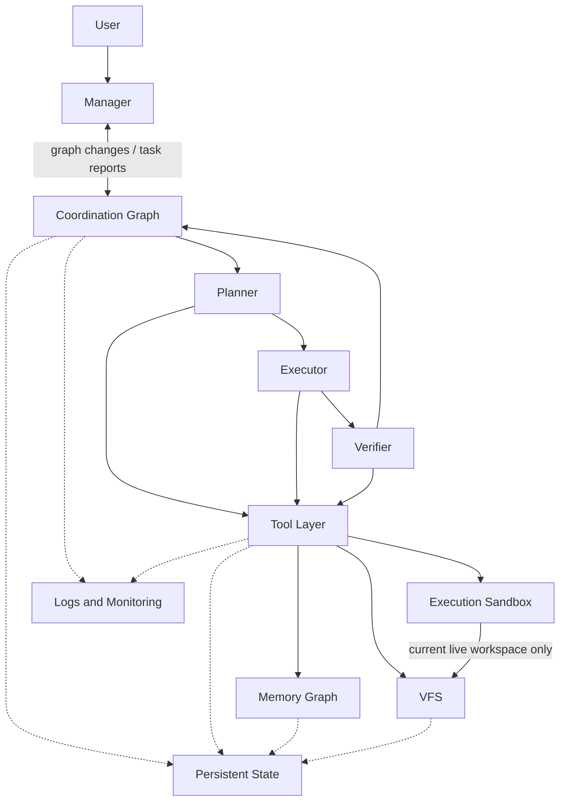

# Threadmill Architecture Governance

## Architecture

Solid arrows are the only allowed business dependencies. Dashed arrows are persistence or one-way telemetry only. A new arrow requires explicit human approval and an update to this document.

## Allowed Changes

| Module | Allowed changes | Boundary |
| --- | --- | --- |
| Manager | Prompts, tool descriptions, context presentation, request classification, report handling, and small lifecycle bugs | May change the graph only through coordination tools. Must not read or write project files, execute commands, or perform task work |
| Coordination Graph | Reproducible bug fixes, invariant checks, cancellation and recovery fixes, and optimizations that preserve current semantics | Keep Root, Spawn, Join, Help, Planner → Executor → Verifier, and existing edge semantics fixed. Do not add roles, edge kinds, graph tools, or scheduling semantics without explicit human approval |
| Planner | Prompt, context, investigation behavior, plan format, and model parameters | May use file and command tools in a disposable workspace. Only the text plan is retained. Must not persist an implementation or mutate the graph except by requesting help |
| Executor | Prompt, context, implementation behavior, validation behavior, and model parameters | May change the persistent task workspace. Must not mutate the graph, talk to the user, or declare final acceptance |
| Verifier | Prompt, context, evidence collection, verdict format, and model parameters | May create disposable validation side effects. Must not repair the persistent implementation or schedule follow-up work; defects belong in the report |
| Tool Layer | Schema validation, environment binding, routing, result normalization, error handling, and event publication | Must not contain role policy, graph scheduling, or paths that bypass Memory, VFS, or the sandbox |
| Memory Graph | Storage, fork and merge, retrieval, deduplication, compaction, and bounded organization | 允许底图保留冗余、过期和局部冲突，不以全局整洁为目标。读取时必须能低成本整理出当前任务的最小相关视图；仍相关的冲突须保留来源，不能靠删除历史掩盖。记忆图使用可配置的节点数软上限；达到上限时明确提醒整理 Agent 做全图整理，而不是限制其思考步数。整理 Agent 只在高价值触发点运行，输入和输出必须有界，继承调用方取消，不另设思考时限；不得访问文件、命令或协调图，并以确定性校验和无操作回退保护结果 |
| VFS | Internal algorithms for snapshots, overlays, materialization, diff, merge, indexing, caching, evidence, cleanup, and recovery | Preserve isolation and visible file semantics. Do not escape configured roots, expose internal storage to Agents, or trade correctness for a fast path |
| Execution Sandbox | Isolation, admission, queue fairness, cancellation, concurrency, timeout, output limits, process cleanup, and stateless startup optimization | Fail closed when no sandbox is available. Bwrap shares the host network by default while retaining mount, user, and PID isolation. An explicitly configured external boundary may provide its own process and network policy. Threadmill must label the active backend and network mode and keep per-environment writable state separate. No silent host process execution, cross-workspace mounts, or reuse of writable state between environments |
| Persistent State | Atomic save and load, compatibility, corruption detection, cleanup, and recovery | Store component state through component-owned Store interfaces. Must not make task decisions or replay model and tool side effects implicitly |
| Logs and Monitoring | Event schema, correlation, human-readable timelines, bounded metrics, performance breakdowns, snapshots, and alerts | Observation is one-way. Monitoring must not alter control flow or retain prompts, model deltas, secrets, or arbitrary file contents |

## Evaluation

| Module | Evaluation dimensions | Evidence from logs and monitoring |
| --- | --- | --- |
| Manager | Request closure, correct task creation, boundary compliance, recovery, latency, and token cost | Manager model and tool events; coordination-tool calls and errors; `pending`; `task_running`; task reports; Manager TTFT, P50/P95, and tokens |
| Coordination Graph | Graph invariants, exactly-once join behavior, terminal-state correctness, cancellation, recovery, and scheduling latency | Graph revision, tasks and edges; progress `Outputs`, `Merged`, and `Prepared`; task start/end events; active/done/failed/canceled counts; stuck-active duration |
| Planner | Plan executability, evidence quality, disposable-workspace compliance, stability, latency, and cost | Planner model/tool events; investigation tool results; Executor completion; Verifier verdict; persistent VFS delta; steps, tokens, and P50/P95 |
| Executor | Implementation correctness, scope control, first-pass acceptance, test quality, recovery idempotence, latency, and cost | Executor model/tool events; file delta; command results; first Verifier verdict; repair-root count; steps, tokens, command wait, and run duration |
| Verifier | Verdict precision and recall, requirement coverage, evidence quality, persistent-workspace compliance, latency, and cost | Structured verdict and per-requirement evidence; hidden tests or human ground truth; verifier tool events; persistent VFS delta; tokens and P50/P95 |
| Tool Layer | Start/end pairing, error rate, latency, retry cost, cancellation, authorization rejection, and idle cleanup | Runtime events grouped by `agent_id`, tool `name`, and `call_id`; Model retry totals; Tool started/completed/errors/active; duration P50/P95 |
| Memory Graph | 可整理性、retrieval relevance, organizer return on cost, recovery, and latency; raw graph redundancy or growth alone is not a failure | Memory operation events; candidate and selected node counts; selected nodes compared with current Task Info, coordination state, and source provenance; organizer tokens and duration; downstream task result; environments, baselines, subgraphs, nodes, and edges |
| VFS | Isolation, diff and merge correctness, crash recovery, cleanup, latency, scanned I/O, copied I/O, and space use | VFS lifecycle events for materialize/absorb/prepare/commit/discard; environments, live dirs, files, tombstones, and overlay bytes; isolation and crash-injection results |
| Execution Sandbox | Isolation, reliability, fairness, saturation, cancellation, timeout behavior, throughput, and process cleanup | Sandbox backend and network mode; requests/started/completed/errors/canceled/timed out; queued/active/capacity; wait and run duration; tracked process groups |
| Persistent State | Atomicity, recovery success, replay safety, format compatibility, latency, and storage growth | Save/load/recovery events by component; corruption errors; recovery attempts/successes/failures; duplicate-side-effect checks; persistence duration and bytes |
| Logs and Monitoring | Event coverage, cross-module correlation, readability, metric accuracy, overhead, bounded cardinality, and privacy | Presence of start/end events and stable turn/task/role/call identifiers; timeline completeness; active counters returning to zero; collector CPU/memory cost; secret and content-leak checks |

`done` means that a task flow reached a terminal state; it does not replace the Verifier verdict.
