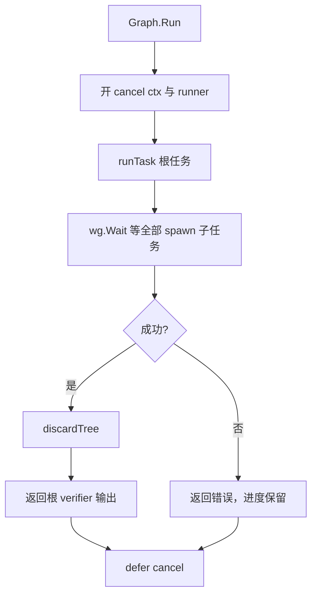
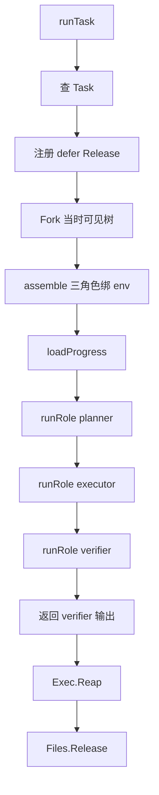
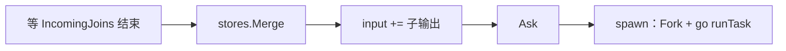
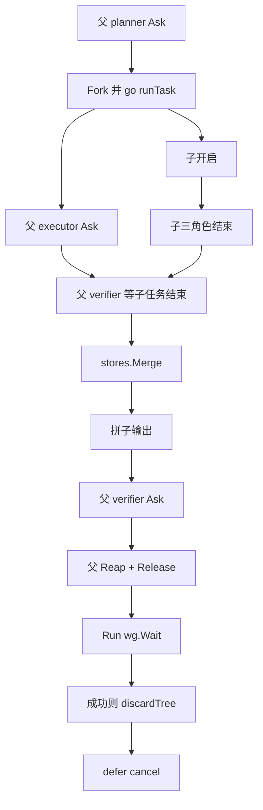

# Threadmill 两图原生设计：协调图 Join 语义、记忆图合并与默认记忆生命周期

状态：Draft。已落地：协调图 `runRole` 顺序与 `Spawn` 环检测（§3.1）、记忆 join 子图并集（§3.2）、默认记忆生命周期（§3.3）、vfs `Fork`/`Merge`/`Release` 内化 Absorb（R10）。
范围：`internal/coordination`、`internal/context`、`internal/agent`（compact / hooks / hidden tools）

本文回答三件事：

1. 从 [threadmill-AgentTeams docs](https://github.com/KDZZZZZZ/threadmill-AgentTeams/tree/main/docs) 的协调图与记忆图设计中提炼哪些精华、丢弃哪些机制；
2. 当前实现有哪些逻辑问题（含三个已知问题的完整机理）；
3. 目标设计与逐文件改动方案，保证三个已知问题被结构性解决，而不是打补丁。

---

## 1. 参照设计精华提炼

### 1.1 来源

已逐篇查阅：

- [coordination-graph.md](https://github.com/KDZZZZZZ/threadmill-AgentTeams/blob/main/docs/coordination-graph.md)（v0.8）
- [context-graph.md](https://github.com/KDZZZZZZ/threadmill-AgentTeams/blob/main/docs/context-graph.md)（v0.2）
- [threadmill-unified-design.md](https://github.com/KDZZZZZZ/threadmill-AgentTeams/blob/main/docs/threadmill-unified-design.md)（v1.0-draft）
- [workspace-merge.md](https://github.com/KDZZZZZZ/threadmill-AgentTeams/blob/main/docs/workspace-merge.md)（v0.4）

横向先例：[cloudwego/eino](https://github.com/cloudwego/eino) 的 DAG 执行引擎（[compose/dag.go](https://github.com/cloudwego/eino/blob/main/compose/dag.go)、[compose/graph.go](https://github.com/cloudwego/eino/blob/5e130550/compose/graph.go) 的 `validateDAG`、[编排设计原则](https://www.cloudwego.io/docs/eino/core_modules/chain_and_graph_orchestration/orchestration_design_principles/)）。AGENTS.md 列出的 Pi 与 deepseek-harness 本次未查阅（本设计聚焦图语义，未涉及 provider/harness 层）。

### 1.2 协调图精华

| # | 精华 | 出处 | 对 Threadmill 的含义 |
| --- | --- | --- | --- |
| C1 | **边区分 start 门控与 completion 门控**：`Edge.RequiredBy: start \| completion`；依赖必须连到"最早真正消费结果的阶段"，且在其**开始前**满足 | coordination-graph.md §2.1；unified §5.2 | join 边是 start 门控：合入点开始 ReAct 前必须拿到子任务成果。这是已知问题一的病根 |
| C2 | **边同时表达控制与数据**：边携带 `ArtifactKinds` / `Data []ArtifactRef`，下游按 `PhaseInputSet` 拿到已交付输入 | coordination-graph.md §2.1；unified §5.1、§5.5 | join 边应把子任务 verifier 的输出文本交付给合入点作为输入，而不是只同步不传数据 |
| C3 | **环是建图错误**：`invalid_graph`——"未知引用、缺 phase、环或非法枚举"在提交时拒绝，而不是运行时挂死 | coordination-graph.md §5；Eino `validateDAG`（DAG 模式明确"不支持环"） | 现状"完成依赖成环会一直等到 ctx 取消"必须改为 `Spawn` 时拒绝 |
| C4 | **汇聚节点等全部前驱完成、前驱输出合并进本节点输入**：Eino `AllPredecessor` 模式下节点仅在全部前驱完成后可运行，`dagChannel.get` 把多前驱输出 `mergeValues` 后作为输入 | Eino compose/dag.go | 与 C1+C2 相同结论的独立实现验证 |
| C5 | 三阶段 plan→execute→verify 是**内建顺序，不是可编辑边** | coordination-graph.md §5 不变量 2 | 当前 `Task.Sequence()` 已如此；顺序边不需要事件机制，for 循环即是保证 |
| C6 | 失败处理单一化：stop 优先、出错即取消、决定从持久事实重算而非相信触发载荷 | coordination-graph.md §4.1 | 现有 `fail→cancel` 与 ProgressStore 重放已是其原生极简版，保留 |
| C7 | 图只向前演化：旧结果显式失效，不回改、不删除 | unified §2.2 | 记忆图合并也遵守：不删除节点，用状态与新增表达演化 |

### 1.3 记忆图精华

| # | 精华 | 出处 | 对 Threadmill 的含义 |
| --- | --- | --- | --- |
| M1 | **两类自动边**：`logical_adjacent` 连**同一 CreatorAgentID** 的最近节点（创建者连续记忆链）；`derives_from_subgraph` 连创建时订阅的子图（可见上下文） | context-graph.md §1、§4 | 创建者链按 agent 隔离，不能连到"订阅子图里恰好最后一个节点"（可能是别人写的） |
| M2 | **节点可以不属于任何子图**："`SubgraphIDs` 为空是合法状态，不妨碍通过创建者关系被后续召回" | context-graph.md §1 | 空归属可以落图，但**不进本 agent 窗口**。无订阅时靠「压缩仍截断对话、窗口为空」解决问题三，不靠创建者链当默认保留集 |
| M3 | **可见性 = 订阅并集，订阅之外无旁路**：`EffectiveSubgraphs(invocation) = union(subscription.SubgraphIDs)`，权限过滤优先 | context-graph.md §6.1；unified §14 | Threadmill 拆成两层：整理时的**归属目录**可以是全图子图；压缩后本 agent **窗口里保留的节点**只含订阅子图，且必须是这些子图的全集。未订阅子图上的节点不进窗口，不是整理时看不见子图名字 |
| M4 | **归属建议必须过硬门槛**："`SubgraphIDs` 只含调用者可写的子图"，不一致则整体拒绝，"避免跨 Task 可见性泄漏" | context-graph.md §2、§8.2、§9 | 本机单写者：模型可以把节点标到图里已有的任意子图，或标空。硬门槛是「归属 ID 必须是已存在子图」，不是「必须已订阅」。未订阅只影响本 agent 还要不要这些节点 |
| M5 | **节点生命周期用状态演化，不删除**：accepted/disputed/superseded/outdated；修订是"同键较新 revision 修订该节点"，冲突显式保留（disputed / contradicts） | context-graph.md §3.1、§8.2；unified §9.3 | 节点不删除。join 不改 Statement；子图归属按并集合入，加入 A 不影响加入 B。不做 Status/`disputed` 三路，也不跟 vfs 对齐 |
| M6 | 每个节点可追溯创建者（`CreatorAgentID` 由运行时注入，agent 不可自报） | context-graph.md §10 不变量 1、2 | 当前 `Node.CreatorAgentID` 字段存在但压缩路径从未填写，需接通 |
| M7 | 来源边 ≠ 归属：`derives_from_subgraph` 不把节点加入子图，归属只写 `SubgraphIDs` | context-graph.md §4.2 | 当前实现已正确，保持 |

### 1.4 明确不引入的机制（原生等价物对照）

AgentTeams 文档是多进程、多租户、可审计的企业形态。Threadmill 是单机进程内 Agent OS，直接照搬会毁掉简洁性。对照如下，右列是本仓库已有或本文采用的原生等价物：

| AgentTeams 机制 | 不引入的理由 | 原生等价物 |
| --- | --- | --- |
| GraphRuntime / lease / 命令日志 / 幂等 PhaseCommand | 进程内没有"命令投递丢失"问题 | `runner` goroutine + `ProgressStore` 重放 |
| Task Manager Agent / Transition 封闭状态机 | 单机形态没有人工审批环节 | `Graph.Spawn/AddTask` 直接建图 + 建图期校验 |
| Event Log / Artifact Store / 订阅推送执行器 | 单机无需投影与推送总线 | 记忆图快照 + `EnvView.Snapshot/Commit` |
| 候选缓冲 + Context Agent 终审 | 两级 LLM 审查太重 | `CompactHistory` 一次整理即落图（保留其硬门槛思想，见 M4） |
| Merge Queue / write set / phase lease | 文件合并已有 `vfs.Store` 三路合并 | `vfs.Store.Merge`（保留冲突即报错语义） |
| revision CAS / PermissionSnapshot | 单写者模型 | `Store` 互斥锁 + `Graph.Revision` 递增 |

---

## 2. 当前实现的问题

### 2.1 已知问题一：Join 节点 Ask 先结束，再等子任务、再 Merge

现状时序（`internal/coordination/run.go` 的 `runRole`）：

```164:226:internal/coordination/run.go
func (r *runner) runRole(ctx context.Context, node Node, roles Roles, input string, outputs map[string]string, merged map[string]bool) (string, error) {
	// ... spawn 子任务（不等结束）
	// ... asker.Ask(ctx, input)          ← 合入点先跑完 ReAct
	// ... stores.Files.Absorb(task.Env.ID)
	for _, pred := range r.graph.Incoming(node.ID) {
		if err := r.waitDone(ctx, pred.ID); err != nil { // ← 然后才等子任务
			return "", err
		}
	}
	// ... r.stores.Merge(child.Env.ID, target.Env.ID)   ← 最后才合并环境
	r.finish(node.ID)
	return output, nil
}
```

后果链：

1. **合入点的 ReAct 看不到子任务的任何成果**——文本输出、文件、记忆全都在它 Ask 结束后才合入。合并结果只对合入点**之后**的节点可见；而 `Spawn` 的默认拓扑常把 verifier 设为合入点，此时合并成果没有任何后续节点消费，join 退化为纯粹的同步屏障。
2. **子任务的文本输出被整体丢弃**：`runRole` 里 `if _, err := r.runTask(ctx, childID, input)` 只取错误。
3. **spawn 边被赋予了"门控子任务完成"的多余语义**（子 planner 要等父角色声明完成才能自己声明完成），由此制造了人为依赖环：spawn 与 join 落同一节点、或 join 指向更早阶段时死锁，代码注释自认"会一直等到 ctx 取消"。这违反精华 C3。
4. 等待对象是子任务 **verifier 节点的完成事件**，而不是子任务 goroutine 的结束。子任务 `runTask` 的收尾（deferred `Absorb`/`Release`/`Reap`）与父任务的 `Merge` 之间没有先后保证，时序上只是碰巧正确。

### 2.2 已知问题二：记忆 Merge 只比 Statement，其它字段变更丢失

```137:157:internal/context/store.go
		if baseNode, ok := base.nodeByID(node.ID); ok && baseNode.Statement == node.Statement {
			continue
		}
		if oursNode, ok := result.nodeByID(node.ID); ok {
			if oursNode.Statement == node.Statement {
				continue
			}
			newID, existed := collisionNodeID(fromID, node, result, used)
			// ...（改名追加）
		}
```

三条丢失路径里，真正会在 join 丢掉、且属于记忆图主路径的只有第一条：

1. 子环境只改了节点的 `SubgraphIDs`（`memory_add_to_subgraph`）而 `Statement` 未变 → 与 base 或 ours 的 Statement 相等 → 整个节点被跳过。加入 A 与加入 B 本是独立集合，join 却把子环境的归属整段丢掉。
2. 子环境改了 Statement 而合入方没动过该节点 → 走改名追加。记忆图不回改原陈述，这条**保持现状**。
3. 子图元数据只按 ID 存在性合并；`Revision` 取 `ours+1`。元数据改名与 revision 倒退**不做**字段级三路。

记忆图和协调图一样，与 vfs 无关。文件冲突报错、三路字段合并都不套到记忆节点上。join 对同 ID 做 `SubgraphIDs` 并集即可。

### 2.3 已知问题三：默认记忆生命周期不工作

无订阅不压缩：

```54:57:internal/agent/compact.go
	subgraphIDs = uniqueIDs(subgraphIDs)
	if len(subgraphIDs) == 0 {
		return graph.Clone(), cloneMessages(messages), nil
	}
```

一个从未调用 `organize_subgraph`、也没被 `SetSubscribedSubgraphs` 的 agent（**默认状态**）：上下文超窗后 `CompactOnOverflow` → `compact_memory` → 原样返回 → 消息永远不会被截断，每一步模型调用继续超窗；`CommitTailOnTurnEnd`（keep=0）同样空转，回合结束什么也不落图。默认生命周期整体失效。

有订阅则目录泄漏：

```170:176:internal/agent/compact.go
func catalogIDs(graph ctxgraph.Graph, subscribed []string) []string {
	ids := append([]string(nil), subscribed...)
	for _, subgraph := range graph.Subgraphs {
		ids = append(ids, subgraph.ID)
	}
	return uniqueIDs(ids)
}
```

`catalogIDs` 把**图中全部子图**并进目录，随后 `buildOrganizeUserPrompt` 的「已有记忆」用 `NodesInSubgraphs(catalog)` 把**所有子图的节点陈述**注入整理提示词。归属候选用全图子图是对的（整理本来就可以标到任意子图）；把未订阅子图里的**节点正文**也喂给模型，才是泄漏。另外：`nodesFromDrafts` 在模型给出空归属或未知 ID 时，会把节点强行写进**当前全部订阅**（`members = subscribed`），和「可以不标子图 / 标到未订阅子图就不进本 agent 窗口」相反。

其它生命周期错误：

- `previousID` 取"订阅子图里最后一个节点"而不是"本 agent 创建的最近节点"，`logical_adjacent` 会跨 agent 乱连（违反 M1）；
- 压缩产生的节点从不填 `CreatorAgentID`（违反 M6）。

### 2.4 关联问题清单

| # | 问题 | 位置 | 处置 |
| --- | --- | --- | --- |
| P1 | spawn/join 依赖环运行时挂死（见 2.1.3） | `run.go` / `graph.go` | 已落地：`Spawn` 返回 `ErrJoinCycle` |
| P2 | `Spawn(from, join)` 允许 join 目标在另一棵任务树：目标树运行时等待一个永远不会运行的节点 | `graph.go` `Spawn` | 已落地：同根校验，跨树返回 `ErrJoinCycle` |
| P3 | 子任务输出文本被丢弃（见 2.1.2） | `run.go` | §3.1 join 数据边 |
| P4 | 合并后 `Revision = ours+1`，可能低于子环境 revision | `store.go` `mergeAdditive` | 不改 |
| P5 | `CreatorAgentID` 全链路未填写 | `compact.go` / `hidden_tools.go` | §3.3 |
| P6 | `Stores.Merge` 中 Files 与 Memory 两步非原子（Files 成功后 Memory 失败则半合并；当前 Memory 恒成功，属潜在坑） | `stores.go` | 记为不变量 I6，暂不改 |
| P7 | `organizeSubgraphTool` 创建的查询子图 `Kind=task`，语义上是"查询工作集"而非 AgentTeams 定义的 task 投影子图；Kind 语义待定 | `factory.go` | 记录，不阻塞 |
| P8 | `estimateTokens` 按字节/4 估算，对中文略有偏差 | `compact.go` | 可接受，不改 |
| P9 | `BindCheckpoints` 无锁改 `loop.agentID`（装配期单线程，实际安全） | `factory.go` | 记录，不改 |

---

## 3. 目标设计

### 3.1 协调图规则

图里只有 task 和三种边。每个 task 固定 `planner → executor → verifier`（sequence，不是可编辑边）。`Graph.Spawn(from, join)` 一次加两条边：`from → child.planner`（spawn）、`child.verifier → join`（join）。`Graph.Run` 从某个 task 往下跑。

**R1 sequence。** 同一 task 三个角色按顺序执行。上一角色的 `runRole` 返回后，下一角色才开始。不靠完成事件。

**R2 角色顺序：join → Ask → spawn。** 每个角色节点只做这三步，缺边的步空过。

**R3 join 门控开始。** Ask 之前：等本节点每条 join 入边的子任务结束 → `stores.Merge(子.env, 本 task.env)` → 把子任务最终输出拼进本节点输入。合入点 Ask 时必须已经看见子任务的文本、文件、记忆。

**R4 spawn 在 Ask 之后，只 fork 不等待。** 对本节点每条 spawn 出边：`Fork` 父 env **此刻最新内容**，用本角色 Ask 输出当子任务输入，拉起子 `runTask`，立刻继续。不产生完成依赖。同一 task 里后一次 spawn 再 fork 一次「现在」。

**R5 当且仅当 join，子改动才进被 join 的节点。** 提交就是 R3 的 `Merge`。没有 join 的子任务，改动不写回任何人。Ask 结束和 task 关闭都不做这次提交。

**R6 数据跟着边走。** spawn：子输入 = 发射角色的 Ask 输出。join：合入点输入 += 子 verifier 输出。

**R7 等子任务，不等节点事件。** join 等待的是子 `runTask` 结束（含收尾）。删掉 `done` / `finish` / `waitDone`。

**R8 建图即无环、同树。** `Spawn` 时：join 与 from 同属一棵任务树；把节点拆成 `start`/`ask` 做 DFS——sequence：`前驱.ask → 后继.start`；spawn：`源.ask → 子.planner.start`；join：`子.verifier.ask → 目标.start`。有环（含 `Spawn(x, x)`、join 指到 spawn 源之前）→ `ErrJoinCycle`。

**R9 失败即取消。** 任一 Ask / Merge / 子任务出错 → 记下首错、cancel 会话 ctx、所有 join 等待退出。已开启 task 仍走自己的关闭。成功才 `discardTree`。

**R10 图不调用 `Absorb`。** 图只发 `Fork`（spawn）和 `Merge`（join）。live → 本 env overlay 是 vfs 内部的事。

**R11 并行只存在于发射点之后、合入点之前。** 子任务不与发射它的角色并行。

| `Spawn(from, join)` | 时序 | 子输入 |
| --- | --- | --- |
| `(planner, verifier)` | planner Ask → 子 \|\| executor → verifier 合入后 Ask | 计划 |
| `(planner, executor)` | planner Ask → 子 → executor 合入后 Ask | 计划 |
| `(executor, verifier)` | executor Ask → 子 → verifier 合入后 Ask | executor 产物 |

`runRole` 就是 R2–R6 的展开：

```text
join：等子结束 → Merge(子.env, 本.env) → input += 子输出     # 无入边则空
Ask：progress 已有输出则跳过
spawn：Fork 最新内容 → go runTask(Ask 输出)                  # 无出边则空
```

重放：Ask 可跳过，spawn 仍走（子靠自身 progress 跳过已完成角色）。join 的 Merge 用 `merged[node.ID]` 防重放；子输出从子 progress 重建。

### 3.1.1 按规则跑一次 Task


三层：`Graph.Run` ⊃ `runTask` ⊃ `runRole`。下面按 R1–R10 展开。

**会话 `Graph.Run`**



**单个 Task：开启一次、defer 关闭一次（失败也走）**



关闭是 Reap + Release（R10：这里不 Merge、不 Absorb）。

**角色（task 开着期间的心跳，不是独立生命周期）**



无 join 入边则前三步空过；无 spawn 出边则最后一步空过（R2）。

**默认拓扑 `Spawn(planner, verifier)`：父子开启/关闭如何咬合**



R4 + R5：spawn 只 Fork 最新内容；join 才 Merge 进合入点。

**失败**


### 3.2 记忆图：join 时子图归属并集

记忆图与 vfs 无关。节点陈述不回改；子图归属是独立集合：加入 A 不影响加入 B。

`Store.Merge` 仍以 ours 为底，并入 theirs 相对 base 的增量：

- 同 ID、同 Statement：`SubgraphIDs = ours ∪ theirs`。子图元数据按 ID 追加缺失项。
- 同 ID、不同 Statement：保留 ours，theirs 走现有 `collisionNodeID` 改名追加并重写边。
- 新 ID：追加。base 里有、ours 没有、Statement 未变：不复活（子环境没改陈述）。
- 边：维持现状（base 已有则跳过、按 remap 重写、去重追加）。
- `Revision`：仍 `ours+1`。不比较 Status / Kind / SourceRefs，不置 `disputed`。

### 3.3 默认记忆生命周期：整理归入任意子图，窗口只留订阅全集

压缩做两件独立的事：**归档**（对话 → 记忆节点，标归属）和 **窗口**（本 agent 还要哪些节点）。订阅管窗口，不管能不能标子图。

**整理（归档）**

- 删除 `CompactHistory` 开头的 `len(subgraphIDs) == 0` 短路。有可切对话就整理；`cut == 0` 仍短路。
- 模型把切点前的对话整理成节点。`subgraph_ids` 从**图里已有的全部子图**里选，也可以不标（空归属合法）。
- 未知子图 ID 丢掉，不要改写成当前订阅。空归属就保持空，**禁止**回落成 `subscribed`。
- 节点写入记忆图：标到未订阅子图的，留给订了那些子图的调用者；无归属的留在图上但不进本 agent 窗口。
- 「可选归属子图」= 全图子图的 ID/Name/Summary。「已有记忆」（去重）= **当前订阅子图的节点全集**（无订阅则为空）。不要把未订阅子图里的节点陈述塞进提示词。

**窗口（保留）**

本 agent 压缩之后、以及 `InjectSubscribedMemory`，保留集都是：

> 只保留、且完全包括：当前订阅子图上的记忆节点。

推论：

- 新节点若归属与订阅无交集（未订阅子图，或空归属）→ 本 agent **不需要**这些被压缩的记忆，窗口里不再保留。对话前缀照样切掉。
- 新节点若落在某个已订阅子图里 → 它成为该子图全集的一部分，下次注入会带上。
- 无订阅：仍然压缩（对话能截断）；窗口注入为空。这就是默认生命周期：不订就不把旧话留在窗口里。

**创建者链**（修 P5，对齐 M1/M6，不替代窗口规则）：

- `agent.Transcript` 增加 `AgentID`；新节点写 `CreatorAgentID`。
- `previousID` 改为「该 `CreatorAgentID` 在图中的最近节点」（`LastNodeOfCreator`），`logical_adjacent` 不跨 agent。

`InjectSubscribedMemory` 仍只注入订阅子图内容。无订阅注入为空。

---

## 4. 改动清单（按文件）

| 文件 | 改动 |
| --- | --- |
| `internal/coordination/run.go` | `runRole` 重排为 join(等子任务+Merge+拼输入) → Ask → spawn；不调用 Absorb；`runner` 用 `childDone` 取代 `done`；删除 `finish/waitDone/doneCh` |
| `internal/vfs/store.go` / `live.go` | `Fork`/`Merge`/`Release` 内部 Absorb；图不调用 `Absorb` |
| `internal/coordination/graph.go` | `Spawn`：同根校验与 start/ask 环检测；环或跨树返回 `ErrJoinCycle` |
| `internal/coordination/progress.go` | 不变（`Outputs`/`Merged` 语义沿用，仅落盘时点前移） |
| `internal/context/store.go` | `mergeAdditive`：同 ID 同陈述并集 `SubgraphIDs`；其余保持追加 / 改名 |
| `internal/context/graph.go` | 新增 `LastNodeOfCreator(agentID string) (Node, bool)` |
| `internal/agent/compact.go` | `CompactHistory` 增加 `agentID`、删无订阅短路；「可选归属」= 全图子图，「已有记忆」= 订阅子图节点全集；`nodesFromDrafts` 允许空归属、禁止回落成订阅列表、未知 ID 丢弃；节点填 `CreatorAgentID`；`previousID` 换创建者链锚点；`OrganizePrompt` 允许不标或标任意已有子图 |
| `internal/agent/hidden_tools.go` | `Transcript` 增加 `AgentID`；`snapshotTranscript` 填写；`compactMemoryTool.Execute` 透传 |
| 各 `_test.go` | 见 §6 |

不改：`internal/agent/loop.go` 主循环、`internal/coordination/stores.go`（P6 只记不变量）。

## 5. 不变量

1. **I1 合入点开始前，其全部 join 入边的子任务已结束且环境已合并**；合入点输入包含每个子任务的最终输出。
2. **I2** 即 R4–R5：spawn 只 `Fork` 最新内容且不等待；当且仅当 join 才 `Merge` 进被 join 的节点。协调图不调用 `Absorb`。
3. **I3 图中不存在开始依赖环**（`Spawn` 建图期保证）；join 目标与 spawn 源同属一棵任务树；`Spawn(x, x)` 非法。
4. **I4 记忆 join 子图并集**：同 ID 同陈述节点的 `SubgraphIDs` 为双方并集；加入 A 与加入 B 互不覆盖。
5. **I5 记忆合并不重复**：对同一 (from, into) 重放合并不重复节点、不重复子图归属 ID。
6. **I6 环境合并顺序固定 Files→Memory**，Files 冲突报错时 Memory 未动；Memory 合并不返回业务错误（若未来会失败，需先解决半合并问题）。
7. **I7 压缩总能推进**：只要切点前有消息，`compact_memory` 之后消息长度严格减小；整理出的节点写入记忆图（归属可为任意已存在子图或空）。
8. **I8 窗口 = 订阅子图节点全集**：本 agent 注入/压缩后保留的记忆节点 = `NodesInSubgraphs(订阅)`，一份不漏、一份不多。未订阅子图上的节点和无归属节点不进窗口。整理提示词可以列出全图子图供归属，但「已有记忆」正文只含订阅子图。
9. **I9 每个压缩产出节点带 `CreatorAgentID`**，`logical_adjacent` 只连接同创建者节点。

## 6. 测试计划

协调图（`run_test.go` / `graph_test.go`）：

- join 门控：`Spawn(planner, verifier)`，断言 verifier 的 Ask 输入含子任务输出、Ask 时其环境已含子环境文件与记忆；子任务与 executor 并行（现有 `Spawn(executor, verifier)` 并行用例改挂到 planner 上；现有"Ask 后才合并"断言要反转）。
- 发射点在 Ask 后：`Spawn(executor, verifier)` 时，子 planner 不得在根 executor Ask 结束前启动，且子任务输入是 executor 输出而非 planner 输出。
- 同节点拒绝：`Spawn(x, x)` → `ErrJoinCycle`（旧设计死锁用例改为建图失败）。
- 兄弟 join：A spawn B、C，C joins B.executor——B.executor 拿到 C 输出。
- 环拒绝：join 指向 spawn 源之前的节点 → `Spawn` 返回 `ErrJoinCycle`；跨树 join → 报错。
- 失败传播：子任务出错，join 等待者以该错误退出；progress 重放后 merged 不重复合并、join 输入可重建。

记忆合并（`merge_test.go`）：

- 父环境把节点加入 sg-a、子环境加入 sg-b → join 后归属为 `sg ∪ sg-a ∪ sg-b`，陈述不变。
- 同 ID 不同陈述仍改名追加；重放合并不重复归属 ID。

记忆生命周期（`compact_test.go` / `loop_test.go` / `memory_hooks_test.go`）：

- 无订阅：溢出后消息被截断；节点可落图（空归属或标到已有子图）；窗口注入为空。
- 有订阅：可选归属列出全图子图；「已有记忆」不含未订阅子图的节点陈述；模型标到未订阅子图的节点写入该子图，但不出现在本 agent 注入里。
- 空 `subgraph_ids` 保持空，不得回落成当前订阅列表。
- 创建者链：两个 agent 交替压缩，各自 `logical_adjacent` 链不交叉。

## 7. 行为变化（评审需知）

1. 合入点不再与其 join 的子任务并行；发射角色也不再与它 spawn 的子任务并行。需要并行度时把 spawn 放在更早角色、join 放在更晚角色（见 §3.1 三种摆法）。`Spawn(executor, verifier)` 从"与 executor 并行"变为"executor 之后、verifier 之前串行"。
2. 子任务输入从"父角色 Ask 前的输入"变为"父角色 Ask 输出"。
3. 曾经"运行时挂死"的图（含同节点 spawn/join）现在建图即报错（`ErrJoinCycle`），属于把故障提前，不算破坏。
4. `CompactHistory` 签名变化（新增 `agentID`）；无订阅 agent 从「从不压缩」变为「仍截断对话，窗口不保留未订阅/无归属节点」。整理归属不再限制为已订阅子图。
5. 三个已知问题对应的现有测试断言需按 §6 反转或收紧。
6. join 后合入点能看见子环境加过的子图归属（并集）。运行中父/子环境仍各自写自己的图；这不是 vfs 式冲突，也不是泄漏。

## 8. 明确不做

- 不引入 §1.4 左列的任何企业机制（lease、Event Log、Merge Queue、双 Agent 审查等）。
- 不给记忆边增加权重、置信度、来源字段（AgentTeams 同样明确拒绝，见 context-graph.md §3.4）。
- 不做记忆节点删除；演化只经状态与新增。
- 不为 join 输入引入结构化 `PhaseInputSet` 对象；纯文本拼接够用，出现真实需求再说。
- 不改 `vfs` 合并语义。记忆图不跟 vfs 对齐：join 只做子图归属并集，文件冲突仍然报错。
