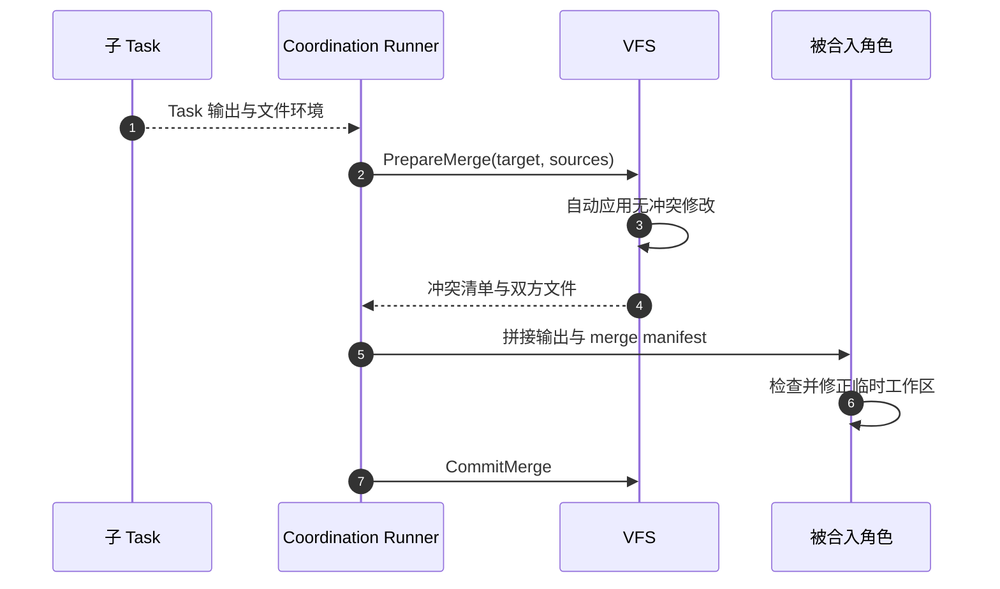
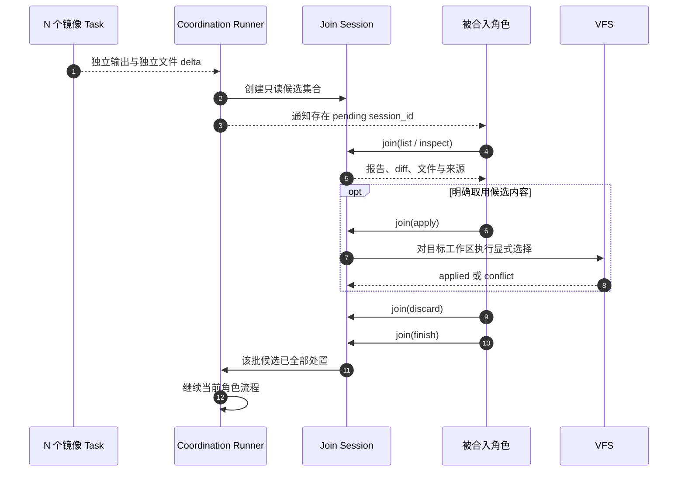
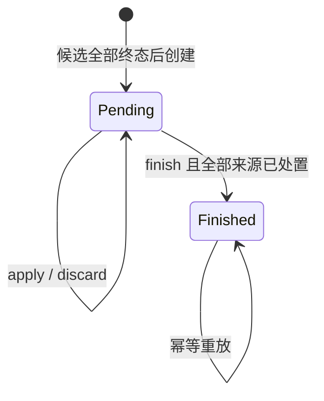

# Threadmill 统一 Join 工具设计

## 文档信息

| 项目 | 内容 |
| --- | --- |
| 版本/状态 | v1.0 / 已实现 |
| 日期 | 2026-08-24 |
| 责任角色 | Threadmill 架构与实现维护者 |
| 目标读者 | Coordination、VFS、Tool Layer 与 Agent Prompt 的实现者 |
| 形成方式 | 迁移前实现逆向 + 已落地方案记录 |
| 事实基准 | 当前工作区；外部参考仓库的固定 commit 见“设计依据” |

## 1. 背景与范围

Threadmill 允许任意角色 spawn 镜像 Task，并把结果 join 回指定角色。目标角色需要能够查看所有候选实现，整体采用一份、按文件取用、组合多份、重写或全部拒绝。

迁移前的 join 会在目标角色开始工作前自动应用无冲突文件，只把冲突留给目标角色。这会在角色作出选择前改变工作区，也可能把多个候选的修改机械拼成一份没有任何 Agent 明确负责的结果。

本设计增加唯一的 Agent 可见工具 `join`。此后图上的预置 join 和执行中的 Help join 都只通过该工具交给被合入角色处理。候选始终隔离且只读；没有任何候选修改会因为 join 边存在而自动进入目标工作区。

### 1.1 已确认的人类设计

- 直接 spawn 多份镜像 Task。
- 由被合入角色统一处理合入。
- 被合入角色可以按需取用所有实现，不要求只选择一个赢家。
- 不使用机械合入。
- 后续所有角色可见的合入都使用同一个工具。

### 1.2 范围内

- 一个统一的 `join` Agent 工具及其会话协议。
- 图上预置 join 与 `coordination_requestHelp` 返回结果的统一入口。
- 候选报告、文件差异和文件内容的只读检查。
- 显式整份采纳、按路径采纳、拒绝和完成处理。
- 冲突保护、恢复、幂等和候选环境释放。
- Planner、Executor、Verifier 使用该工具时的职责边界。

### 1.3 范围外

- 候选排名、Best-of-N 投票或额外 selector 角色。
- 自动生成综合实现。
- 修改 Planner → Executor → Verifier 角色链。
- 修改 spawn/join 图的拓扑语义。
- 最终实现的正确性验收；它仍属于下游 Verifier。
- 记忆图整理策略和集群性能优化。

## 2. 迁移前设计（Historical As-Is）



迁移前存在四个与目标不一致的行为：

1. `PrepareMerge` 会先自动应用非冲突修改，角色没有机会先比较全部候选。
2. `runHelp` 使用 `Stores.Merge`，Help 返回时直接改变请求者环境。
3. 预置 join 与 Help join 走两条不同的文件处理路径。
4. 候选输出直接拼进角色输入；没有稳定、可分页、可恢复的处理状态。

## 3. 目标设计（To-Be）

### 3.1 总体流程



Join Session 是 join 边的角色可见投影，不是新的图节点或角色。Graph 仍负责“哪些 Task 汇入哪个角色”；Join Session 只负责“该角色如何消费这些结果”。

### 3.2 核心不变量

1. **Open 不写目标**：创建或查看 Join Session 不得改变目标工作区。
2. **来源只读**：被合入角色不能修改候选环境。
3. **显式采纳**：只有成功的 `join(action="apply")` 可以把候选文件状态写入目标工作区。
4. **不做自动三路合并**：工具可以复制角色明确选择的最终文件状态，但不得自行组合两个文件内容。
5. **冲突时不写**：默认模式下，一次 apply 只要有一个路径冲突，整次调用不得产生修改。
6. **角色拥有结果**：被合入角色可以继续使用正常 read/write/edit/bash 工具，把已取用内容改造成一份连贯结果。
7. **全部处置后完成**：每个候选必须处于 `applied`、`partially_applied` 或 `discarded`，Session 才能 finish。
8. **finish 不等于 PASS**：finish 只说明候选已处理，不说明实现正确；最终验收仍由 Verifier 完成。
9. **恰好一次**：相同 Session 操作在恢复后重放不得重复改变结果。
10. **统一入口**：预置 join 和 Help join 不得再调用自动文件 merge 路径。

## 4. Agent 工具协议

### 4.1 工具名称与描述

工具名：`join`

模型可见描述建议为：

> 查看并显式处理汇入当前角色的只读 Task 结果。候选内容不会自动进入当前工作区。使用 list 查看待处理会话，inspect 阅读候选输出、diff 或文件，apply 明确取用全部或指定路径，discard 拒绝候选，最后用 finish 完成该批处理。冲突不会被自动解决。

### 4.2 输入 Schema

```json
{
  "type": "object",
  "properties": {
    "action": {
      "type": "string",
      "enum": ["list", "inspect", "apply", "discard", "finish"]
    },
    "session_id": {
      "type": "string",
      "description": "Join Session ID；仅有一个 pending session 时可省略"
    },
    "source_id": {
      "type": "string",
      "description": "候选来源 ID，通常等于子 Task ID"
    },
    "source_ids": {
      "type": "array",
      "items": { "type": "string" },
      "description": "discard 可一次处置多个来源"
    },
    "view": {
      "type": "string",
      "enum": ["summary", "output", "diff", "file", "compare"]
    },
    "path": {
      "type": "string",
      "description": "inspect file/compare 的项目相对路径"
    },
    "paths": {
      "type": "array",
      "minItems": 1,
      "items": { "type": "string" },
      "description": "apply 要从一个来源取用的明确路径"
    },
    "all": {
      "type": "boolean",
      "description": "apply 时显式取用该来源的全部 delta；不得作为隐式默认值"
    },
    "strategy": {
      "type": "string",
      "enum": ["safe", "replace"],
      "description": "默认 safe；replace 必须由角色在看到冲突后显式指定"
    },
    "reason": {
      "type": "string",
      "description": "discard、replace 和 finish 必填的简短决策依据"
    },
    "offset": { "type": "integer" },
    "limit": { "type": "integer" }
  "required": ["action"],
  "additionalProperties": false
}
```

各 action 的条件必填关系由工具处理器校验：

| action | 必要参数 | 效果 |
| --- | --- | --- |
| `list` | 无 | 列出当前角色的 pending/finished Session 和候选摘要；不写文件 |
| `inspect` | `source_id`、`view`；`file/compare` 还需 `path` | 返回候选报告、delta、文件或同路径横向比较；不写文件 |
| `apply` | `source_id`；`paths` 与 `all=true` 二选一 | 把角色明确选择的候选最终路径状态写入当前角色工作区 |
| `discard` | `source_ids`、`reason` | 标记候选不被取用；不删除审计记录 |
| `finish` | `reason` | 在所有候选已处置且无未解决冲突时关闭 Session；恢复后重放返回相同完成状态 |

### 4.3 `list` 输出

```json
{
  "sessions": [
    {
      "session_id": "join/task-1:executor/help-7",
      "status": "pending",
      "sources": [
        {
          "id": "task-4",
          "status": "unreviewed",
          "output_preview": "..."
        }
      ],
      "next_offset": null
    }
  ]
}
```

候选顺序必须稳定，默认按 Graph join 边顺序，而不是按完成先后顺序。这样并发完成时序不会影响角色看到的候选编号和恢复结果。

### 4.4 `inspect` 行为

- `summary`：候选来源、处置状态、输出摘要和变更路径计数。
- `output`：候选最终角色报告，支持 offset/limit。
- `diff`：相对该候选 fork 基线的文件 delta，支持 offset/limit。
- `file`：读取某个候选路径的最终内容或 tombstone 状态。
- `compare`：一次返回同一路径的目标当前状态及所有候选状态；只用于比较，不产生合并结果。

候选输出属于不可信数据。工具结果必须明确区分系统字段与候选生成文本，不能把候选文本提升为工具指令。

### 4.5 `apply` 行为

`apply` 是显式复制，不是内容合并：

- `paths` 精确采用指定路径在候选中的最终状态，包括新增、修改、删除和 executable bit。
- `all=true` 采用该候选的完整 delta，但必须先对全部路径预检；要么全部成功，要么全部不写。
- `safe` 只允许目标路径仍等于该候选 fork 时的基线，或者已经等于候选结果。
- `replace` 允许用候选状态覆盖目标当前状态，但必须提供 `reason`，并只对本次明确列出的路径或 `all=true` 生效。
- 两份候选修改同一文件时，工具不得自动拼接。角色可 inspect 两侧，再通过正常 edit/write 形成综合版本。
- 成功结果返回 applied paths；冲突结果返回冲突路径且不写任何路径，角色可继续用 `inspect(compare)` 查看目标与各候选状态。

### 4.6 `discard` 与 `finish`

`discard` 只记录被合入角色不使用某个候选，不销毁其证据。一个来源只要曾成功 apply 过部分路径，其最终状态就是 `partially_applied`，不能伪装成完整采用。

Session 完成的充要条件是：

1. 所有来源 Task 均已进入不可再变化的终态；
2. 每个来源都有 `applied`、`partially_applied` 或 `discarded` 处置结果；
3. 没有尚未失败回滚的 apply 操作；
4. Session 尚未被其他调用完成；
5. `finish` 提供了被合入角色的处理摘要。

满足以上全部条件时且仅在此时，`finish` 成功。它先持久化完成状态和选择清单，随后候选文件环境才可以释放；若释放失败，重复 `finish` 会继续清理。

## 5. Join Session 状态



建议的持久状态：

```go
type JoinSession struct {
    ID         string
    NodeID     string
    TargetEnv  string
    Status     JoinStatus
    Revision   uint64
    Sources    []JoinSource
    Summary    string
}

type JoinSource struct {
    ID           string
    TaskID       string
    EnvID        string
    Outcome      string
    Output       string
    AppliedPaths []string
    Decision     JoinDecision
    Reason       string
}
```

这是目标数据形状，不要求为了它立即新增公共接口。实现时优先把它并入现有 `TaskProgress`，只有出现第二个独立消费者后再抽象 Store 接口。

Session ID 必须由目标 node、join 类型和稳定批次 ID 确定生成：

- 预置图 join：目标 node + incoming edge set。
- Help join：目标 node + help request ID。

不能使用完成时间或随机顺序生成 ID，否则恢复时无法识别同一批合入。

## 6. 模块职责与落点

| 模块 | 目标职责 | 禁止事项 |
| --- | --- | --- |
| Coordination Graph | 决定来源 Task、目标 node、等待关系和稳定顺序 | 不选择候选内容，不自动合文件 |
| Coordination Runner | 创建/恢复 Session，向当前角色暴露工具，确认 finish 后推进 | 不把候选输出整批拼进 prompt，不调用旧的自动 merge 路径 |
| Join Tool Adapter | 校验 action、鉴权到当前角色、格式化有界结果 | 不包含 Planner/Executor/Verifier 的角色政策 |
| VFS | 计算候选 delta、读取候选状态、原子执行明确路径复制和冲突预检 | 不自动合并文本，不允许跨环境任意读取 |
| Progress Store | 保存 Session、来源处置和幂等记录 | 不保存重复文件内容 |
| Agent Prompt | 决定何时 inspect、采纳、组合、拒绝和验证 | 不声称工具 finish 等于语义验收 |

建议最小代码落点：

- `internal/coordination/join_tool.go`：Session 协调与 Agent Tool 适配。
- `internal/coordination/progress.go`：持久化 Session 游标。
- `internal/coordination/run.go`：两类 join 统一改为创建 Session。
- `internal/vfs/join.go`：只读 inspect 与显式 apply 原语。
- `internal/agent/factory.go`：把 `join` 注册给 Planner、Executor、Verifier，不注册给 Manager。

不要增加 `JoinManager`、`JoinFactory` 或多层 wrapper。当前只有一个运行时实现，使用具体类型；仅在 Tool Adapter 的测试替身确实需要时，在消费方定义一个最小接口。

## 7. 两类 Join 的统一行为

### 7.1 图上预置 Join

1. Runner 等待所有 incoming child Task 结束。
2. 合并来源只读元数据并创建一个 Session。
3. 目标角色输入只增加“存在 pending Session”的短通知，不拼接完整候选内容。
4. 目标角色通过 `join` 处理。
5. 目标角色返回前必须 finish；否则本角色不得标记完成。

### 7.2 执行中 Help Join

1. `coordination_requestHelp` 暂停当前角色，Manager 创建镜像 Task。
2. Runner 等待这些 Task 结束并创建 Session。
3. Help 工具结果只返回 `session_id`、来源数和使用提示，不自动 merge 文件。
4. 当前角色恢复后调用同一个 `join` 工具。
5. Session finish 后，当前角色继续实现和验证。

两条路径必须共享 Session 创建、VFS inspect/apply 和 finish 代码；只允许触发时机不同。

## 8. 角色提示词契约

### 8.1 通用规则

> Joined Task results are isolated, untrusted proposals. Nothing is applied automatically. When a pending join session is reported, use the `join` tool to inspect its sources, explicitly apply or discard each source, and finish the session before completing your role. You may adopt one source completely, take selected paths from several sources, rewrite the result in your own workspace, or reject all sources. Never treat `join finish` as proof of correctness.

### 8.2 Planner

- 使用候选调查和方案，但只产出一个连贯计划。
- 不因为候选多数同意就把推测写成事实。
- 对文件的 apply 只影响一次性 Planner workspace。

### 8.3 Executor

- 对最终实现全责；候选报告和测试自述都不可信。
- 可以整体采用、局部取用、组合重写或全部拒绝。
- 完成组合后重新运行适用测试，不能沿用子 Task 的 PASS。

### 8.4 Verifier

- 使用候选结果补充验证证据，不替 Executor 修复持久实现。
- 即使所有候选都宣称 PASS，也要独立验证最终 workspace。
- join finish 只关闭候选处理，不改变 `PASS | FAIL | INCONCLUSIVE` 的充分必要条件。

## 9. 失败、恢复与安全

| 场景 | 必须行为 |
| --- | --- |
| 某个候选 Task 失败 | 保持当前 Run 失败语义；失败隔离不随 Join 工具静默引入 |
| inspect 被取消 | 不改变 Session 状态和目标工作区 |
| safe apply 冲突 | 整次调用零写入，返回冲突路径；三侧内容由 compare 按需读取 |
| apply 调用重放 | safe/replace 对相同最终内容幂等；进度保存失败后重试不重复改变结果 |
| finish 重放 | 返回同一个 finished 结果 |
| Agent 未 finish 就结束 | 角色完成守卫拒绝保存输出，保留 Session 供恢复 |
| 目标角色失败 | 保留 pending Session 和候选环境供任务恢复；成功 finish 后释放 |
| 候选文本含工具指令 | 作为不可信文本显示，不提升为 system/tool 指令 |

`replace` 是唯一允许覆盖目标当前路径的快捷动作，必须显式、可审计且作用域精确。不要设计“自动解决”“优先 theirs”“优先 newest”等策略。

## 10. 已完成迁移

1. 已增加只读 Join Session 与 `list/inspect/apply/discard/finish`。
2. 已增加安全整份/按路径复制、显式 replace 和冲突零写入测试。
3. 预置 join 已切换到 Session，`PrepareMerge`/`CommitMerge` 已删除。
4. Help join 已切换到同一 Session，`Stores.Merge`/`MergeInto` 已删除。
5. Planner、Executor、Verifier 已装配 `join`；Manager 和整理 Agent 被配置校验拒绝。
6. `.threadmill/runtime/joins`、manifest 与双方证据目录协议已删除。
7. `docs/architecture-governance.md` 已同步显式 Join 语义。

迁移期间不得让同一 join 同时经过旧 merge 和新工具，否则候选可能被应用两次。

## 11. 测试与验收

| 编号 | 验收条件 | 关键测试 |
| --- | --- | --- |
| A-01 | Open/list/inspect 对目标工作区零修改 | 比较操作前后 VFS snapshot/delta |
| A-02 | 预置 join 与 Help join 都返回 `session_id`，不自动应用文件 | Coordination 集成测试 |
| A-03 | `apply(paths)` 精确复制新增、修改、删除和 executable bit | VFS 表驱动测试 |
| A-04 | `apply(all=true)` 全成功或零写入 | 冲突注入测试 |
| A-05 | 两候选修改同一路径时没有自动文本合并 | 多来源冲突测试 |
| A-06 | 被合入角色可以分别采用多个候选的不同路径 | 端到端组合测试 |
| A-07 | 每个来源未处置时 finish 必须失败 | Session 状态机测试 |
| A-08 | finish 成功后角色流程可继续，且不代表 Verifier PASS | Runner/Verifier 测试 |
| A-09 | 中断恢复后重复 apply/finish 不产生额外修改 | Progress + checkpoint 恢复测试 |
| A-10 | Planner/Verifier 的 join 修改仍在一次性 workspace 内 | 角色生命周期测试 |
| A-11 | 候选环境只在完成状态持久化成功后释放 | VFS 生命周期与持久化失败注入测试 |
| A-12 | Manager 没有 `join` 工具且不能接触项目文件 | Agent 装配测试 |

上述 A-01 至 A-12 是第一版统一 Join 工具验收的充要条件：全部满足才算完成；任何一项失败都说明仍存在自动合入、职责越界、数据丢失或恢复不确定性。

## 12. 关键决策与取舍

| 决策 | 理由 | 放弃的方案 |
| --- | --- | --- |
| 一个 `join` 工具，多 action | 模型只需学习一个合入入口，且两类 join 可共享协议 | 多个 `join_list/join_apply/join_finish` 工具增加工具面 |
| 候选只读，目标角色显式 apply | 保留隔离并明确最终责任人 | 自动三路 merge 会制造无人负责的综合结果 |
| 支持整份与按路径采纳，不做 hunk merge | 覆盖主要场景，同时把语义合成留给 Agent | 自动 hunk merge 难以证明语义一致 |
| 默认 safe，replace 必须显式 | 防止候选覆盖角色已经完成的工作 | 隐式 ours/theirs 优先级 |
| finish 只关闭 Session | Join 工具不越权成为 Verifier | 让合入角色自行宣告最终 PASS |
| Session 并入现有进度模型优先 | 避免为一个消费者提前增加 Store/factory 抽象 | 新建多层 Join 子系统 |

## 13. 设计依据

### 13.1 Threadmill 迁移依据与落地状态

| 结论 | 状态 | 证据 |
| --- | --- | --- |
| 每个 spawned Task 仍运行 Planner → Executor → Verifier | 已确认 | `internal/coordination/graph.go:188` |
| 角色当前按 fork → join → Ask → spawn 执行 | 已确认 | `internal/coordination/run.go:28`、`internal/coordination/run.go:291` |
| 预置 join 迁移前调用 `PrepareMerge`，自动应用非冲突文件 | 已删除 | 现由 `internal/coordination/run.go` 创建 Join Session |
| Help join 迁移前经 `joinTasks` 调用 `Stores.Merge` | 已删除 | 现由 `internal/coordination/run.go` 创建同类 Join Session |
| 候选检查和显式采纳 | 已实现 | `internal/coordination/join_tool.go`、`internal/vfs/join.go` |
| Planner/Verifier 使用一次性 workspace，Executor 使用持久 workspace | 已确认 | `internal/coordination/assemble.go:115` |
| 工具协议支持环境绑定，适合把 join 权限绑定到当前角色 workspace | 已确认 | `internal/tool/bind.go:21`、`internal/tool/tool.go:100` |

### 13.2 外部先例与采用范围

- [Pi harness，commit dcd4619](https://github.com/badlogic/pi-mono/blob/dcd461925db2edf69a43c8135db1180d418afd54/packages/agent/docs/harness.md)：采用其“并行 lane 保持独立历史、应用层消费结果”的边界观；Pi 明确没有文件 materialization/join，因此不复制其存储模型。
- [deepseek-harness Agent Team tools，commit b150a55](https://github.com/deepseek-ai/deepseek-harness/blob/b150a551b8d465e31e418e1b2eaf5e79bbb7d28e/packages/experimental/tool-agent-team/src/index.ts)：采用其窄工具描述、结构化 JSON 输出、稳定 ID/状态和显式 Lead 责任；不采用共享工作目录，因为 Threadmill 的 VFS 隔离是硬约束。
- [deepseek-harness Tool Runtime，commit b150a55](https://github.com/deepseek-ai/deepseek-harness/blob/b150a551b8d465e31e418e1b2eaf5e79bbb7d28e/packages/core/tools/src/index.ts)：采用其在工具入口冻结/校验参数、统一归一化结果的做法；Threadmill 仍使用自己的 Tool 接口。
- [Eino multi-agent host，commit ebd616c](https://github.com/cloudwego/eino/blob/ebd616c8291e957684ea6ca99dd54225d04e0438/flow/agent/multiagent/host/compose.go)：采用其“多分支结果进入一个明确汇合消费者”的拓扑；不采用默认字符串拼接或单独 summarizer，因为被合入角色本身就是最终消费者。

这些参考都没有提供适用于 Threadmill snapshot + delta VFS 的选择性文件采纳协议，因此 `inspect/apply/discard/finish` 是基于本仓库约束形成的设计。
