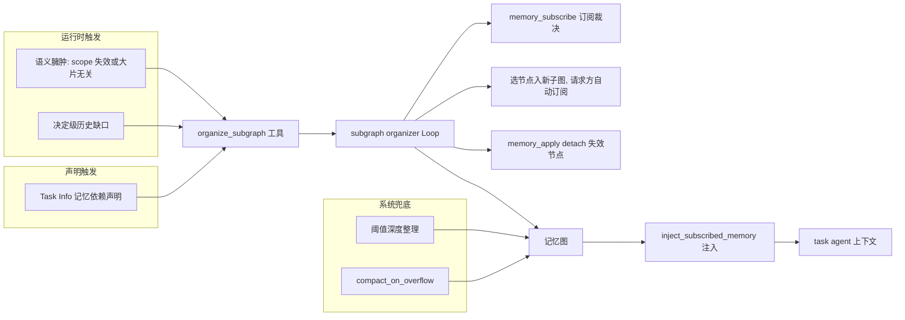
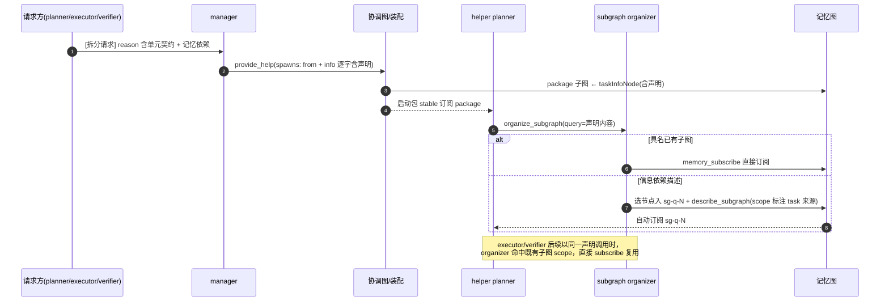

# organize_subgraph 适时调用与 Task Info 记忆依赖声明设计

## 文档信息

| 项目 | 内容 |
| --- | --- |
| 版本/状态 | v0.2 / 已实现（待真实模型成本验收） |
| 日期 | 2026-08-31 |
| 责任角色 | agent 起草，人类评审 |
| 目标读者 | Threadmill 提示词与协调图维护者、benchmark 评估者 |
| 形成方式 | 需求驱动设计（现状事实由代码逆向核对） |
| 事实基准 | 工作区 `threadmill.yaml`、`internal/agent`、`internal/coordination`、`internal/manager` 当前代码 |

### 修订记录

| 版本 | 日期 | 修订人/责任角色 | 修订内容 | 状态 |
| --- | --- | --- | --- | --- |
| v0.1 | 2026-08-31 | agent | 初稿：三触发工具说明 + Task Info 记忆依赖声明 | 草案 |
| v0.2 | 2026-09-01 | agent | 对齐结构化 help 契约、三角色 help 与已落地提示词；回填静态测试 | 已实现 |

## 1. 背景与范围

### 1.1 背景和目标

Threadmill 的记忆图（Memory Graph）由节点与子图组成，task 角色的上下文里只注入其订阅子图的节点投影（`internal/agent/input.go:232` `formatMemory`）。organizer（subgraph-organizer）是唯一能做召回选择与订阅裁决的角色，写权限集中在它身上（`internal/agent/factory.go:86-90`）。

当前设计刻意不做 eager recall：task 启动包只含 Task Info，organizer 在角色显式请求前绝不运行，由测试 `TestManagerBuildsTaskPackageFromTaskInfoWithoutEagerRecall` 锁死。因此“何时调用 organizer”由工具说明和角色提示词守门。下面两个缺口已经由本设计落地：

1. **触发语义不完整**。`organize_subgraph` 的说明（`threadmill.yaml:18-19`）只覆盖"缺记忆"方向，且把 exclude 定义为 query 的附属负向过滤——纯粹为瘦身而调用在语义上不成立。四个角色共享的同一句说明（`threadmill.yaml:234, 296, 402, 471`）只讲参数语义和禁令，没有给出任何一方的正当触发条件。同时 `NodesInSubgraphs` 不按 status 过滤（`docs/model-context-blocks.md`），superseded/outdated 节点每次照样注入，"上下文里记忆节点臃肿、低效"是结构性存在的场景，却没有对应的调用语义。
2. **先验依赖没有声明通道**。manager 编排 root、请求方拆分 helper 时，往往已经知道该任务依赖哪些前序结论或哪张已有子图，但 Task Info 没有约定如何携带这类记忆依赖，task agent 只能靠运行时偶遇缺口，或者被"开工不摸底"的纪律压制而不敢取回。

本设计的目标：

- 让 `organize_subgraph` 的调用时机对 agent 可判断、可审计：声明依赖、运行时缺口、运行时退订三个正当触发，均有可观察条件与成本契约；
- 让 Task Info 能携带记忆依赖声明，编写责任明确：help 路径由请求方编写、manager 逐字转录；manager 直接编排的 root 由 manager 编写；
- task agent 开工时依据声明调用一次 organizer 完成初始召回，与"不做 eager recall"的架构不变量兼容——调用仍是 agent 发起的，只是被声明确定性驱动。

### 1.2 范围

- 范围内：
  - `threadmill.yaml` 中 `organize_subgraph` 工具说明、四个角色与 organizer 的系统提示词、`prompts.organize_query`、`coordination_requestHelp` / `coordination_orchestrate` 工具说明的改写；
  - Task Info 记忆依赖声明的文本约定、编写责任与审计规则；
  - 声明驱动的开工召回流程与去重约定；
  - `internal/agent/factory.go:804-810` Go fallback 文案同步。
- 范围外（列出但不在本设计内决策）：
  - 协调图 `Task` 结构体增加结构化字段（schema 变更需按 `docs/architecture-governance.md` 另行审批）；
  - `NodesInSubgraphs` 按 status 过滤注入（文档写明的现状设计选择，属治理层决策）；
  - 给 task 角色启用 `remind_drop_context_on_pressure` hook 与 `memory_drop_from_context` 工具（基础设施存在于 `internal/agent/drop_context.go:137`，默认 yaml 未接线）；
  - organizer 长期历史的 compact（已知开放问题，`docs/model-context-blocks.md:405`）。
- 外部依赖：无新依赖；全部改动落在 yaml 提示词与约定文本。

### 1.3 约束与待确认项

| 类型 | 内容 | 影响 |
| --- | --- | --- |
| 已确认约束 | 静态提示词总预算 36,500 UTF-8 bytes，8 份 prompt 结构受 `TestRepositorySystemPromptsUseTopicalSections` 约束（`internal/provider/config_test.go:695-739`） | 新增文案必须在预算内，角色 prompt 保持分节结构 |
| 已确认约束 | 启动包不做 eager recall（`internal/manager/manager_test.go:815`） | 声明驱动的召回必须走 agent 显式调用，不能在装配期由系统代调 |
| 已确认约束 | `task-info-*` 节点属保护层，开始后不可改写（`internal/tool/memory_apply.go:20,263-267`；已开始节点 info 不可改，`threadmill.yaml:51`） | 声明写错不能改图补救，只能靠运行时缺口触发补偿 |
| 待确认 | 声明格式维持纯文本约定，还是未来升级为 Task 结构化字段 | 影响协调图 schema 与持久化兼容；见第 10 节 |

## 2. 需求与质量属性摘要

| 编号 | 需求或场景 | 验收标准 | 状态/证据 |
| --- | --- | --- | --- |
| FR-01 | `organize_subgraph` 说明与角色提示词给出三个正当触发（声明依赖、运行时缺口、运行时退订）及成本契约 | 说明文本含三触发与“0 结果不重查”语义；provider 契约测试通过 | 已实现 |
| FR-02 | Task Info 编写责任：help 路径由请求方编写、manager 逐字转录；root 由 manager 编写 | requestHelp / provide_help 说明与 planner 输出格式含该规则 | 已实现 |
| FR-03 | Task Info 可声明记忆依赖：具名订阅已有子图，或描述信息依赖 | 声明格式写入工具和角色提示；声明随 Task Info 进入受保护启动包 | 已实现 |
| FR-04 | task agent 开工时按声明调用一次 organizer 完成初始召回；同 task 后续角色复用结果 | 流程见 4.1；复用由 organizer 订阅裁决实现 | 已实现，待真实成本验收 |
| FR-05 | 退订路径提供三档粒度：不动 / detach 失效节点 / 取消整图动态订阅 | organizer 提示词含 detach 档，`memory_apply` 支持原子 detach | 已实现 |
| NFR-01 | organizer 调用成本可观测、可回归 | `memory_organizer_runs/tokens` 指标（`internal/manager/manager.go:653-660`）在 benchmark 前后对比，无数量级恶化 | 已确认指标存在；阈值为建议目标 |
| NFR-02 | 提示词改动不突破静态预算与结构约束 | `go test ./internal/provider -count=1` 通过 | 2026-09-01 已验证 |

## 3. 总体架构

下图目的：给出"谁有权在什么时机触发 organizer"的全貌，区分 agent 主动触发与系统兜底，防止职责重叠。



关键结论：

- **agent 只发起自己才能判断的事**。机械窗口压力由 `compact_on_overflow` 自动处理（`threadmill.yaml` 各角色 hooks），图本身的脏乱由 compact 后阈值深度整理兜底（`internal/agent/curation.go:107-110`，默认 64 节点 / 32 新增）。语义层面的"我需要什么"和"这段记忆对我的职责失效了"只有 agent 知道，这是 `organize_subgraph` 存在的理由。
- **声明触发不违反 no-eager-recall**。装配期仍只注入 Task Info（`internal/coordination/assemble.go:100-137`）；召回由 task agent 第一个回合显式发起，区别只是"发起依据从偶遇缺口变成了 Task Info 里的确定声明"。
- **三档瘦身粒度**：整图失效 → `memory_subscribe` 取消动态订阅；少数节点失效而子图整体仍适用 → `memory_apply` detach；只是暂时挡路 → 不动，交给 compact。任务启动包与固定订阅结构上不可取消（`threadmill.yaml:114`）。

| 模块 | 职责 | 拥有的数据 | 依赖 |
| --- | --- | --- | --- |
| 工具说明（`threadmill.yaml:18-19`） | 三触发条件、成本契约、空结果语义 | 随工具 schema 常驻各角色上下文 | 无 |
| 角色系统提示词 | 角色专属触发纪律与 Task Info 编写规则 | 各角色 | 工具说明 |
| Task Info 声明约定 | 记忆依赖的文本格式与编写责任 | 随 `task-info-*` 保护节点进入启动包 | 协调图 Task.Info（`internal/coordination/graph.go:84-96`） |
| organizer 提示词 | 声明识别、具名子图直接订阅、复用裁决、detach 档位 | 记忆图 | `prompts.organize_query` |
| manager 审计 | 声明与 admission_reason 相称性、逐字转录 | 协调图与 manager 记忆 | requestHelp / provide_help 协议 |

## 4. 核心流程

### 4.1 help 路径的声明驱动召回

- 前置条件：请求方（planner/executor/verifier）判定任务需拆分，且知道 helper 需要某段先验上下文。
- 主路径：请求方在 requestHelp 的单元契约中编写含记忆依赖的 info → manager 审计并逐字转录进 `spawn.Info` → 装配时 Task Info（含声明）投影为受保护节点进入 helper 启动包 → helper planner 第一回合按声明调用 organizer → organizer 具名订阅或选节点建子图，请求方自动订阅 → 同 task 的 executor/verifier 看到同一声明，各自调用时 organizer 复用既有子图直接订阅。
- 失败路径：声明指向不存在的子图 → `memory_subscribe` 逐项跳过并回报（`threadmill.yaml:114`），agent 转为运行时缺口处理或工作区核对；查询意图 0 命中 → 不重查，按无依赖继续。
- 一致性边界：声明随 `task-info-*` 节点进入保护层，task 开始后不可改；声明写错只能由 agent 运行时补偿。
- 权限与审计：manager 逐字转录不改写（`threadmill.yaml:247`），审计声明与 admission_reason 相称。



### 4.2 运行时缺口与退订调用

- 触发者：任一持有 `organize_subgraph` 的角色（manager/planner/executor/verifier）。
- 缺口路径：核对顺序为 Task Info → 已注入订阅记忆 → 当前工作区；三者都核对后仍缺一个**会改变下一步行动**的历史事实才调用，query 一次写全全部必要条件。返回 0 节点即"记忆图没有"，改去工作区核对，不换措辞重查。
- 退订路径：注入记忆里出现大片与当前职责无关、或其 scope 确已失效（契约被取代、模块重写、假设已裁决）的内容时，以 exclude 声明范围调用；organizer 按第 3 节三档粒度裁决。exclude 导致的退订是持久的，写错等于静默丢失知识，所以只写确已失效的范围。
- 反向护栏：无声明、无决定级缺口时不为摸底调用（开工摸底由 `internal/manager/manager_test.go:815` 的设计意图禁止）；不用 organize_subgraph 轮询 task 进度（已有规则，`threadmill.yaml:232`）。

## 5. 数据设计

无 schema 变更。Task Info 仍为纯文本字符串，声明是其中的约定小节，随 `taskInfoNode`（`internal/coordination/stores.go:98-107`）原样投影进受保护启动包。

声明格式约定（Task Info 末尾，可缺省；缺省即无声明、开工不调用）：

```text
记忆依赖：
- 订阅：<已有子图 ID 或名称>；用途：<哪项契约或决定需要它>
- 查询：<需要的历史信息问题>；用途：<哪项契约或决定需要它>
```

编写规则：

- 每条必须标用途；只写作者自己确知存在的内容（manager 依据其 `system-manager` 子图中的前序 task 报告；请求方依据自己的订阅记忆）。"订阅全部相关子图"不合法。
- 能直接写进 Task Info 正文的事实写正文，不写成依赖——声明是给"正文装不下的历史上下文"用的。
- root 由 manager 编写；helper 由请求方编写、manager 逐字转录。helper 看不到 manager 对话与请求方的订阅记忆，缺失内容无法自行补齐（`threadmill.yaml:68`），所以请求方必须在声明或正文里给足。

## 6. API 与接口设计

本设计的“接口”是工具说明与提示词文本。以下是已落地契约的可审计摘录；运行时以 `threadmill.yaml` 为准。

### 6.1 `organize_subgraph` 工具说明（替换 `threadmill.yaml:18-19`，同步 `internal/agent/factory.go:804-810` fallback）

```yaml
  organize_subgraph:
    description: |-
      按 query 召回记忆，结果作为新子图返回并自动订阅；整理 Agent 也可能据 exclude 取消你的动态订阅。三个正当触发：
      - 声明依赖：Task Info 含"记忆依赖"声明时，开工第一个回合调用一次，query 逐字携带声明内容；这是执行声明，不是摸底。
      - 运行时缺口：先核对 Task Info、已注入记忆和当前工作区，仍缺一个会改变下一步行动的历史事实。
      - 运行时退订：注入记忆里有大片与当前职责无关、或其适用范围确已失效的内容，用 exclude 声明范围。
      每次调用是一次完整的整理 Loop，成本高：query 一次写全全部必要条件；返回 0 个节点说明记忆图没有，改去工作区核对，不换措辞重查；无声明且无决定级缺口时不调用。exclude 的退订是持久的，只写确已失效的范围。
```

### 6.2 角色提示词改动

- 四个角色共享句（`threadmill.yaml:234, 296, 402, 471`）缩减为：`organize_subgraph 的触发与成本以其工具说明为准；exclude 导致的退订是持久的，只写确已失效的范围。`
- planner：保留 `threadmill.yaml:294`"只有改变计划的历史缺口才调用"；调查节补"Task Info 含记忆依赖声明时，第一回合先按声明调用一次，再开始调查"。
- executor：开工节（`threadmill.yaml:398-404`）补"若 Task Info 含记忆依赖声明，在处理 ready frontier 之后、调查保留实现面之前调用一次"。
- verifier：建验收表节（`threadmill.yaml:465-471`）补"若 Task Info 含记忆依赖声明，先按声明调用一次再定稿验收表"。
- manager：保留 `threadmill.yaml:232` 反轮询；建 root 节补编写规则（第 5 节）。
- planner 输出格式的 helper 字段清单（`threadmill.yaml:368`）增加"记忆依赖（如有）"；`coordination_requestHelp` 说明（`threadmill.yaml:87`）的自包含清单与 `coordination_orchestrate` provide_help 的逐字保留清单（`threadmill.yaml:68`）同步增加"记忆依赖"。

### 6.3 organizer 提示词改动（`threadmill.yaml:524-577`）

- query 模式节补：请求 query 逐字来自 Task Info"记忆依赖"声明时，具名已有子图直接 `memory_subscribe`，不重新选择；信息依赖命中既有子图 scope（含本 task 先前角色已整理的子图）时同样直接订阅复用，目标子图的 `describe_subgraph` scope 写明"为 task-N 声明的记忆依赖整理"。
- 订阅节（`threadmill.yaml:553-557`）补第三档：exclude 范围内只是少数节点失效而子图整体仍适用时，用 `memory_apply` 的 detach 把这些节点移出订阅子图，不取消整图订阅。
- `prompts.organize_query`（`threadmill.yaml:202-209`）补一句声明识别规则，与上面保持一致。

## 7. 非功能设计

| 质量属性 | 设计措施 | 验证方式 | 状态 |
| --- | --- | --- | --- |
| 成本 | 说明内写成本契约（一次写全、0 结果不重查）；organizer 渐进展开；同 task 三角色经 scope 匹配复用订阅 | benchmark 对比 `memory_organizer_runs/tokens/p50/p95` | 机制已实现；真实模型成本待验收 |
| 可观测性 | 每次 organize 调用有 `MemoryStart/MemoryOrganized` 事件与隐藏成本归集 | 事件流检查声明触发是否恰好一次/角色 | 已确认机制存在 |
| 兼容性 | 无 schema 变更；声明缺省等价于现状行为 | 现有测试套件 | 已确认（设计层面） |

## 8. 部署、发布与迁移

纯提示词与约定变更，随 `threadmill.yaml` 经 `defaults.go:5-6` 内嵌发布。无数据迁移：旧任务无声明小节，行为等同现状。回滚即还原 yaml。

## 9. 测试与验收

| 风险/场景 | 测试层级 | 验证点 | 证据状态/执行结果 |
| --- | --- | --- | --- |
| 提示词结构回潮、预算超标 | 静态测试 | `go test ./internal/provider -count=1`（结构与总字节预算） | 2026-09-01 通过 |
| 声明触发被滥用为开工摸底 | 既有设计测试 | `go test ./internal/manager -count=1` 中 no-eager-recall 保持绿：装配产物不因声明而变化 | 2026-09-01 通过 |
| 三触发语义生效、成本收敛 | benchmark 对比 | `memory_organizer_*` 指标前后对比；抽检事件流确认调用落在三触发内 | 待实施后运行 |

## 10. 决策、风险与待确认项

| 类型 | 内容 | 理由/影响 | 责任角色或复审条件 |
| --- | --- | --- | --- |
| 决策 | 声明用纯文本约定，不改 Task schema | 零迁移；格式漂移靠工具契约、manager 审计与 organizer 容错 | 若 benchmark 显示声明解析失败率高，复审结构化字段 |
| 决策 | 同 task 三角色复用靠 organizer scope 匹配，而非装配期记录子图 ID | 不改装配代码；代价是每角色至多一次 organizer 调用的固定成本 | benchmark 显示重复调用成本显著时复审 |
| 风险 | 声明被滥用为"全量订阅"，抵消 context_offload 的拆分收益 | manager 审计相称性 + organizer 选择纪律双重守门 | manager 提示词审计节 |
| 风险 | exclude 退订写错导致静默知识丢失 | 退订持久性警告写入说明与共享句；固定订阅结构不可取消兜底 | 各角色提示词 |
| 风险 | 提示词膨胀突破静态预算 | 共享句缩减对冲新增触发句 | `internal/provider/config_test.go` |
| 待确认 | `formatMemory` 是否加计数头部（如 `记忆（stable N 条 / 订阅 M 条）：`）让臃肿可观察 | 无计数则"臃肿"只是体感，退订触发不可验证；改动小但动 C3 块形状 | 人类评审决定，可独立实施 |
| 待确认 | verifier 的声明范围是否应受限，避免生产者侧记忆污染独立验收 | verifier 把报告当线索而非 oracle（`threadmill.yaml:462, 487`），声明过宽会削弱该边界 | 人类评审决定 |
| 待确认 | 是否给 task 角色启用 `remind_drop_context_on_pressure` + `memory_drop_from_context`，并写明与 exclude 退订的临时/持久分工 | 基础设施已存在（`internal/agent/drop_context.go:137-163`）但默认未接线 | 独立决策，不阻塞本设计 |

## 11. 追踪矩阵

| 需求/用例 | 模块 | 数据/API | 验证 |
| --- | --- | --- | --- |
| FR-01 三触发说明 | `threadmill.yaml:18-19` + 6.1 文案 | `organize_subgraph` description | `go test ./internal/provider/...`；事件流抽检 |
| FR-02 编写责任 | manager / requestHelp / provide_help 提示词（6.2） | Task.Info 文本 | 提示词评审；benchmark 抽检 helper 启动包 |
| FR-03 声明格式 | 第 5 节约定 | `task-info-*` 节点 | 装配测试可断言声明文本随节点投影 |
| FR-04 声明驱动召回 | 角色提示词 + organizer 提示词（6.2/6.3） | organize_subgraph → memory_subscribe / 新子图 | 4.1 流程；`memory_organizer_*` 指标 |
| FR-05 三档退订 | organizer 订阅节（6.3） | memory_subscribe / memory_apply detach | benchmark 抽检订阅裁决理由 |

## 12. 设计依据

| 结论 | 状态 | 证据位置 | 备注 |
| --- | --- | --- | --- |
| 无独立 query 工具，召回等价物是 `organize_subgraph`（主参数 query） | 已确认 | `internal/agent/factory.go:19, 804-810` | yaml 说明覆盖 Go fallback |
| 启动包只含 Task Info、不做 eager recall 是锁死设计 | 已确认 | `internal/manager/manager_test.go:815-890` | 本设计与其兼容 |
| 注入记忆块只有 kind/status/statement，无 ID、子图归属与计数 | 已确认 | `internal/agent/input.go:232-248` | 退订触发缺可观察性的根因 |
| 注入不按 status 过滤 | 已确认 | `docs/model-context-blocks.md`（NodesInSubgraphs 行为） | 臃肿的结构性来源 |
| requestHelp 以结构化 `units[]` 固定 id/goal/admission/输入/写入/依赖/交付，扩展契约与记忆依赖仍在 reason | 已确认 | `internal/coordination/help.go` | manager 可机校验 frontier，语义细节逐字转录 |
| provide_help 校验真实 request、合法 source、依赖和图不变量，并保留 info 文本 | 已确认 | `internal/coordination/help.go` | manager 仍负责语义审计，不靠 schema 猜目标 |
| 三角色 stable 订阅 task package 子图 | 已确认 | `internal/coordination/assemble.go:135-137` | 声明经 Task Info 到达全部角色 |
| memory_subscribe 仅服务 organize 查询、查询收尾统一生效、无效 ID 逐项跳过 | 已确认 | `threadmill.yaml:113-114`；`internal/agent/subscription.go:59-127` | 声明指向失效子图的失败路径依据 |
| memory_apply 支持 detach、保护层不可写 | 已确认 | `threadmill.yaml:115-123`；`internal/tool/memory_apply.go:20,263-267` | 第三档粒度的机制基础 |
| organizer 双模式与写权限集中 | 已确认 | `threadmill.yaml:524-577`；`internal/agent/factory.go:86-90` | — |
| 阈值深度整理与 compact 兜底存在 | 已确认 | `internal/agent/curation.go:20-23, 107-110`；`threadmill.yaml:13-16` | 系统/agent 分工边界 |
| drop 提醒与工具存在但默认未给 task 角色启用 | 已确认 | `internal/agent/drop_context.go:11, 137-163`；`threadmill.yaml` 各角色 hooks 列表 | 列为待确认项 |
| organizer 单次调用成本高 | 已确认 | `docs/agent-prompts-after.md:211`（139,748 token 实例） | 成本契约的依据 |
