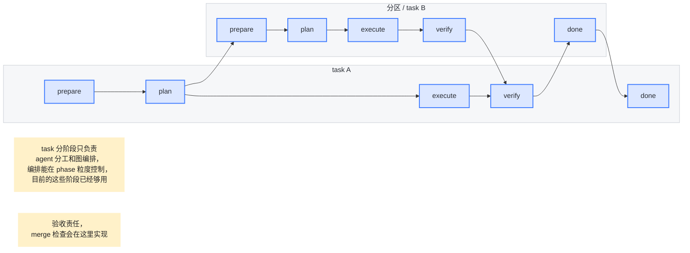

# Task Graph 设计（简化版）

版本：v0.4
状态：Draft

---

## 1. 定位

Task Graph 只负责两件事：

1. **task 分阶段**：用固定 phase 表达 agent 分工和 phase gate。
2. **图编排**：在 task 或 phase 粒度上表达跨 task 的依赖、阻塞和验收关系。

Task Graph 不负责描述 agent 的内部执行细节，也不把运行时过程拆成过多状态。当前阶段粒度已经够用：

```text
prepare -> plan -> execute -> verify -> done
```

---

## 2. 核心规则

- `task` 是可编排的工作单元，不区分 root task / child task。
- 每个 task 使用同一套 phase：`prepare`、`plan`、`execute`、`verify`、`done`。
- 跨 task 编排可以挂在 phase 粒度，例如 `A.plan -> B.prepare`、`B.verify -> A.verify`。
- phase 的主要作用是划分 agent 责任和提供图编排锚点，不承载更细的 runtime 状态机。
- `verify` 承担验收责任；merge 检查也在 verify gate 中实现。
- `done` 只表示该 task 已经通过验收，并且相关编排条件已经满足。

---

## 3. Requirement 到实时编排链路

所有新增需求都先通过 Agent Runtime 进入 Task Manager Agent，再由它实时更新 Task Graph：

```text
Human UI / planner / executor / verifier
  -> requirement
  -> Agent Runtime(role=task_manager, tool=graph_write)
  -> Task Manager Agent（intake + 校验 + 去重/关联 + 依赖编排）
  -> Task Graph（task / phase endpoint / edge / blocker）
  -> Scheduler 读取新的可运行 phase
```

简要逻辑：

1. 人类或 agent 只提交 `requirement`，不直接创建 task、edge 或 blocker。
2. Task Manager Agent 读取当前全局 task graph，判断这个 requirement 是新 task、已有 task 的补充、重复/重叠，还是阻塞/依赖关系。
3. 如果需要新增工作，Task Manager Agent 创建 task，并给它挂上标准 phase：`prepare -> plan -> execute -> verify -> done`。
4. 如果 requirement 来自某个运行中的 phase，Task Manager Agent 可以把依赖挂到具体 phase endpoint，例如 `current.verify -> new_task.done`。
5. Task Graph 更新后，Scheduler 只需要读取新的 phase 依赖关系，选择下一批可运行 phase。

Task Manager Agent 只负责任务契约和图编排：定义“做什么、为什么、怎样算完成”，不生成“怎么做”的执行方案；具体 how 仍属于 `plan` 阶段。它本身也是经 Agent Runtime 启动的系统 agent，只是被授予 graph_read / graph_write capability。

---

### 3.1 Scheduler 视角的 Node / Edge 抽象

Task Graph 的持久层仍然只保存 task、phase endpoint 和跨 phase 关系；Scheduler 在读取 Task Graph 后，可以把一批可运行 phase **物化**成更通用的运行图。这个图模型属于 Task Graph / Scheduler 边界，不属于 Agent Runtime。Agent Runtime 只接收已经物化出的单次 invocation，包括系统 agent invocation。

```go
type NodeSpec struct {
	// Active 根据入边控制信号决定 node 是否执行。
	Active Active `json:"active"`
	// Runtime 是 node 的统一执行体引用。
	Runtime RuntimeRef `json:"runtime"`
}

type EdgeSpec struct {
	// From 是源端口。
	From PortRef `json:"from"`
	// To 是目标端口。
	To PortRef `json:"to"`
	// Data 描述 Message 数据传输规则；nil 表示不传递数据。
	Data *DataTransfer `json:"data,omitempty"`
	// Signal 描述控制信号规则；nil 表示该边信号默认为 true。
	Signal *SignalEmit `json:"signal,omitempty"`
}
```

边界划分：

```text
Task Manager Agent 写入：经 Agent Runtime 授权后写 task / phase endpoint / dependency edge / blocker
Scheduler 读取 Task Graph：把 ready phase 转成 NodeSpec / EdgeSpec，并计算 active / signal
Graph runner 调用 RuntimeRef：把某个 node 变成一次 LLM / Tool / Subgraph 调用
Agent Runtime 执行所有 agent invocation：包括 task_manager、ctx_manager、planner、executor、verifier；管理输入输出、动作、权限、事件、artifact，不拥有图拓扑
Runtime 过程事件：通过 ctx.emit(...) 进入 Event Log / Artifact Store
```

控制流拆成两级：

1. **Edge.signal**：每条入边产生一个 `EdgeSignalValue`，默认 `true`。
2. **Node.active**：目标 Node 收到 `[]EdgeSignalValue` 后合成最终布尔值；只有返回 `true` 才调用 `runtime`。

数据流和控制流分离：

```text
Edge.data   负责传递 Message
Edge.signal 负责产生控制真值
Node.active 负责合并多条入边的控制真值
NodeRuntime 只处理 []Message -> []Message
```

统一执行体可以表达为：

```go
type NodeRuntime interface {
	// Invoke 执行 node；输入输出统一使用 Message 列表表达。
	Invoke(ctx context.Context, run RunContext, input []Message) ([]Message, error)
	// Kind 返回 node 类型，供 Graph Runner 做调度和观测。
	Kind() NodeKind
}

type NodeKind string

const (
	// NodeKindLLM 表示 LLM 节点，可通过 RuntimeRef 调用 Agent Runtime。
	NodeKindLLM NodeKind = "llm"
	// NodeKindTool 表示 Tool 节点，由工具注册表执行。
	NodeKindTool NodeKind = "tool"
	// NodeKindSubgraph 表示子图节点，由 Graph Runner 递归执行。
	NodeKindSubgraph NodeKind = "subgraph"
)
```

但这里的 `NodeRuntime` 是图节点执行体的接口，不等同于 Agent Runtime 模块。`Llm` 节点可以通过 `RuntimeRef` 调用 Agent Runtime；当目标角色是 task_manager 或 ctx_manager 时，也仍然通过 Agent Runtime 生成受控 invocation；`Tool` 节点可以调用工具注册表；`Subgraph` 节点可以递归执行子图。

Tool Node 分成两类：

```go
type ToolNodeRuntime struct {
	// Mode 区分固定工具节点和分发工具节点。
	Mode ToolNodeMode `json:"mode"`
	// ToolName 仅在 fixed 模式下使用，表示 graph 拓扑里已经编排好的工具名。
	ToolName ToolName `json:"tool_name,omitempty"`
	// Registry 仅在 dispatch 模式下使用，按 function_tool_call.tool_name 查找工具。
	Registry ToolRegistryRef `json:"registry,omitempty"`
	// Execution 仅在 dispatch 模式下使用，控制多个 tool_call 的并行执行方式。
	Execution ToolExecutionPolicy `json:"execution,omitempty"`
}

type ToolNodeMode string

const (
	// ToolNodeModeFixed 表示拓扑已固定具体工具。
	ToolNodeModeFixed ToolNodeMode = "fixed"
	// ToolNodeModeDispatch 表示按模型输出的 tool_name 动态分发。
	ToolNodeModeDispatch ToolNodeMode = "dispatch"
)
```

含义：

```text
- Fixed Tool Node：拓扑已经确定调用哪个 tool；是否执行由 Edge.signal / Node.active 决定。
- Dispatch Tool Node：解析 LLM 输出里的 function_tool_call，按 tool_name 分发；多个 tool_call 可以并行执行，但结果按原始 tool_call 顺序输出。
- LLM 每轮可见哪些 tool schema 由 LLM node 的配置决定；Dispatch Tool Node 只执行已经产生的 tool call。
```

因此，复杂控制流不需要把 phase 继续拆成更多状态；它可以由边信号和 node active 表达。例如：

```text
B.verify --signal: passed--> A.verify
B.verify --data: verification_summary--> A.verify
A.verify.active = all(required signals are true)
```

---
## 4. Phase 职责

| Phase | 职责 |
| --- | --- |
| `prepare` | 准备 task contract、上下文、工作区等执行前条件。 |
| `plan` | 生成方案、拆分需要外部 task 支持的工作，并建立后续编排关系。 |
| `execute` | 执行实现、研究、文档或其他交付动作。 |
| `verify` | 验收结果、检查依赖 task 的交付，并执行 merge 检查。 |
| `done` | 标记 task 已完成。 |

---

## 5. 编排示意



---

## 6. 图关系含义

上图表达的是一种典型分区任务编排：

1. `A_plan --> B_prepare`：task A 在 plan 阶段发现需要分区 / task B，于是触发 B 的准备阶段。
2. `B_verify --> A_verify`：B 的交付先完成自身 verify，再作为 A verify 的输入。
3. `A_verify --> B_done`：A 的 verify 负责总体验收和 merge 检查；通过后，B 才能标记 done。
4. `B_done --> A_done`：A 依赖 B 的完成结果，最后进入 done。

---

## 7. 保留的不变量

```text
1. task graph 以 task 和 phase 为编排粒度。
2. phase 用于 agent 分工和图编排，不继续细拆 runtime 状态。
3. 跨 task 依赖可以指向任意 phase endpoint。
4. verify 是验收 gate；merge 检查在 verify gate 实现。
5. task 未通过 verify 不得进入 done。
```
