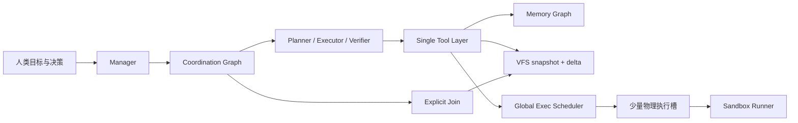
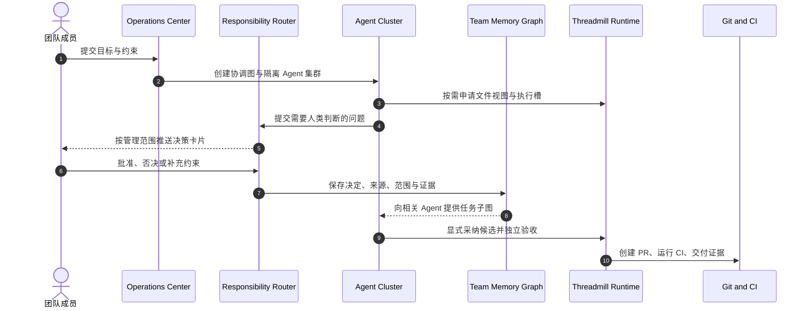
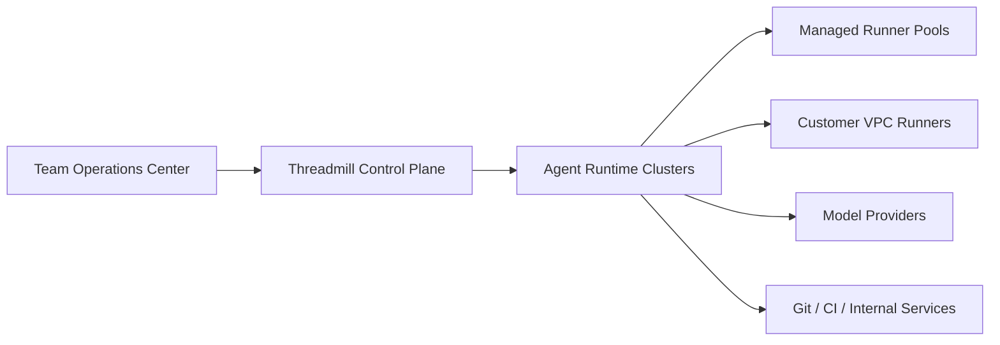

# Threadmill：面向团队的云端 Agent OS

> Threadmill 让数百个 Agent 保持彼此隔离的任务、记忆和文件状态，同时只让真正需要执行命令的少量 Agent 占用物理环境；在此之上，人类按管理范围协助整个 Agent 集群，而不是逐个操作 Agent。

| 项目 | 内容 |
| --- | --- |
| 文档状态 | 产品与架构概要 v0.2 |
| 日期 | 2026-08-26 |
| 当前底座 | 单机 Agent OS：协调图、Memory Graph、VFS、Sandbox、Join、Verifier |
| 目标产品 | B2B 中心化云端 Agent 协作开发平台 |

## 1. 性能与成本优势

### 1.1 单机承载数百个隔离 Agent

在 8 CPU、15 GiB RAM、ext4、Linux OverlayFS 的固定运行时压测中，主对比使用 Pi 的**原生运行路径，不额外挂 OverlayFS**：

| 指标 | Threadmill | Pi 原生路径（无 OverlayFS） | Threadmill 优势 |
| --- | ---: | ---: | ---: |
| 建议稳定活跃宽度 | **384 Agent** | 384 Agent 已饱和 | **稳定运行** |
| 实测有效峰值 | **448 Agent** | 未形成有效峰值 | **明显领先** |
| 384 Agent 命令吞吐 | **761 commands/s** | 约 324 commands/s | **约 2.35 倍** |
| 384 Agent 总耗时 | **15.71 s** | 37.09 s | **降低 58%** |
| 384 Agent 文件写 P95 | **98 ms** | 1.52–1.54 s | **约低 15.5 倍** |

这意味着 Threadmill 可以把团队级 Agent 并发集中到少量机器上，而不必让每个 Agent 常驻一个 CLI 进程、一份完整项目目录和一套独立执行资源。

### 1.2 文件隔离数据量降低约 99.5%

在同一压测中，385 个隔离文件视图如果使用完整目录复制，需要约 4.73 GB 基线文件有效载荷；Threadmill 只保存一份 12.288 MB 基线和约 10.2 MB 逻辑增量，总计约 22.5 MB：

| 文件状态模型 | 数据量 |
| --- | ---: |
| 385 份完整私有目录 | 约 4.73 GB |
| Threadmill baseline + delta | 约 22.5 MB |
| 降低幅度 | **99.5%，约 210 倍** |

Agent 可以拥有完整独立的文件视图，但系统不需要为每个 Agent 复制整个项目。

这里的 99.5% 是相对“每个 Agent 完整复制目录”的数据层优势；主性能对比使用 Pi 原生路径，Threadmill 同时提供了 Pi 原生路径没有的隔离工作区、协调图和全局调度。外置 OverlayFS 只作为额外的工程化安全对照，数据见完整性能报告。

### 1.3 500 个 Agent 的环境成本模型

以 2 vCPU、4 GiB 的云端开发环境计算，E2B 与 Daytona 的公开价格约为 `$0.1656/环境小时`。如果500个 Agent 各自占用一个环境，环境成本约为 `$82.80/小时`。

Threadmill 当前压测使用384个逻辑 Agent 对64个物理命令槽。按相同比例扩展到500个逻辑 Agent，只需要约83个执行槽：

| 运行模型 | 环境成本/小时 | 每月成本¹ |
| --- | ---: | ---: |
| 500 Agent × 500 环境 | `$82.80` | `$14,573` |
| 500 Agent × 83 Threadmill 执行槽 | `$13.80` | `$2,429` |
| 节省 | **83.3%** | **约 `$12,144`** |

¹ 按每天8小时、每月22天估算，不含模型 Token。

综合模型 Token、环境、人类协作和返工后，目标经济指标是：

- 环境执行成本降低 **50%–85%**。
- 平台总 COGS 降低 **5%–20%**。
- 每个被接受变更的人类主动时间降低 **30%–60%**。
- 每个被接受变更的综合成本降低 **35%–50%**。

### 1.4 Memory Graph 提高协作效率

Threadmill 的记忆不是不断增长的聊天记录，而是可 fork、合入和按任务取用的知识图：

| 普通会话记忆 | Threadmill Memory Graph |
| --- | --- |
| 信息按时间堆叠 | 信息按目标、任务、来源和关系组织 |
| 要求、事实和猜测混在一起 | 区分 directive、fact、hypothesis |
| 新结论覆盖旧上下文 | 保留 accepted、disputed、superseded、outdated 状态 |
| 子 Agent 重复读取全部历史 | 每个 Agent 只取得当前任务相关子图 |
| 人类决定散落在会话中 | 决定可带来源、适用范围和证据进入后续任务 |

它直接改善多人多 Agent 协作：原始要求不会在多轮修复中丢失，已经调查过的事实不必重复消耗 Token，互相冲突的结论不会被静默覆盖，人类的一次决定可以成为一组 Agent 的共同约束。

## 2. 性能优势从何而来

Threadmill 的性能并非来自某一个更快的工具，而是来自协调、文件、执行和记忆四层共享同一个 Agent 生命周期。



### 2.1 协调图定义资源生命周期

Coordination Graph 不只是任务列表。Spawn、角色、Join 和终态共同定义：

- 子 Agent 从哪个文件和记忆状态 fork。
- 哪些角色使用一次性工作区，哪些状态需要持久化。
- 哪些候选等待集成，由谁负责采纳。
- 哪个时点可以安全释放目录、进程和环境。

因为资源层知道任务语义，所以不需要为每个 Agent 永久保留物理环境。

### 2.2 snapshot + delta 取代完整工作区复制

VFS Fork 只记录父快照与子增量。Agent 读取和编辑的是自己的逻辑视图；只有真正运行构建、测试或脚本时，系统才按需创建 live workspace。

```text
传统模式：N 个 Agent → N 份项目目录 → N 个运行环境

Threadmill：N 个 Agent → 1 份基线 + N 份小增量
                         ↓
                    K 个执行槽，K << N
```

纯规划、等待模型或等待人类的 Agent 不需要占用完整执行环境。

### 2.3 单一 Tool Layer 强制环境绑定

Agent 不能绕过工具层直接读取宿主文件、修改项目或启动命令。每次工具调用都绑定环境 ID，VFS、Memory、Sandbox、调度和观测看到的是同一个任务身份。

这一边界让系统可以安全地：

- 共享不可变基线。
- 隔离每个 Agent 的可写增量。
- 把命令统一排入全局资源池。
- 准确回收已经结束的环境。
- 把 Token、文件、命令和验收成本归属到同一任务。

### 2.4 全局调度取代一 Agent 一机器

Agent 生命周期中的大部分时间用于模型推理、读取、等待依赖或等待人类。Threadmill 只在命令阶段申请物理槽，并统一进行普通/重命令分类、内存准入、超时、取消和进程回收。

384 Agent 压测中的命令占空比约为11.4%，平均命令需求约44个槽；64个全局槽即可吸收真实轨迹中的突发。这是逻辑宽度可以远大于物理宽度的直接原因。

### 2.5 Memory Graph 与任务一起 fork 和汇合

文件只能说明“代码现在是什么”，Memory Graph 还保存“为什么这样做、哪些约束不能违反、什么已经证实、什么仍有争议”。

任务 Spawn 时，子 Agent 获得父任务记忆快照和自己的任务包；工作过程中产生的新事实、假设、失败和证据留在独立环境中；结果汇合时，新增知识按来源进入目标记忆，而不是把所有 Agent 的对话直接拼接。

记忆节点同时带有内容性质、有效状态、来源引用、创建者和子图归属。Planner、Executor、Verifier 因而能够共享同一份任务事实，又只读取自己职责所需的最小视图。

这使协作开发拥有两条并行的状态链：

```text
代码状态：baseline → delta → candidate → accepted change
知识状态：directive → evidence → decision → verified fact
```

### 2.6 候选隔离与显式 Join

并行 Agent 的输出不是自动合并的代码，而是隔离候选。目标角色可以检查差异、选择文件、安全应用或丢弃；只有明确采纳的增量才进入目标工作区。

因此系统可以大胆并行探索，而不必用共享工作目录换取速度，也不必把所有冲突推迟到最终 PR。

## 3. 为什么底层架构无法被轻易复制

Threadmill 的壁垒不是 OverlayFS、队列或多 Agent UI 中的任何单项功能，而是这些能力已经被设计成同一个闭环。

### 3.1 优势来自跨层协议，不是可外挂功能

要复制 Threadmill 的资源曲线，现有 Agent 平台必须同时改变：

1. **任务模型**：协调图必须成为环境 fork、保存、Join 和回收的事实源。
2. **工具模型**：所有文件和命令工具必须强制携带环境身份，不能继续把真实 cwd 直接交给 Agent。
3. **文件模型**：从“一会话一 checkout”改为 baseline、delta、lazy materialize 和 absorb。
4. **记忆模型**：从聊天历史改为可 fork、分层取用、保留来源和有效状态的知识图。
5. **执行模型**：从“一 Agent 一 VM”改为逻辑 Agent 与短期 Execution Lease 分离。
6. **合入模型**：从共享目录或最终 PR 合并，改为运行时内的隔离候选和显式采纳。
7. **恢复模型**：图、记忆、VFS、Join 与工具副作用必须在崩溃后保持一致。
8. **观测模型**：逻辑 Agent、物理槽、文件增量、决定和验收必须能够端到端关联。

这些改动横跨 Agent harness、状态模型、执行基础设施、文件系统、协作协议和计费系统。只增加更多 VM、worktree 或并行会话，无法获得同样的成本曲线。

### 3.2 正确性与性能来自同一套语义

Threadmill 不是先共享资源、再补隔离规则，而是由协调图先确定所有权，再允许底层复用：

```text
任务关系确定
    ↓
环境所有权确定
    ↓
文件和记忆可以安全 fork
    ↓
命令可以共享物理槽
    ↓
候选可以显式合入
    ↓
终态可以确定性回收
```

如果缺少其中任一层，系统就必须在性能、隔离、恢复或合入正确性之间做取舍。Threadmill 的优势来自这些不变量已经贯穿现有实现和测试，而不是停留在产品概念上。

### 3.3 Memory Graph 与 Human-in-the-loop 形成第二层数据壁垒

云端产品将用 Memory Graph 把每个人的管理范围、历史决定、适用代码、Agent 调查证据和最终验收结果连接起来。随着团队使用，平台会积累：

- 谁负责哪个产品、服务、仓库、目录和接口。
- 哪类问题需要谁批准，哪些决定可以直接复用。
- 一个决定影响了哪些 Agent 和最终变更。
- 哪些事实已经有代码或命令证据，哪些结论仍有争议或已经被取代。
- 哪种任务拆分、模型和验证方式最容易被团队接受。
- 每个管理范围的处理容量、响应时间和质量结果。

这会形成团队专属的“人类责任图 + Agent 执行图 + 软件证据图”。它不是静态 Wiki，而是每次任务都会读取、更新并接受验收反馈的活知识系统。竞争者不仅需要重做底层运行时，还需要重新积累这套组织协作数据。

## 4. 最终上线的产品形态

最终产品不是一个供个人打开更多 Agent 标签页的 IDE，而是团队共同工作的云端 Agent Operations Center。

### 4.1 工作方式



团队成员不再逐个盯住 Agent 对话。他们主要处理与自己责任范围匹配的决策、冲突和验收：

- 产品负责人管理需求语义与优先级。
- 架构负责人管理服务边界、接口和技术约束。
- 模块 Owner 管理对应仓库、目录和代码区域。
- QA 管理验收策略、回归和质量门槛。
- 安全与发布负责人管理高风险操作和上线权限。

一次决定可以同时推进所有适用的 Agent，其他不相关 Agent 继续工作。

### 4.2 核心产品页面

| 页面 | 核心价值 |
| --- | --- |
| **Fleet Overview** | 查看数百个 Agent 的目标、状态、阻塞、物理资源和预计完成时间 |
| **My Scope** | 定义并查看自己负责的产品、服务、仓库、目录、决策类型和权限 |
| **Decision Inbox** | 集中处理去重后的问题、选项、证据和影响面，一次决定推进多个 Agent |
| **Team Memory** | 查看可复用的约束、决定、事实、争议、证据来源及其影响任务 |
| **Coordination Map** | 查看任务怎样拆分、依赖、并行和汇合，以及人类责任落点 |
| **Candidate Review** | 比较隔离候选，选择性采纳文件，并查看独立 Verifier 证据 |
| **Cost and Quality** | 按团队、目标和被接受变更查看 Token、执行槽、人类时间与返工 |

### 4.3 云端部署形态



- **控制面**：Threadmill 托管团队、管理范围、协调图、决策、预算和审计。
- **Agent Runtime**：运行 Manager、Planner、Executor、Verifier、Memory Graph 和 Join。
- **Runner 数据面**：按需物化环境并执行命令，可由 Threadmill 托管，也可部署在客户 VPC。
- **企业集成**：连接 Git、CI、SSO、代码所有权、内部服务和发布门禁。

### 4.4 商业形态

Threadmill 面向团队和企业销售：

- 团队订阅购买 Agent Operations Center、责任路由、审计和质量管理。
- 模型 Token 按实际使用透明计量。
- 执行资源按物理 slot-hour 或客户自托管容量计量。
- 逻辑 Agent 不单独收费，鼓励团队扩大安全并行规模。
- 企业版提供客户 VPC Runner、SSO、私有连接、策略、预算和长期审计。

产品最终衡量的不是创建了多少 Agent，而是：

> **一个团队用多少模型、物理资源和人类注意力，交付了多少经过验收的有效软件变更。**

## 5. 证据基线

- 当前架构边界：[`architecture-governance.md`](architecture-governance.md)。
- 完整性能方法与固定结果：[`threadmill-vs-pi-architecture-and-performance.md`](threadmill-vs-pi-architecture-and-performance.md)。
- VFS 逻辑 Fork 与惰性物化：[`internal/vfs/store.go`](../internal/vfs/store.go#L343-L356)、[`internal/vfs/live.go`](../internal/vfs/live.go#L16-L45)。
- 工具环境绑定：[`internal/tool/bind.go`](../internal/tool/bind.go#L21-L100)。
- Memory Graph 节点、状态、来源和子图：[`internal/context/graph.go`](../internal/context/graph.go#L9-L72)。
- Memory Graph 的环境 Fork 与增量合入：[`internal/context/store.go`](../internal/context/store.go#L182-L237)。
- 全局命令调度：[`internal/exec/scheduler.go`](../internal/exec/scheduler.go#L224-L317)。
- 显式候选应用：[`internal/vfs/join.go`](../internal/vfs/join.go#L14-L158)。
- 云环境成本参考：[E2B Pricing](https://e2b.dev/pricing)、[Daytona Pricing](https://www.daytona.io/pricing)。

性能数字来自固定的本地 Agent 运行时压测，不包含模型请求；成本和云端产品指标为基于该资源比例形成的目标模型。
