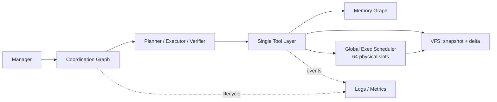

# Threadmill 相比 Pi 的高并发 Agent OS 架构与效果

| 项目 | 内容 |
| --- | --- |
| 文档状态 | 当前架构说明与固定实测基线 |
| Threadmill 压测版本 | `98ed7d3d38c0fc956de0bc70c858f4ef65c90e02`（`dev-native`；性能数字固定于该版本） |
| Pi 版本 | [`a470b121bf683b4c2b9fc0b3a7c807de7e0cfe9c`](https://github.com/badlogic/pi-mono/commit/a470b121bf683b4c2b9fc0b3a7c807de7e0cfe9c) |
| 测试日期 | 2026-08-24 |
| 测试主机 | 8 CPU、15 GiB RAM、ext4、Linux OverlayFS |
| 对比范围 | 本地 Agent 运行时：文件、命令、隔离、调度与监控；不含模型请求 |

## 结论先行

Threadmill 的优势不是让一条 `bash` 命令变快，而是把“很多逻辑 Agent”与“少量昂贵物理资源”分离：协调图可以很宽，文件环境按需物化，Linux 命令统一进入 64 槽调度器。因而机器不需要为每个 Agent 常驻一份项目副本、进程和执行资源。

在相同 DeepSWE 轨迹分布的合成负载下，最终效果是：

| 指标卡 | Threadmill | Pi 对照 | Threadmill 效果 |
| --- | ---: | ---: | ---: |
| **建议稳定协调图宽度** | **384 Agent** | 96 Agent | **4.0×** |
| **实测有效峰值宽度** | **448 Agent** | 128 Agent | **3.5×** |
| **384 Agent 同宽吞吐** | **761 commands/s** | 307–324 commands/s | **2.4–2.5×** |
| **384 Agent 总耗时** | **15.71 s** | 37.09–39.12 s | **降低 58%–60%** |
| **384 Agent 文件写 P95** | **98 ms** | 1.53–1.58 s | **约低 16×** |

> **容量结论：当前机器建议把协调图同时活跃宽度控制在 384；448 是可用峰值，不是日常水位。** 500 Agent 开始软饱和，增加 Exec 槽已不能明显降低总耗时，瓶颈转移到 VFS 与主机 I/O。

> **目录隔离收益：** 若用完整复制实现同样的 385 个私有文件视图，基线文件有效载荷约为 4.73 GB；Threadmill 只保留一份 12.288 MB 基线，实测逻辑增量为 10.2 MB。按“基线 + 逻辑增量”估算约 22.5 MB，比完整复制少 **99.5%（约 210×）**。这是文件数据口径，不是物理磁盘占用，也不是相对 Pi 外置 OverlayFS 的收益。

这些数字不是模型吞吐成绩。测试没有调用模型，目的是把上游服务波动剥离，只回答 Threadmill 自己能承载多宽的活跃协调图。

## 测量口径

### 工作负载

负载由 DeepSWE 批次的真实 Agent 轨迹统计合成，而不是均匀随机压命令：

- 每个 Agent 52 个 ReAct turn，约 31 条 `bash` 命令；
- 命令服务时间占 Agent 生命周期的目标值为 12%，实测基线约 11.66%；
- 每个 Agent 都执行 fork、读/列目录、编辑、命令、absorb 和释放；
- 基线仓为 3,000 个文件，每个文件 4 KiB；
- 思考与命令时长统一按 `0.02` 缩放；
- 每档通常运行 3 次，表格使用中位数。

Threadmill 的负载生成器把轨迹来源和指标口径固化在 [`cmd/tmload/main.go`](../cmd/tmload/main.go#L1-L45)，并直接输出命令占空比、VFS 快慢路径、调度排队、RSS 与操作 P50/P95，见 [`cmd/tmload/main.go`](../cmd/tmload/main.go#L404-L454)。

### Pi 对照模式

Pi 使用固定 commit 的官方 `read`、`ls`、`write`、`bash` 工具源码，在同一 Node.js 进程内复放相同轨迹。由于当时 `models.dev` 下载超时，完整 workspace build 未参与测试；工具源码通过 `tsx` 直接执行，因此这里测的是 Pi 本地工具运行时，不是模型端到端 Harness 分数。

使用了两个边界：

1. **共享 cwd**：Pi 原生本地工具路径，速度上是理论上界，但多个 Agent 共享项目目录，不满足安全隔离。
2. **外置 OverlayFS**：为每个 Pi Agent 额外挂独立 OverlayFS，再调用 Pi 原生工具。这是给 Pi 的有利、安全对照，但 OverlayFS 生命周期并不是 Pi 自身提供的功能。

“建议稳定宽度”取有效峰值的前一档，保留一个实测档位的突发余量；“有效峰值”是进入明显非线性排队或尾延迟之前的最后一个实测档位。它是这台机器和这组轨迹下的容量规划值，不是协议上限。

## 让优化成立的特殊架构



图中最关键的不是模块数量，而是唯一边界：Agent 不能绕过 Tool Layer 直接读写项目或启动命令。工具按环境 ID 重新绑定，见 [`internal/tool/bind.go`](../internal/tool/bind.go#L21-L100)。因此 Threadmill 能在不改变 Agent 工具语义的前提下统一做隔离、缓存、调度、回收和观测。

### 协调图如何催生 VFS 和命令调度

协调图不只是 Manager 的流程表示。它把 Agent 关系变成了稳定的资源生命周期协议；VFS 和 Exec 正是利用这些协议做优化，而不是事后猜测一个目录或进程是否还能复用：

| 协调图语义 | 产生的资源契约 | VFS / Exec 因而可以做什么 |
| --- | --- | --- |
| Spawn 边记录父 Task 和子 Task | Fork 的父环境与发生时点确定 | 记录父快照和子增量，不复制整个 checkout |
| Planner / Executor / Verifier 是显式角色 | Planner、Verifier 一次性；Executor 持久 | 自动丢弃试验性文件，只保留实现环境 |
| Join 边记录来源、目标和提交点 | 哪些环境待合入、由谁处理候选确定 | 创建只读 Join Session；被 join 的角色按需检查并显式采纳或丢弃，系统不自动应用文件 |
| Task 完成、取消和恢复是显式状态 | Release、Discard、Reap 的安全时点确定 | 逻辑 Agent 不必永久占有目录、挂载或进程 |
| 每个工具调用绑定环境 ID | 文件视图与命令归属确定 | 命令前才按需物化；所有命令可进入同一个机器级调度器 |

角色工作区的选择和清理在 [`internal/coordination/assemble.go`](../internal/coordination/assemble.go)，Join Session 的创建、处置守卫和回收在 [`internal/coordination/run.go`](../internal/coordination/run.go)、[`internal/coordination/join_tool.go`](../internal/coordination/join_tool.go) 与 [`internal/vfs/join.go`](../internal/vfs/join.go)。命令调度器拿到同一个环境 ID，先物化正确视图，再申请物理执行槽，见 [`internal/exec/scheduler.go`](../internal/exec/scheduler.go#L224-L317)。

所以这里的因果关系是：**协调图定义资源所有权和边界，Tool Layer 强制执行边界，VFS 才能安全共享文件基线，Exec 才能安全复用物理槽。** 没有前两层，OverlayFS 和 semaphore 仍可外挂，但外部编排必须自行维护父子关系、合入点、清理点和监控归属，很难形成同一套端到端快路径。

### 1. 协调图保存逻辑并发，资源层限制物理并发

每个 Task 固定为 `Planner → Executor → Verifier`，同时允许从任意角色 spawn 子 Task 并 join 回来，见 [`internal/coordination/graph.go`](../internal/coordination/graph.go#L1-L6) 和 [`internal/coordination/graph.go`](../internal/coordination/graph.go#L68-L103)。

这让“图上有 384 个活跃 Agent”不等于“同时启动 384 条 Linux 命令”。Agent 思考、模型等待、文件读取和命令执行是不同资源阶段；命令只在需要时进入 64 个全局槽位。当前配置见 [`threadmill.yaml`](../threadmill.yaml#L7-L8)。

384 Agent 档的命令服务时间占比为 11.4%。用占空比做简单均值，命令执行需求约为 `384 × 11.4% ≈ 44` 个槽，低于 64 槽容量；真实轨迹的突发让活跃槽短时到达 64，但三轮中位排队峰值只有 4、累计等待 17 ms。协调图因此可以保留 384 路逻辑进展，而无需预留 384 份进程资源。这个乘法只是容量直觉，最终水位仍由实测排队和尾延迟决定。

角色的保存语义也由环境生命周期自然形成：

- Planner 和 Verifier 使用一次性工作区，结束后丢弃文件副作用；
- Executor 绑定 Task 的持久工作区；
- Join 候选保持在各自隔离环境中，由被 join 的角色通过统一工具检查，并把明确选择的路径写入当前角色工作区；
- 角色输出与 Join 的 apply/discard/finish 进度持久化，可在崩溃后跳过已完成步骤并继续未完成处置。

对应实现见 [`internal/coordination/assemble.go`](../internal/coordination/assemble.go#L115-L180) 和 [`internal/coordination/run.go`](../internal/coordination/run.go#L26-L37)。这种语义使并行 Task 不需要共享一个可写 checkout，也不需要把 Planner/Verifier 的试验性改动带入最终实现。

### 2. VFS 把项目副本变成逻辑快照与小增量

普通的“一个 Agent 一个目录”会让 fork 成本随仓库大小和 Agent 数相乘。Threadmill 的 Fork 只记录父 overlay 快照，不复制 host 树；只有第一次执行命令或显式物化时才创建 live 目录，纯认知型环境永不落盘，见 [`internal/vfs/store.go`](../internal/vfs/store.go#L340-L385)。

物化和回收采用分层快路径：

| 阶段 | 首选路径 | 退化路径 | 为什么有效 |
| --- | --- | --- | --- |
| Fork | 逻辑 snapshot + delta | 无需复制基线 | Agent 多但真正执行命令的比例低 |
| Materialize | 原生或 FUSE OverlayFS | reflink → 完整复制 | 只在命令需要真实目录时付费 |
| Absorb | 直接读取 OverlayFS `upperdir` | 分桶 fingerprint → 内容比较 | 只读取实际修改和 whiteout，不扫描合并目录 |
| 顺序交接 | Handoff 已物化目录 | 普通逻辑 Fork | Planner/Executor/Verifier 串行时避免重复物化 |

Materialize 对同一环境做 singleflight，并用独立 I/O 槽控制复制风暴，见 [`internal/vfs/live.go`](../internal/vfs/live.go#L16-L45)。原生和 FUSE OverlayFS 吸收优先只扫描 upper 层，把 whiteout 当删除日志，遇到未知语义再退回正确的合并树算法，见 [`internal/vfs/absorb_overlay_linux.go`](../internal/vfs/absorb_overlay_linux.go#L43-L124)。

在 384 Agent 实测中：

- 385 个环境使用原生 OverlayFS；
- direct-upper absorb 尝试 768 次、成功 768 次；
- 完整 absorb scan 为 0；
- 没有 materialize fallback；
- 文件写 P95 为 98 ms。

这组结果说明优化不是“有快路径但压测没走到”，而是主负载确实命中了预期路径。

#### 独立目录开销降低了多少

384 Agent 压测实际物化了 385 个文件视图（根环境加 384 个 Agent 环境）。基线包含 3,000 个 4 KiB 文件，因此完整私有目录复制的基线有效载荷为：

```text
385 × 3,000 × 4 KiB = 4,730.88 MB
```

Threadmill 的数据模型只保存一次 12.288 MB 基线，各环境记录自己的增量；同档监控中的逻辑 overlay 数据合计为 10.2 MB。由此可以从两个口径看节省：

| 口径 | 完整私有目录 | Threadmill | 降低幅度 |
| --- | ---: | ---: | ---: |
| 基线文件重复 | 385 份，4.73 GB | 1 份，12.288 MB | **99.74%，少 384 份基线** |
| 基线 + 逻辑增量估算 | 4.73 GB（尚未计各目录改动） | 约 22.5 MB | **99.5%，约 210×** |

这里故意不用压测输出的 `disk_live=4730.9MB` 当作物理占用：该指标遍历 385 个合并视图，会把共享基线重复计入每个视图，只能验证上述“完整目录有效载荷”数量级。真实磁盘块还受 OverlayFS upperdir、元数据、块取整和运行时临时文件影响；10.2 MB 也是 VFS 记录的逻辑增量，不是 `du` 实测。因此 **99.5% 是可复核的数据层估算，不是物理磁盘节省承诺**。

对 Pi 也要区分基线：Pi 的共享 cwd 同样只有一份基线，但没有 Agent 间文件隔离；若每个 Agent 完整复制私有目录，就承担上面的 4.73 GB。报告中的 Pi 安全对照已经额外挂了 OverlayFS，也能共享基线，所以不能声称 Threadmill 相对该模式仍节省 210×。相对 Pi 外置 OverlayFS，Threadmill 的实测优势来自协调图原生管理增量生命周期、direct-upper absorb 和统一调度：384 Agent 下总耗时低 58%–60%，文件写 P95 约低 16×。

### 3. Exec 是全局资源调度器，不是工具内部直接 `spawn`

Threadmill 在所有 Agent 之间共享命令槽、重命令槽和可选内存预算。命令先物化环境，再做成本分类和内存准入，最后申请全局槽；环境准备不会占住昂贵的 Exec 槽，见 [`internal/exec/scheduler.go`](../internal/exec/scheduler.go#L235-L317)。

调度器当前具备：

- 64 个普通命令槽；
- 默认 `slots/8` 的重命令车道；
- 基于历史平均时长和冷启动规则的轻/重分类；
- 基于历史进程树峰值 RSS 的可选内存准入；
- timeout、输出上限、取消、进程组追踪和环境级 Reap；
- 有界 4,096 项命令成本表，不让缓存随命令数量无限增长。

配置和调度状态见 [`internal/exec/scheduler.go`](../internal/exec/scheduler.go#L33-L117)，重命令判断见 [`internal/exec/heavylane.go`](../internal/exec/heavylane.go#L14-L67)，RSS 与成本表见 [`internal/exec/meter.go`](../internal/exec/meter.go#L11-L21) 和 [`internal/exec/meter.go`](../internal/exec/meter.go#L101-L165)。

实测把槽位从 64 提高到 96/128 后，500/576 Agent 的 Exec 排队基本消失，但总耗时没有实质改善。这证明当前瓶颈已经不是命令槽；继续放大并发只会把压力转移到文件系统。

### 4. 记忆图允许混乱，但整理成本有界

Threadmill 的记忆不是一份不断增长的聊天串，而是带来源、状态和子图归属的事实图。节点可标记为 accepted、disputed、superseded 或 outdated；同一节点也可属于多个子图，见 [`internal/context/graph.go`](../internal/context/graph.go#L15-L72)。

设计目标是“允许可整理的混乱”：底图允许冗余和局部冲突，读取时按当前 Task 子图取最小相关视图。只有节点总量或单次新增跨过软阈值时，才调用一个受限的整理 Agent；失败只记录事件，不阻断任务，见 [`internal/agent/curation.go`](../internal/agent/curation.go#L14-L45) 和 [`internal/agent/curation.go`](../internal/agent/curation.go#L78-L136)。

这限制的是送入模型的上下文和整理调用次数，不等同于底层记忆存储零复制。当前 `context.Store.Fork` 仍会克隆父图和 merge baseline，见 [`internal/context/store.go`](../internal/context/store.go#L182-L215)；本次本地运行时压测没有覆盖大记忆图，因此没有把记忆存储扩展性计入首页性能结论。

### 5. 监控直接对应容量决策

统一 Tool Layer 和资源 Store 让监控不只是打印 Agent 文本。Threadmill 能同时观察：

- 模型、工具、Task、Memory 的 started/completed/errors/active；
- 模型和记忆请求的 TTFT、P50/P95、重试、token 和流空闲；
- Exec capacity、queued/active 峰值、wait/run、取消、超时、进程组；
- VFS materialize backend、fallback、upperdir 命中、scan、字节量与等待；
- 记忆整理候选数、选择数、耗时和 token。

事件采集器使用有界直方图且不保留 prompt 或 delta 正文，见 [`internal/event/collector.go`](../internal/event/collector.go#L11-L73) 和 [`internal/event/collector.go`](../internal/event/collector.go#L169-L207)。模块允许的改动边界与评价证据统一记录在 [`docs/architecture-governance.md`](architecture-governance.md#evaluation)。

正因为这些指标覆盖了“逻辑图 → 工具 → VFS/Exec → 主机”，容量结论才可以定位为：384 建议稳定、448 峰值、500 VFS 软饱和，而不是只看 CPU 利用率猜并发数。

## Pi 做得好的部分

Pi 是优秀的轻量 Agent 运行库和 coding CLI。当前版本已经具备：

- 默认并行执行同一模型回合里的多个工具，也允许工具声明顺序执行；
- immutable entry tree、共享历史、branch/compaction/fork；
- lane 级并行、subagent 支持和持久 operation state；
- timeout、AbortSignal 与进程树终止；
- 扩展可替换 Bash operations，自行接入远程或隔离执行后端。

因此，本报告不把“多 Agent、共享历史或崩溃恢复”说成 Threadmill 独有。Pi 的 entry tree 与 lanes 见其固定版本的 [`harness.md`](https://github.com/badlogic/pi-mono/blob/a470b121bf683b4c2b9fc0b3a7c807de7e0cfe9c/packages/agent/docs/harness.md#L85-L109)，工具并行策略见 [`agent-loop.ts`](https://github.com/badlogic/pi-mono/blob/a470b121bf683b4c2b9fc0b3a7c807de7e0cfe9c/packages/agent/src/agent-loop.ts#L411-L542)。

## Pi 在这个场景下的局限

这里的“局限”是相对单机数百个同时活跃 coding Agent 的目标，不代表 Pi 的通用设计有缺陷。

| 维度 | Pi 标准本地工具路径 | 对高并发 coding Agent 的影响 |
| --- | --- | --- |
| 项目环境 | 工具接收一个真实 `cwd`；内建 Bash 直接在其中启动 shell | 多 Agent 要么共享可写目录，要么由外部系统另建隔离目录/挂载 |
| 命令调度 | 一个回合的并行工具通过 `Promise.all` 一次发出，没有跨 Agent 的全局槽、重车道或内存准入 | 小宽度延迟低；大宽度时突发直接落到 OS 和磁盘 |
| 文件版本 | 内建工具没有 snapshot/delta、lazy materialize、absorb 或显式 Join Session | 安全并行需要外置 worktree、容器或 OverlayFS，生命周期也由外部编排 |
| 写入协调 | 按文件串行 mutation，但注册路径经过进程全局 `registrationQueue` | 保证单文件一致性；数百 Agent 同时写不同文件时会形成共享注册热点 |
| 角色语义 | Lane 是通用并行游标，没有固定 Planner/Executor/Verifier 文件保存和 join 语义 | 更灵活，但 coding 流程的隔离、验收与冲突处理需要应用自己约定 |
| 容量监控 | 有 Agent/tool 事件，但标准路径没有统一 VFS/Exec resource store | 难以直接得到物化 fallback、全局排队、upperdir 命中和有效图宽度 |

Pi 内建 Bash 的直接 `spawn` 路径见 [`bash.ts`](https://github.com/badlogic/pi-mono/blob/a470b121bf683b4c2b9fc0b3a7c807de7e0cfe9c/packages/coding-agent/src/core/tools/bash.ts#L88-L150)；并行批次的 `Promise.all` 见 [`agent-loop.ts`](https://github.com/badlogic/pi-mono/blob/a470b121bf683b4c2b9fc0b3a7c807de7e0cfe9c/packages/agent/src/agent-loop.ts#L489-L542)；全局 mutation 注册路径见 [`file-mutation-queue.ts`](https://github.com/badlogic/pi-mono/blob/a470b121bf683b4c2b9fc0b3a7c807de7e0cfe9c/packages/coding-agent/src/core/tools/file-mutation-queue.ts#L4-L60)。

Pi 可以通过 extension 替换 Bash、在外部增加容器或调度器，但这会形成多套彼此不认识的资源边界。Threadmill 的特殊点是 VFS、Exec、协调图和监控共享同一个环境 ID 与生命周期，因此 fast path、安全语义和容量指标可以互相闭合。

## 完整实测结果

### Threadmill：64 Exec 槽

| 活跃 Agent | Wall 中位数 | 命令数 | 命令占空比 | Exec 排队峰值 | Exec 总等待 | 文件写 P95 | 结论 |
| ---: | ---: | ---: | ---: | ---: | ---: | ---: | --- |
| 384 | 15.706 s | 11,954 | 11.4% | 4 | 17 ms | 98 ms | 建议稳定水位 |
| 448 | 17.054 s | 13,986 | 11.1% | 23 | 3.416 s | 156 ms | 有效峰值 |
| 500 | 18.417 s | 15,590 | 10.4% | 58 | 30.471 s | 261 ms | 开始软饱和 |
| 576 | 21.188 s | 17,984 | 9.3% | 28* | 38.856 s | 432 ms | 不适合作为持续水位 |

\* 576 档不同轮次的瞬时峰值波动较大；总等待和尾延迟已经明确进入退化区，峰值队长不应单独用于判断容量。

### Pi：相同轨迹

| 模式 | 活跃 Agent | Wall | 命令数 | 命令占空比 | 文件写 P95 | 结论 |
| --- | ---: | ---: | ---: | ---: | ---: | --- |
| 共享 cwd | 64 | 14.276 s | 1,999 | 13.2% | 2.9–3.3 ms | 快，但不隔离 |
| 外置 OverlayFS | 96 | 15.379 s | 3,013 | 12.4% | 15.2 ms | 建议稳定水位 |
| 外置 OverlayFS | 128 | 15.920 s | 4,040 | 12.8% | 25–26 ms | 有效峰值 |
| 共享 cwd | 160 | 16.611 s | 5,031 | 12.7% | 41 ms | 开始出现 I/O 尾部 |
| 共享 cwd | 192 | 19.193 s | 6,039 | 11.9% | 174 ms | 明显退化 |
| 共享 cwd | 384 | 37.092 s | 12,032 | 6.2% | 1.52–1.54 s | 3 次结果稳定，已饱和 |
| 外置 OverlayFS | 384 | 39.123 s | 12,020 | 6.1% | 1.576 s | 单次确认，已饱和 |

384 Agent 时，Pi 的 Bash P95 仍约 262 ms，和 Threadmill 的约 243 ms 接近；真正拉开总耗时的是文件写尾延迟从几十毫秒上升到约 1.5 秒。这也支持“VFS 与写入协调是主要差异”的归因，而不是把差距错误归因给 shell 本身。

### 进程内存补充观察

同宽工具压测中，Threadmill 的 Go harness 峰值 RSS 约 38 MiB，Pi 的 Node.js/`tsx` harness 约 234 MiB，表面上相差约 6.2×。这个数字同时包含语言运行时和加载方式差异，不作为架构主结论。

另用本机已安装的 Pi CLI `0.80.10` 测得空闲进程平均约 146 MiB RSS：64 个进程的 RSS 合计约 9.3 GiB、系统实际多消耗约 6.4 GiB；88 个进程时可用内存已低于 2 GiB。它说明“每 Agent 一个 CLI 进程”不适合本机数百宽度，但版本和执行模式与上面的固定源码压测不同，只能作为部署参考，不能混入主评分。

## 当前瓶颈与下一步

### 已确认瓶颈

1. **384 以内：** Exec 排队近乎为零，VFS fast path 全命中，仍有稳定余量。
2. **448 附近：** 开始同时出现命令突发和写入尾延迟，但占空比仍接近目标。
3. **500 以上：** 增加 Exec 槽不再改善 wall time；VFS 元数据、OverlayFS mount/upper 操作与主机磁盘调度成为主瓶颈。
4. **端到端真实任务：** 模型 TTFT、token 吞吐与限流仍可能先于本地运行时成为瓶颈，本报告没有测量它们。

### 推荐动作

- 本机继续使用 64 Exec 槽，并把 384 作为活跃图容量规划值；448 只用于短时突发。
- 告警优先观察 `VFS write/absorb P95`、materialize/absorb wait 和 Exec wait，而不是只看活跃 Agent 数。
- 下一轮性能工作应减少 500+ Agent 下的 VFS 元数据竞争与 mount 生命周期开销；不应继续盲目增加 Exec 槽。
- 若真实 DeepSWE 轨迹的命令占空比、仓库规模或磁盘类型变化，应重新校准宽度，不直接复用 384。

## 事实、推断与复现状态

| 结论 | 类型 | 证据 |
| --- | --- | --- |
| Threadmill Fork 为逻辑 overlay，按需物化 | 代码事实 | [`internal/vfs/store.go`](../internal/vfs/store.go#L340-L385) |
| 协调图角色和 Join 状态决定环境保存、提交与回收 | 代码事实 | [`internal/coordination/assemble.go`](../internal/coordination/assemble.go#L105-L185)、[`internal/coordination/run.go`](../internal/coordination/run.go#L291-L380) |
| 原生和 FUSE OverlayFS absorb 优先只读 upperdir，异常时回退 | 代码事实 | [`internal/vfs/absorb_overlay_linux.go`](../internal/vfs/absorb_overlay_linux.go#L43-L124) |
| 命令统一进入全局普通/重命令/内存准入 | 代码事实 | [`internal/exec/scheduler.go`](../internal/exec/scheduler.go#L235-L317) |
| 385 个完整目录基线 4.73 GB，Threadmill 基线加逻辑增量约 22.5 MB | 公式推算 | 3,000 × 4 KiB 基线、385 个物化视图、VFS `overlay_MB=10.2`；不代表物理磁盘块 |
| Pi 标准本地 Bash 直接在 cwd spawn | 上游代码事实 | [`bash.ts`](https://github.com/badlogic/pi-mono/blob/a470b121bf683b4c2b9fc0b3a7c807de7e0cfe9c/packages/coding-agent/src/core/tools/bash.ts#L88-L150) |
| Pi 同回合并行工具没有全局资源槽 | 上游代码事实 | [`agent-loop.ts`](https://github.com/badlogic/pi-mono/blob/a470b121bf683b4c2b9fc0b3a7c807de7e0cfe9c/packages/agent/src/agent-loop.ts#L489-L542) |
| Threadmill 建议稳定宽度 384、峰值 448 | 实测容量结论 | 3 次/档轨迹合成压测中位数 |
| Pi 建议稳定宽度 96、峰值 128 | 实测容量结论 | 外置 OverlayFS 安全对照；容量值留一档余量 |
| Pi 的全局 mutation 注册路径是高宽写尾部的贡献因素 | 有代码支持的推断 | 注册队列事实 + 384 Agent 尾延迟；未做单因素消融 |
| Threadmill 差距主要来自 VFS 而非 shell | 有实测支持的推断 | 384 Agent Bash P95 接近，文件写 P95 相差约 16× |
| 记忆图在数百宽度下同样接近零复制 | 不成立/未验证 | 当前 Fork 克隆图快照与 baseline；不纳入性能评分 |

本报告的比较结论固定在上述 commits。Pi 和 Threadmill 后续实现变化后，应更新源码证据并重跑同一轨迹，而不是继续引用旧数字。
