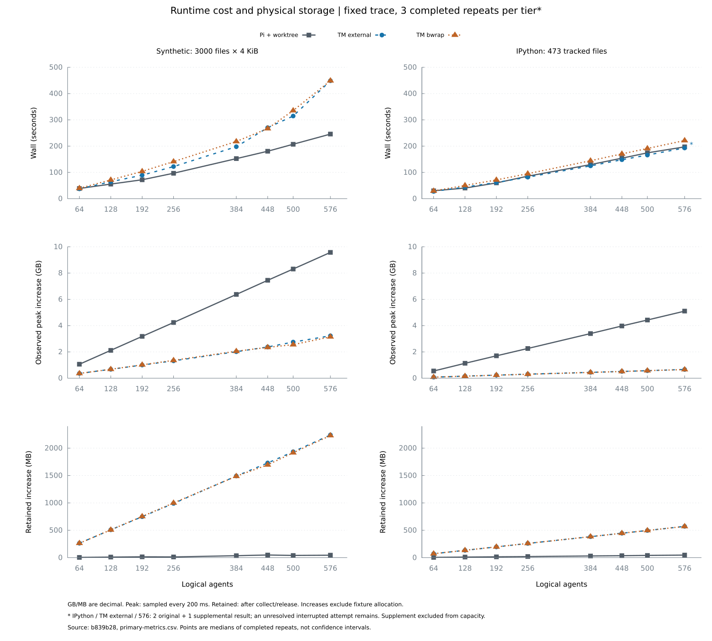
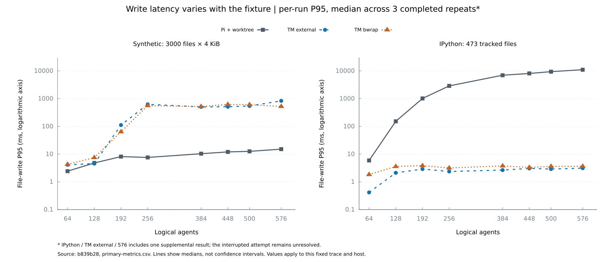

# Threadmill 与 Pi 原生工具 + worktree：运行时和命令缓存实测

主矩阵及缓存测量源码固定为 `b839b28747ae398f7badec9d2d0e51ae7e732c74`。测试开始于 2026-10-02；本文的数字来自各组登记后的原始回放，[旧报告](threadmill-vs-pi-architecture-and-performance.md)保留为历史材料。

主对照采用 Pi 原生工具和每个 Agent 一个 git worktree。主矩阵已获得 144 份完整记录；其中 IPython/external/576 的第三份为另存补测，原中断尝试仍计入限制。六组按事前规则计算的有效峰值均为 64，稳定宽度未确定，因此没有可报告的稳定并发倍数。

物理空间与 wall 需要一起看：合成仓 576 档，Threadmill bwrap 的采样峰值增量比 Pi worktree 低 67.1%，wall 长 82.6%，保存后的物理增量约为 49.5 倍。IPython 500 档，bwrap 的峰值增量低 87.0%，wall 长 9.5%，保存后的增量约为 12.1 倍。这些是指定 fixture、硬件、操作轨迹与生命周期下三次中位数的比较，不是通用 Agent 性能指标。

缓存、历史 OverlayFS 与 Harbor 的完成状态分别列在后文；主矩阵不代替端到端评测。

| 附件阶段 | 当前交付状态 |
| --- | --- |
| 0 环境与复现 | Btrfs、静态 strace、Pi 离线构建、登记与硬失败门禁已实现；真实 Harbor USER 的 namespace 准入尚未通过 |
| 1 修复、2 观测 | 已通过 PR #48–51 合入，回归与观测字段进入冻结版本 |
| 3 运行时对比 | 主矩阵 144 份、共享 cwd 48 份与历史 OverlayFS 48 份均完成审计 |
| 4 缓存微基准 | pytest 40/40 完成；新 Go 轮次在第 2/40 条停止，保留全部失败证据 |
| 5 Harbor A/B | pilot 尚未开始，模型调用为零；实际用户能力与 Responses 兼容配置仍未落实 |
| 6 规范化与提示 | AST 键通过 PR #52 合入；top-K 与 Planner 提示按附件要求等待 A 组数据 |
| 7 报告与引用 | 提供本报告、原始数据与复算入口；不提供未完成实验的结论 |

## 源码、环境与复现

| 项目 | 固定值 |
| --- | --- |
| Threadmill | `b839b28747ae398f7badec9d2d0e51ae7e732c74`，干净源码，已经 PR #51 进入 main |
| tmload SHA-256 | `05ea03a95b30be48564624c1d49f267b5ff87bf791bdb8c91b9a24d17937c4bf` |
| Pi | `earendil-works/pi@7fbbd5f4a1d982bb02d63472dde0774fa639f99b` |
| Pi 构建 | 完整离线 npm 安装与 build:offline；Node 24.18.0，npm 11.16.0；构建登记摘要 `13a62f692cc4292dd248705b6ff917dbae17eb524661dd657cd1c3992cf38d3c` |
| 宿主 | i5-9300H，4 核/8 线程，约 15.4 GiB RAM；Linux 7.0.0-30-generic |
| 工具链 | Go 1.24.2，Git 2.43.0，Python 3.12.3，strace 6.8 |
| 运行时磁盘 | 独立 16 GiB Btrfs image，/dev/loop25，rw/noatime；全部硬件回放串行 |
| 合成 fixture | `ffcb2718172365b11873bad5e9a4498a81b80cf7`，3000 × 4096 字节 |
| 真实 fixture | IPython `0bb317d10fdcb3aa13beb1031d5f10e5b821203b`，473 tracked files，7,481,778 regular bytes |

真实仓来自 DeepSWE `435ee89ec2f2e2289f33b0da4f992f0b7b7266b9` 的 ipython-session-bundle-replay 题目。文件数少于合成仓，不能用这两点证明文件数的单调影响。原 IPython partial clone 缺失对象造成准备失败；新完整检出保持相同 commit，准备失败 stderr 也保留。

Go 二进制的 vcs.revision 和 vcs.modified=false 均实查。Go 1.24.2 在 git worktree 的 .git 文件上未盖 VCS 章，因此构建使用同 commit 的干净普通 clone，没有放宽正式预检；对应实现见 [Go 1.24.2 的 VCS 发现](https://github.com/golang/go/blob/go1.24.2/src/cmd/go/internal/vcs/vcs.go)。

宿主已有用户进程没有被停止。独立 Btrfs 卷保证没有其他实验者写入该测量文件系统；不代表宿主 CPU、内存和交换空间完全空闲。登记环境字段、构建、命令行、源码摘要与事前预测见登记 JSON。中断尝试留下的运行目录也被保留，补测与后续行的 before 包含这部分固定占用；增量不是卷的全部占用。补测于 2026-10-03T06:11:28Z 启动。第一次缓存续跑的外层进程回收存在方法问题，15 行全部作为诊断数据保留；2026-10-03T13:17:54Z 的新缓存矩阵改用持续回收，详见后文。两次均保持冻结运行时、命令、登记环境变量和资源限制。原协议没有完整冻结其他继承环境变量，这项复现边界保留。

## 公平性与计时范围

两个 fixture 各使用 64、128、192、256、384、448、500、576 并发档，每档三次。默认 40 turns、seed 42、time-scale 0.05、command-duty 0.12、Threadmill command slots 8。逻辑 Agent 宽度与命令执行 slots 是不同概念。全部组读取同一逐条 JSON trace，不重新抽样，固定思考间隔、文件路径、写入内容和命令。

Threadmill external 与 Pi 都无沙箱，Threadmill bwrap 使用运行时的文件系统、用户与 PID 隔离；后者的额外隔离成本单独报告。RSS 只作 Go/Node 运行时的补充观察。Git 的 gc.auto=0 是对 Pi 有利的去噪设置。

这里的 external 只设置 `ExternalSandbox=true`，没有启用 `ExternalWorkspaceIsolation`；Harbor 的 external 配置则额外要求私有 mount/PID namespace，两者不能混为一个准入结果。主矩阵关闭命令缓存与依赖追踪，heavy threshold 设为 24 小时，内存记账准入关闭，bwrap 的网络仍为 shared。测到的是这些明确设置下的运行时与隔离成本，不包含完整生产配置的所有开销；固定实现见 [tmload 回放配置](https://github.com/KDZZZZZZ/threadmill/blob/b839b28747ae398f7badec9d2d0e51ae7e732c74/cmd/tmload/replay.go)与 [Scheduler 配置及快照](https://github.com/KDZZZZZZ/threadmill/blob/b839b28747ae398f7badec9d2d0e51ae7e732c74/internal/exec/scheduler.go)。

| 阶段 | Threadmill | Pi + worktree |
| --- | --- | --- |
| setup，单列 | git archive 得到不含 .git 的同 commit 文件树，建立 floor | 导入该 pin 的原生工具，准备同 commit 仓库 |
| fork | 创建逻辑环境；第一次写/命令才按需物化 | git worktree add -b agent-N |
| read/write/list/bash | View 与 Scheduler 的实际能力 | 原生 create*ToolDefinition(cwd) 默认能力 |
| collect | Absorb + Archive，持久保存 reflink checkpoint | git add -A + git commit --allow-empty，保留 branch/commit 对象 |
| release | Reap + Release + Discard 原工作环境 | git worktree remove --force |

wall 包含所有 Agent 的 fork、操作、collect、release。Pi 原生 read/list 的格式与默认截断和 Threadmill View 不同；本轮统一输入操作，不能声称输出字节完全相同。文件写入延迟包含工具实现及调度等待，不是裸文件系统 syscall 耗时。Exec.Run 不自动 Absorb：单条命令时长包括按需物化、排队、运行与追踪，Absorb 在 collect 中计时。文件写可能先于 bash 完成物化，不能把每次首条 bash 都称为首次物化。

Git 2.43.0 的共享 worktree 管理目录存在初始化窗口：[add_worktree](https://github.com/git/git/blob/v2.43.0/builtin/worktree.c) 先创建管理目录与 HEAD，再写 commondir；同期 [get_worktrees](https://github.com/git/git/blob/v2.43.0/worktree.c) 枚举可能观察到中间状态。本 harness 对同一个 common gitdir 的 add/remove 使用 FIFO，排队完整计入 fork/release 和 wall；各 Agent 的文件工具、bash、git add/commit 保持并发。队列失败会返回错误，后续请求继续处理。这是 harness 生命周期协调成本，没有给 Pi bash 加全局执行限制。

物理空间采用专用文件系统 statvfs 的 allocated bytes（与 df 对应），保存 before、每 200 ms 的 peak 采样、collect/release 后的 retained；前后 Btrfs sync 和 filesystem du -s --raw 原文同时保留。fixture 已在 before 中，不重复算入增量。peak 是采样观测下界，涵盖 floor/live/checkpoint/Git 对象/文件系统元数据。retained 衡量保存后的检查点与 Git 对象；checkpoint 的 reflink backing 当前没有自动 GC。逻辑大小和公式不替代这些实测值。

## 事前判定与实际矩阵

每个 fixture、backend 分别以最低档三次 wall 中位数 × 1.25 为阈值。每次均零错误且 wall 中位数不超阈值的最高档为有效峰值，前一档为登记规则的稳定宽度。前一档仍需检查错误与终态；最低档就是峰值时，稳定宽度未确定。预测在测量前已冻结，不随数据调整。

### 容量判定

| Fixture | Backend | wall 阈值（秒） | 有效峰值 | 稳定宽度 |
| --- | --- | ---: | ---: | --- |
| synthetic | Pi worktree | 48.704 | 64 | 未确定 |
| synthetic | TM external | 46.987 | 64 | 未确定 |
| synthetic | TM bwrap | 49.554 | 64 | 未确定 |
| ipython | Pi worktree | 37.789 | 64 | 未确定 |
| ipython | TM external | 34.758 | 64 | 未确定 |
| ipython | TM bwrap | 36.950 | 64 | 未确定 |

最低档已经是有效峰值，登记规则没有更低一档可认定为稳定宽度，因此没有可报告的稳定宽度倍数。

事前登记的合成仓预测——external 有效峰值至少 384、bwrap 至少 256、Pi worktree 为 128–256——均被本次按规则计算的结果否定。逻辑分叉 P95 低于 worktree checkout 的预测在全部已测档位得到支持，但它没有转化为合成仓高档位的 wall 优势。文件写 P95 在两种 fixture 上方向相反，不能据此给出通用倍数。

两个图的坐标范围在同类指标内一致。写入图采用明确标注的对数坐标；图中各点为逐次统计量的中位数，不是置信区间。GB/MB 均采用十进制。

### synthetic：完整主矩阵

wall 单位为秒；吞吐为完成的 bash commands/s。

| 宽度 | Pi wall | external wall | bwrap wall | Pi commands/s | external commands/s | bwrap commands/s |
| ---: | ---: | ---: | ---: | ---: | ---: | ---: |
| 64 | 38.963 | 37.590 | 39.643 | 39.576 | 41.022 | 38.897 |
| 128 | 55.671 | 64.623 | 71.483 | 55.056 | 47.429 | 42.877 |
| 192 | 72.121 | 89.533 | 104.030 | 63.366 | 51.043 | 43.930 |
| 256 | 96.935 | 122.317 | 141.155 | 63.300 | 50.165 | 43.470 |
| 384 | 152.488 | 197.902 | 217.733 | 60.175 | 46.366 | 42.143 |
| 448 | 180.656 | 270.218 | 266.972 | 59.456 | 39.749 | 40.233 |
| 500 | 207.263 | 314.625 | 335.386 | 57.733 | 38.033 | 35.678 |
| 576 | 245.893 | 448.911 | 449.111 | 56.199 | 30.783 | 30.770 |

空间为相对于各次 before 的物理增量；peak 为每 200 ms 采样的观测峰值，retained 为收集并释放后的保留状态。

| 宽度 | Pi peak GB | external peak GB | bwrap peak GB | Pi retained MB | external retained MB | bwrap retained MB |
| ---: | ---: | ---: | ---: | ---: | ---: | ---: |
| 64 | 1.061 | 0.362 | 0.361 | 5.030 | 263.819 | 263.623 |
| 128 | 2.120 | 0.676 | 0.680 | 10.346 | 509.145 | 507.900 |
| 192 | 3.182 | 1.002 | 1.015 | 15.897 | 748.241 | 752.763 |
| 256 | 4.236 | 1.322 | 1.359 | 13.169 | 990.708 | 999.244 |
| 384 | 6.373 | 2.016 | 2.052 | 35.865 | 1491.329 | 1487.430 |
| 448 | 7.449 | 2.377 | 2.345 | 48.943 | 1729.786 | 1695.560 |
| 500 | 8.309 | 2.749 | 2.554 | 40.579 | 1934.569 | 1916.465 |
| 576 | 9.574 | 3.226 | 3.146 | 45.052 | 2241.499 | 2230.817 |

以下延迟均为毫秒；每次先计算 P50/P95，再对三次完成记录取中位数。

| 宽度 | Backend | write P50 | write P95 | fork P50 | fork P95 | collect P50 | collect P95 |
| ---: | --- | ---: | ---: | ---: | ---: | ---: | ---: |
| 64 | Pi worktree | 0.401 | 2.428 | 6848.959 | 13155.344 | 106.112 | 158.862 |
| 64 | TM external | 0.174 | 4.116 | 0.025 | 0.070 | 3591.813 | 6344.534 |
| 64 | TM bwrap | 0.189 | 4.263 | 0.024 | 0.082 | 4165.809 | 7311.970 |
| 128 | Pi worktree | 0.466 | 4.797 | 14347.343 | 29387.666 | 129.301 | 330.359 |
| 128 | TM external | 0.216 | 4.555 | 0.028 | 0.078 | 7043.382 | 14936.958 |
| 128 | TM bwrap | 0.257 | 7.491 | 0.024 | 0.109 | 8824.855 | 14868.124 |
| 192 | Pi worktree | 0.461 | 8.136 | 21693.841 | 45791.731 | 142.461 | 212.496 |
| 192 | TM external | 0.349 | 111.329 | 0.025 | 0.078 | 6127.532 | 20640.776 |
| 192 | TM bwrap | 0.445 | 63.668 | 0.026 | 0.195 | 6606.217 | 20198.496 |
| 256 | Pi worktree | 0.501 | 7.596 | 31711.466 | 65531.740 | 222.710 | 602.089 |
| 256 | TM external | 0.697 | 624.127 | 0.026 | 0.199 | 8294.209 | 30204.304 |
| 256 | TM bwrap | 1.031 | 559.593 | 0.025 | 0.149 | 12273.900 | 29516.337 |
| 384 | Pi worktree | 0.536 | 10.341 | 50192.739 | 104293.034 | 309.170 | 656.077 |
| 384 | TM external | 1.717 | 503.117 | 0.026 | 0.186 | 21373.283 | 56320.605 |
| 384 | TM bwrap | 1.890 | 517.198 | 0.026 | 0.222 | 17644.468 | 43210.154 |
| 448 | Pi worktree | 0.547 | 12.009 | 60421.485 | 123646.275 | 308.870 | 780.432 |
| 448 | TM external | 1.859 | 509.147 | 0.024 | 0.133 | 32985.696 | 103282.308 |
| 448 | TM bwrap | 2.121 | 617.643 | 0.024 | 0.078 | 30820.376 | 67604.031 |
| 500 | Pi worktree | 0.560 | 12.575 | 70258.580 | 143527.605 | 356.044 | 787.731 |
| 500 | TM external | 1.754 | 542.925 | 0.023 | 0.251 | 47045.912 | 111225.145 |
| 500 | TM bwrap | 2.563 | 604.616 | 0.026 | 0.232 | 42510.773 | 102543.932 |
| 576 | Pi worktree | 0.573 | 15.109 | 83080.418 | 168917.596 | 364.621 | 764.028 |
| 576 | TM external | 2.160 | 831.278 | 0.023 | 0.248 | 88621.752 | 226770.089 |
| 576 | TM bwrap | 3.024 | 520.681 | 0.024 | 0.189 | 78844.557 | 183699.335 |

### ipython：完整主矩阵

wall 单位为秒；吞吐为完成的 bash commands/s。

| 宽度 | Pi wall | external wall | bwrap wall | Pi commands/s | external commands/s | bwrap commands/s |
| ---: | ---: | ---: | ---: | ---: | ---: | ---: |
| 64 | 30.231 | 27.806 | 29.560 | 51.007 | 55.455 | 52.165 |
| 128 | 40.454 | 44.309 | 50.481 | 75.766 | 69.174 | 60.715 |
| 192 | 60.077 | 61.795 | 71.442 | 76.069 | 73.954 | 63.968 |
| 256 | 85.811 | 81.980 | 95.169 | 71.506 | 74.848 | 64.475 |
| 384 | 129.803 | 124.943 | 144.543 | 70.692 | 73.442 | 63.483 |
| 448 | 154.281 | 148.352 | 170.571 | 69.620 | 72.402 | 62.971 |
| 500 | 174.555 | 166.082 | 191.066 | 68.551 | 72.049 | 62.627 |
| 576* | 197.258 | 193.094 | 221.460 | 70.056 | 71.566 | 62.400 |

空间为相对于各次 before 的物理增量；peak 为每 200 ms 采样的观测峰值，retained 为收集并释放后的保留状态。

| 宽度 | Pi peak GB | external peak GB | bwrap peak GB | Pi retained MB | external retained MB | bwrap retained MB |
| ---: | ---: | ---: | ---: | ---: | ---: | ---: |
| 64 | 0.546 | 0.079 | 0.080 | 5.468 | 72.143 | 72.208 |
| 128 | 1.133 | 0.156 | 0.155 | 10.596 | 134.537 | 134.865 |
| 192 | 1.702 | 0.231 | 0.230 | 15.520 | 196.645 | 197.300 |
| 256 | 2.262 | 0.307 | 0.299 | 20.095 | 260.022 | 259.990 |
| 384 | 3.396 | 0.443 | 0.439 | 30.982 | 383.345 | 384.066 |
| 448 | 3.974 | 0.512 | 0.508 | 36.225 | 446.657 | 446.263 |
| 500 | 4.428 | 0.571 | 0.575 | 41.058 | 496.361 | 496.460 |
| 576* | 5.103 | 0.665 | 0.655 | 47.243 | 572.047 | 570.606 |

以下延迟均为毫秒；每次先计算 P50/P95，再对三次完成记录取中位数。

| 宽度 | Backend | write P50 | write P95 | fork P50 | fork P95 | collect P50 | collect P95 |
| ---: | --- | ---: | ---: | ---: | ---: | ---: | ---: |
| 64 | Pi worktree | 0.436 | 5.889 | 2031.877 | 3941.723 | 88.004 | 122.404 |
| 64 | TM external | 0.135 | 0.416 | 0.027 | 0.125 | 51.421 | 63.066 |
| 64 | TM bwrap | 0.144 | 1.839 | 0.024 | 0.065 | 53.217 | 71.839 |
| 128 | Pi worktree | 33.555 | 151.967 | 4254.366 | 9456.009 | 135.529 | 303.582 |
| 128 | TM external | 0.154 | 2.114 | 0.024 | 0.073 | 59.862 | 463.026 |
| 128 | TM bwrap | 0.155 | 3.574 | 0.028 | 0.080 | 57.949 | 128.658 |
| 192 | Pi worktree | 267.094 | 1012.872 | 6759.910 | 17436.761 | 159.884 | 282.889 |
| 192 | TM external | 0.155 | 2.891 | 0.023 | 0.055 | 66.852 | 1077.510 |
| 192 | TM bwrap | 0.164 | 3.844 | 0.023 | 0.081 | 67.343 | 454.880 |
| 256 | Pi worktree | 1137.826 | 2878.524 | 10358.096 | 28241.267 | 213.973 | 315.582 |
| 256 | TM external | 0.159 | 2.366 | 0.024 | 0.120 | 72.162 | 974.643 |
| 256 | TM bwrap | 0.171 | 3.165 | 0.026 | 0.102 | 69.880 | 808.037 |
| 384 | Pi worktree | 3253.923 | 6970.162 | 19234.940 | 50060.635 | 241.268 | 365.240 |
| 384 | TM external | 0.162 | 2.657 | 0.023 | 0.085 | 57.453 | 124.422 |
| 384 | TM bwrap | 0.173 | 3.751 | 0.023 | 0.066 | 75.610 | 1349.824 |
| 448 | Pi worktree | 4440.496 | 8083.324 | 25723.158 | 62931.659 | 258.164 | 392.795 |
| 448 | TM external | 0.164 | 3.056 | 0.023 | 0.077 | 62.594 | 888.794 |
| 448 | TM bwrap | 0.173 | 3.314 | 0.023 | 0.089 | 67.324 | 464.783 |
| 500 | Pi worktree | 5440.183 | 9381.777 | 30994.178 | 72523.081 | 256.506 | 394.175 |
| 500 | TM external | 0.162 | 2.897 | 0.024 | 0.419 | 63.822 | 1617.544 |
| 500 | TM bwrap | 0.173 | 3.601 | 0.026 | 0.360 | 61.703 | 233.608 |
| 576 | Pi worktree | 6512.303 | 11041.543 | 36660.443 | 87354.217 | 264.902 | 391.502 |
| 576 | TM external* | 0.166 | 3.111 | 0.023 | 0.217 | 560.280 | 3408.921 |
| 576 | TM bwrap | 0.173 | 3.629 | 0.023 | 0.164 | 67.721 | 2140.127 |

* IPython / TM external / 576 包含两次原始完成与一次补测；另有一次退出时间与原因未知的中断尝试。补测进入描述性中位数，不能替换中断尝试进入容量验收。

除明确标注的中断档位外，每行统计来自三次完整样本。延迟列为每次 P50/P95 再取中位数；commands/s 来自同一次 wall 和实际命令数。不能将端到端 wall、单命令延迟与逻辑 Agent 数直接相互替代。

原串行回放在 143 条完整结果后中断；2026-10-03T05:27:53Z 检查时，旧进程已不存在，IPython/external/576/r3 没有 JSON、日志为空。退出时间和原因未知，不能把该尝试认作成功或资源饱和失败。原登记、状态、日志和未完成运行目录均保留。新增续跑只补这一项，使用相同 b839b28 二进制、trace、方法和参数，另存结果；随后继续尚未开始的缓存与共享 cwd 矩阵。该档按“两次原始完成 + 一次补测 + 一次未完成尝试”披露，补测仅进入注明限制的描述性表，不能替代原始重复进入容量验收。

合成仓的 72 行已全部完成，三组在全部八档均三次零错误，Threadmill 的必需终态计数均为零。按登记的绝对 wall 阈值，三组有效峰值均为 64，稳定宽度未确定；更高档包含了更多总工作量，超过阈值并不表示无法运行该宽度。最高测试档 576 三次完成的事实与这个性能阈值结论分别报告，不能写成一般 coding-agent 容量或稳定容量倍数。

## 缓存微基准

Go 使用 test/crash-recovery-project 的评测副本，保留原测试并修复副本的五处已有边界，使基线和脚本编辑后的两个 pricing 状态均为绿色；生产目录未用该 fixture 修复扩充 scope。pytest 使用 checked-in 小项目，禁止 pycache 与 pytest 自身的 cacheprovider 写入。工具链和依赖位于已有 /usr 只读挂载内，不为评测放宽生产挂载。

每种语言 16 个串行 Agent，seed 42，编辑概率 0.25，全量测试/单包测试/Go vet 分别重跑一次，四组各十个重复，顺序轮转。Pi 各 worktree 共享同一新 GOCACHE；Threadmill 为当前每环境独立 HOME/GOCACHE。每组每次根目录和缓存冷启动。

四组为 Threadmill cache off + tracing、cache on + tracing、Pi worktree、Threadmill cache off + untraced。前序 (command, content) 集合给出可复用 oracle；安全拒绝是 miss，不是错误。verify_sample_rate=0 的脚本 oracle 没有独立 fresh 重跑审计；不能从“没有意外回放”推导影子审计零误命中。

净收益主证据为同 trace 的 cache-off/untraced wall 减 cache-on/traced wall。分解列出历史匹配条目的 saved_duration、实测完整 trace 追踪税与 store_duration；它们跨不同执行、受 warm cache 和排队影响，不严格可加。负收益保留。

### pytest：40 次完整回放

pytest 的 40 条正式回放全部完成且通过逐操作审计，四组各十次、每次 16 个串行 Agent 与 64 条测试命令。外层监督期间回收 1390 个已退出子进程，终态没有存活残留或清理信号。

| pytest 组 | wall 中位数（秒） | 重复数 | 操作错误 |
| --- | ---: | ---: | ---: |
| Threadmill 关缓存、开追踪 | 24.341 | 10 | 0 |
| Threadmill 开缓存、开追踪 | 2.530 | 10 | 0 |
| Pi 原生 + worktree | 16.463 | 10 | 0 |
| Threadmill 关缓存、关追踪 | 17.050 | 10 | 0 |

十次缓存回放各有 64 次 lookup、4 次入库与 60 次回放；预期可复用总数 600，实际回放 600，missed reuse 与 unexpected replay 均为零，没有拒绝入库或 replay error。时间加权命中率的逐次中位数为 **93.74%**。每轮 lookup 总耗时中位数为 0.833 秒，逐次 lookup 最大值的中位数为 19.940 ms（不是 P95）；每轮 no-key miss 为 2 次，read-set miss 为 2 次。这些操作未指定 Planner/Executor/Verifier 角色，统计角色为 unknown，不能据此推导跨角色效果。验证采样率为零，因此本表没有 fresh shadow audit 样本。

以不追踪、不开缓存为比较起点，每轮 wall 中位数净省 **14.519 秒（85.2%）**，已包含缓存开启组的追踪、查找、入库与回放成本。只开启追踪的整轮税为 7.291 秒；入库时间中位数 0.052 秒；历史服务时间 saved_duration 中位数 23.104 秒。按登记分解作差得到 15.761 秒，它是跨运行估计，不能替换实测 wall 净收益。

固定首条全量测试的时长中位数从不追踪的 261.747 ms 升至追踪的 379.299 ms，差 117.552 ms。benchstat 的开/关各十个样本显示：完整回放追踪开销 +42.77%，选定命令 +44.91%，两项均报告 p=0.000（工具显示精度）。这两个相互关联的指标不合成为一个性能倍数；benchstat 的 geomean 不作为结论。

追踪开关各十个固定样本为 agent-0 operation index 1 的第一条全量测试命令；原始 operation.duration_ns 导出 BenchmarkCommand，完整 trace wall 导出 BenchmarkReplay，再用固定 x/perf 2f7363a06fe1 的 benchstat 比较。单命令时长不是裸子进程时间。

[完整 pytest 审计](../benchmarks/results/cache-worktree-20261003/pytest-audit.json)保留逐次缓存快照、oracle、原始文件摘要及全部复算量。该 fixture 很小，流程刻意重复已知状态，不能把本节命中率推广为真实 coding-agent 任务的命中率。

### Go：追踪失败，矩阵未完成

Go 没有足够样本给出四组中位数或净收益。默认 HOME telemetry 写入触发保守拒绝的记录照实保留，没有为提高命中率关闭 telemetry 或引入共享 GOCACHE 优化。

2026-10-03 的第一次缓存续跑在 Go 第 15 条记录停止：cache-on-traced-r4 的 agent-9/index-5（首条 go vet）退出 137，输出为 strace 的 PTRACE_LISTEN EIO。该行没有缓存命中或回放。另已确认外围 subreaper 在整个阶段结束时才回收被收养的已退出子进程，累计 1180 个；全部已回收，余留为零。本次 15 条 Go 数据全部保留并归类为方法诊断，不从中挑选成功行组成正式统计。延后回收与 tracer 错误的因果关系尚未证明。 Linux ptrace 的 EIO 在此表示跟踪状态不满足 LISTEN 的条件，不能解释为磁盘 I/O 故障。后续受 90 秒总时限约束的诊断完成四条预热与 128 条 go vet，未复现该错误；这不证明错误已消失，也不建立延后回收与错误之间的因果关系。

新的四组缓存矩阵全部使用同一外层 supervisor：每 20 ms 非阻塞回收已退出的被收养子进程，不改变 namespace、cgroup、资源限制或测量命令。六个公开 CLI 生命周期测试及“只在结束回收”的负向变异测试通过；诊断期间及时回收 132 个子进程，退出后所有已记录进程身份均不存在。任何存活残留清理、缺失完成证明或非正常退出均不能作为完整阶段验收。失败阶段不自动重试；后续独立阶段只有在失败证据与清理核对后才启动。

新 Go 矩阵于 2026-10-03T13:17:54Z 启动，第二条 cache-on-traced-r1 再次失败：agent-0/index-1 的首次全量测试退出 137，strace 同样报告 PTRACE_LISTEN EIO。本次回收方式正常，198 个已退出子进程及时回收，终态无存活残留、无清理信号，全部已记录进程身份随后消失。因此修正外围回收不足以消除错误；具体触发条件仍待诊断。两条原始记录作为未完成正式阶段保留，没有十次重复的 Go 中位数、benchstat 或净收益结论。失败行的 96 次查找、96 次 HOME 写入拒绝与零回放只描述该行，不代替完整矩阵。 随后只为取证修改 strace 6.8 的 strace.c 并重建诊断版本，新增 GETSIGINFO 返回值/errno 与分组停止日志，不改变事件分类；四个独立 HOME 的冷启动全量测试在 37.25 秒内全部成功，记录 21,268 次成功的 GETSIGINFO，没有失败或 GROUP_STOP。这轮有诊断插桩与静态链接差异，未复现不能作为修复证据。未找到可据以重启正式 Go 矩阵的已验证上游修复。

第三轮诊断回到冻结的 b839b28 运行时，使用原 Go trace、16 个串行 Agent 和全部 96 条命令；只替换本次 PATH 中的静态 strace，保留原有事件处理，仅在失败 GETSIGINFO 和 GROUP_STOP 处输出日志。2026-10-03T15:13:39Z 至 15:17:23Z 的这一次有界回放复现了具体链条：agent-7/index-5 的首条 `go vet ./...` 中，SIGURG（23）、event=0 的停止记录对应 GETSIGINFO 返回 ESRCH（3），继而被分到 GROUP_STOP，再调用 PTRACE_LISTEN 并得到 EIO；命令退出 137。160 个生命周期及工具操作均有记录，96 条命令中只有这条失败，99 个已退出子进程及时回收，终态与进程身份检查通过。

这证明该次诊断存在错误的停止分类，没有证明两个原始失败也由相同 errno 触发，也没有确定为何该时刻无法取得 ptrace 状态。该诊断有静态链接和插桩差异；原运行时会丢弃 raw syscall trace，因此不能补出失败后的完整事件序列。该轮零命中、零入库，拒绝原因分别为 HOME 写入 93 次、追踪不完整 3 次。诊断不进入正式性能统计；没有已验证修复前，Go 四组矩阵继续保持未完成。

## 历史组、失败记录与准入限制

### Pi 共享 cwd 参考

两种 fixture 各 24 次，共 48 次回放与逐操作审计全部完成；错误数均为零，外层监督没有存活残留或清理信号。零错误指工具操作、命令退出和生命周期记录通过检查，不代表每个 Agent 保存了互不干扰的文件版本。此组共享文件树和 Git 状态，没有隔离，不参与主表的隔离容量或磁盘节省结论。

表中各值为三次统计量的中位数，MB 为十进制；完整 write、fork、collect P50/P95 见[参考组 CSV](../benchmarks/results/cache-worktree-20261003/reference-metrics.csv)。

#### synthetic

| 宽度 | wall 秒 | commands/s | write P95 ms | peak 增量 MB | retained 增量 MB | 错误数 |
| ---: | ---: | ---: | ---: | ---: | ---: | ---: |
| 64 | 26.182 | 58.896 | 2.518 | 5.935 | 5.935 | 0 |
| 128 | 27.520 | 111.373 | 3.977 | 10.736 | 10.736 | 0 |
| 192 | 27.734 | 164.782 | 11.518 | 15.008 | 15.008 | 0 |
| 256 | 30.872 | 198.753 | 198.868 | 18.190 | 18.190 | 0 |
| 384 | 48.866 | 187.780 | 1897.210 | 26.595 | 26.407 | 0 |
| 448 | 59.445 | 180.687 | 2974.801 | 31.285 | 31.285 | 0 |
| 500 | 68.056 | 175.826 | 3507.279 | 35.742 | 35.365 | 0 |
| 576 | 81.669 | 169.208 | 4725.222 | 40.989 | 40.989 | 0 |

本组 wall 阈值 32.727 秒；按登记规则的有效峰值为 256，前一档为 192。此结果仅属于本组方法，不能据此计算相对主表的隔离容量倍数。

#### ipython

| 宽度 | wall 秒 | commands/s | write P95 ms | peak 增量 MB | retained 增量 MB | 错误数 |
| ---: | ---: | ---: | ---: | ---: | ---: | ---: |
| 64 | 26.296 | 58.639 | 4.595 | 3.781 | 3.781 | 0 |
| 128 | 29.364 | 104.380 | 48.468 | 5.644 | 5.644 | 0 |
| 192 | 41.727 | 109.522 | 537.258 | 7.311 | 7.311 | 0 |
| 256 | 65.462 | 93.734 | 2348.523 | 10.519 | 10.519 | 0 |
| 384 | 122.408 | 74.962 | 7890.763 | 18.186 | 18.186 | 0 |
| 448 | 170.558 | 62.976 | 11703.223 | 22.561 | 22.426 | 0 |
| 500 | 174.779 | 68.464 | 12838.542 | 25.285 | 25.068 | 0 |
| 576 | 190.681 | 72.472 | 14208.264 | 28.991 | 28.991 | 0 |

本组 wall 阈值 32.870 秒；按登记规则的有效峰值为 128，前一档为 64。此结果仅属于本组方法，不能据此计算相对主表的隔离容量倍数。

共享 cwd 也不是所有档位的速度上界：本次 IPython 448 档的 wall 中位数为 170.558 秒，而 Pi worktree 为 154.281 秒。该参考组的执行与保存语义不同，不能只依据省去 checkout 就承诺更快。

### 旧版原生 OverlayFS

历史组固定旧运行时 `98ed7d3d38c0fc956de0bc70c858f4ef65c90e02`，适配器模板来自已合入的 `e177fa04559275ee2a7604f4513a887df23c9c44`。桥接构建 `ddfdd3c0fb6a4fd51835cda4a1a1024588a39e32` 只增加三个 cmd/tmlegacy 文件；internal、go.mod、go.sum 的 Git 对象与旧版相同。正式制品 SHA-256 为 `ef187c7ab2702d2b8e52a117d741c4a40d79385c98e54f688fbf79a444cde6aa`，没有把新版本缓存、HOME 拆分或 Archive 移植回旧版。

旧运行时仅在请求 Overlay、能力可用且 lower 无法 reflink 时走原生 Overlay。为触发旧版真实路径，每个 fixture 使用只读的独立 ext4 loop lower，upper/work/checkpoint 位于同一个专用 Btrfs 卷；lower 的 df/du 与 backing allocation 单独列出。这个布局与主表不同，因此历史组不用于计算相对主表的容量或磁盘节省倍数。它没有使用外置 Overlay 包裹 Pi。

历史生命周期计入 Fork、Materialize、Absorb、Handoff、原环境 Reap/Release/Discard，以及结束时 Store.Close；保留 checkpoint 的 upper/work。Close 完成后才采样 retained，之后独立审计进程逐个恢复 checkpoint，核对文件路径、类型、内容摘要、执行位及符号链接。恢复审计发生在 wall 和 retained 采样之外，避免审计自身的工作被算入运行峰值。所有旧版原生 Overlay 的运行和恢复均在独立 mount/PID namespace 内进行；root 权限与 ext4 lower 是明确的历史方法差异。

两份固定 lower 的准入采样如下，单位为字节。df 是镜像内文件系统的已用块，du 是 fixture 子树的已分配块，backing 是宿主镜像文件的已分配块；三个范围重叠，不能相加。镜像各有 256 MiB 逻辑容量，逻辑容量不代表实际分配量。后面的 peak/retained 表只报告 Btrfs upper 卷的动态增量。

| Fixture | lower df 已用 | fixture du 分配 | backing 文件分配 |
| --- | ---: | ---: | ---: |
| synthetic | 12,582,912 | 12,558,336 | 30,375,936 |
| ipython | 8,826,880 | 8,802,304 | 25,968,640 |

48 次回放、checkpoint 恢复核验及离线逐操作审计全部通过，错误数为零；外层监督正常退出，195 个已登记进程身份均已消失，专用运行卷内没有残留 Overlay 挂载。两份 lower 的 df/du 前后相同。完整证据见[历史组审计](../benchmarks/results/cache-worktree-20261003/legacy-audit/summary.json)；各值为三次统计量的中位数，完整生命周期分位数见[历史组 CSV](../benchmarks/results/cache-worktree-20261003/legacy-metrics.csv)。

#### synthetic

| 宽度 | wall 秒 | commands/s | write P95 ms | peak 增量 MB | retained 增量 MB | 错误数 |
| ---: | ---: | ---: | ---: | ---: | ---: | ---: |
| 64 | 27.860 | 55.347 | 0.585 | 4.030 | 4.030 | 0 |
| 128 | 43.017 | 71.250 | 0.547 | 8.086 | 8.086 | 0 |
| 192 | 61.344 | 74.498 | 0.614 | 12.268 | 12.268 | 0 |
| 256 | 81.197 | 75.569 | 0.568 | 16.052 | 16.052 | 0 |
| 384 | 124.686 | 73.593 | 0.559 | 24.125 | 24.105 | 0 |
| 448 | 147.988 | 72.580 | 0.571 | 27.943 | 27.943 | 0 |
| 500 | 165.600 | 72.258 | 0.625 | 31.220 | 31.220 | 0 |
| 576 | 191.973 | 71.984 | 0.785 | 36.159 | 36.159 | 0 |

本组 wall 阈值 34.825 秒；按登记规则的有效峰值为 64，前一档为 未确定。此结果仅属于本组方法，不能据此计算相对主表的隔离容量倍数。

#### ipython

| 宽度 | wall 秒 | commands/s | write P95 ms | peak 增量 MB | retained 增量 MB | 错误数 |
| ---: | ---: | ---: | ---: | ---: | ---: | ---: |
| 64 | 27.963 | 55.144 | 0.774 | 4.317 | 4.317 | 0 |
| 128 | 43.375 | 70.662 | 0.887 | 8.385 | 8.385 | 0 |
| 192 | 61.648 | 74.130 | 1.074 | 12.743 | 12.689 | 0 |
| 256 | 81.656 | 75.145 | 0.799 | 16.822 | 16.790 | 0 |
| 384 | 125.384 | 73.183 | 0.831 | 24.900 | 24.900 | 0 |
| 448 | 148.869 | 72.151 | 0.892 | 29.422 | 29.327 | 0 |
| 500 | 166.588 | 71.830 | 0.887 | 32.764 | 32.764 | 0 |
| 576 | 191.368 | 72.212 | 0.784 | 37.736 | 37.736 | 0 |

本组 wall 阈值 34.954 秒；按登记规则的有效峰值为 64，前一档为 未确定。此结果仅属于本组方法，不能据此计算相对主表的隔离容量倍数。

### 早期方法失败

旧 formal-20261002 的十行与完整原始日志保留，归类 harness-invalid/method-debug：Pi 并发 add/remove 观察到半初始化 commondir，并非可用于容量结论的资源饱和。方法修复经 PR #51 合入，换新目录、固定新 commit 重新登记，未覆盖或筛掉旧样本。

## Harbor 准入与端到端状态

Harbor 的独立 Docker daemon 实查 storage driver=btrfs 且 data-root 位于 Btrfs；上传静态 strace 6.8。固定 b839b28 二进制与真实 lang03 镜像 sha256:7c2ff0c6f15dde754fcd6958193a97d4f5d6336cb6000d6ccff85fb65facf458 的 USER agent (uid 2000) 复检，安装期 root 的非空 reflink/strace 探测通过，实际任务用户运行期返回 workspace_isolation_unavailable，exec_dependency_tracing=false，doctor exit 1。

实际用户的 effective/permitted/inheritable/ambient capabilities 全零，但 bounding 集合非零，适配器原配置已有 SYS_ADMIN；不能概括为所有 capability 集合都为零。初次容器的 bwrap/sudo 不存在，unshare -Ur -m 返回 Operation not permitted。root 预检镜像的通过记录不能替代真实 USER agent 准入。没有切换任务 root、增设提权包装程序或改变 grader；模型请求数为零。

随后通过 PR #54 合入实际用户安装与诊断修复（feature commit `2e2222f2cff32b3642baed634224f20b88d75304`）。保留原任务 USER，配置归该用户所有且为 0600，bwrap/strace 的实际 PATH 必须匹配固定制品；Harbor 32 例和 Pier 13 例测试通过，其中 11 例为两处共用的 cache-ab 测试。已核验 Debian 签名/索引/包哈希的 Bookworm bwrap 0.8.0 在真实 UID 2000 下加载成功，4096 字节 reflink、目录写入与配置权限均通过，但完整运行时仍以 sandbox_unavailable 退出 1。最小 bwrap 失败为 setting up uid map: Permission denied，同秒内核日志确认 AppArmor 拒绝 setpcap 与 uid_map 写入。该结果和原始失败均保留；没有修改宿主策略或任务 USER，也未增加提权包装程序。安装修复本身也不能使默认 external 后端获得所需隔离：scheduler 对 external 选择直接 mount/PID namespace，实际用户 permitted/effective capabilities 为零，且不回退到已安装的 bwrap。CapBnd 为 `00000000a82425fb`，已有 SYS_ADMIN bounding 配置并不代表 UID 2000 具有 effective SYS_ADMIN。因此配置权限通过与完整运行时准入是不同的证据。

上述 doctor 未设置任务的 CPU、内存限额，观测到 `cpu.max=max 100000`、`memory.max=max`，只证明实际 USER 下的能力失败。固定 lang03 任务要求 4 CPU、8192 MB 内存、20480 MB 存储；agent 为 UID/GID 2000，预算 54000 秒；独立 root verifier 的资源相同，预算 75600 秒。资源依据为 [SWE-Refactor-Bench 固定任务配置](https://github.com/Einsia/SWE-Refactor-Bench/blob/1270471ccb5e6f254627784658d4e29acb90b953/tasks/lang03-sqlparse-python-to-go/task.toml)，文件 SHA-256 为 `4a8a3f49da13c5a1671d098e04ef12d0dbc38d22a3861e4fd7a77427d973af45`。`storage_mb` 是临时磁盘容量请求，Harbor 没有为它定义强制上限策略，Docker 也不在官方 storage sizing provider 列表中；这项实现限制需要披露，不额外把硬配额作为本轮准入条件。见 [Harbor 资源语义](https://docs.harborframework.com/core-concepts/tasks/resources)。

独立 daemon 原来的 12 GiB Btrfs 卷低于任务存储请求。空闲窗口内已将专用稀疏 backing、loop 设备和挂载文件系统依次扩至 32 GiB；扩容后池可用 32,895,447,040 字节，宿主可用 36,695,801,856 字节，daemon 仍使用原 btrfs data-root。这个操作补足当前容量，不提供空间预留或容器硬配额；Harbor 每次启动前仍须同时检查池和宿主余量。

已准备一个临时 lang03 诊断容器专用的命名 AppArmor profile 和替代 Compose 文件。2026-10-03T13:40:48Z 以 `apparmor_parser --skip-kernel-load --skip-cache --jobs 1` 离线解析，退出 0，仅证明语法可解析。限定诊断尚未获得用户批准，profile 未装载，也未启动依赖它的容器。候选放宽覆盖所选容器中继承该 profile 的进程；已检查的 [Harbor 0.22.0 独立 verifier 路径](https://github.com/harbor-framework/harbor/blob/v0.22.0/src/harbor/trial/trial.py)会清空 `extra_docker_compose`，因此这个入口不会把候选传给独立评分容器。

当前已知模型配置为 DeepSeek V4 Flash 的 OpenCode Go 接口；该接口文档提供 Chat Completions，而冻结运行时仅实现 Responses，现有 model_proxy 也不转换协议。已请求用户提供兼容的 Responses 配置或已有转换服务，或明确授权协议适配；尚无回复。接口依据见 [OpenCode Go endpoints](https://opencode.ai/docs/go/#endpoints)。实际用户能力和模型配置仍须落实后才能开始 pilot；本轮没有 A/B/C 的 reward/token/通过率数字，也没有影子验证的误命中结论。

## AST 键与提示实验状态

AST 近似 miss 观测、无副作用 Peek、跨角色提高验证率、fresh/命中标注已进入 b839b28。附件阶段 6.1 的运行时 AST key 已通过 PR #52 合入（feature commit `4361f570990615bd194277839af03d7636e422a9`），执行了 GREEN→tests-only RED→GREEN：全仓 Go 与受影响包 race 通过，四个新增真实 strace/Btrfs 执行集成用例全部通过且未跳过。tmcmd4 区分 ast/raw，只合并经过资格检查的单行静态命令/管道及安全参数引号，保留源码反射、变量目标与未证明语法的原始 key；原始命令执行与既有分段行为保持。本文 b839b28 性能数字不包含这个新键版本。新版本 Harbor A 尚未完成，不能据此声称零误命中或性能提升；top-K 与 Planner 提示范围仍依赖 A 组数据。

## 可以引用的结果与证据

可以采用有条件的简历表述：“实现快照/增量式 Agent 运行时，并以 Pi 原生工具 + 每 Agent 独立 worktree 进行同轨迹回放；在 i5-9300H、指定 IPython fixture、500 个逻辑 Agent 的三次测试中，bwrap 配置的物理占用采样峰值增量降低 87.0%。”完整报告同时披露 wall 增加 9.5% 和保存后物理增量约为 Pi 的 12.1 倍。该表述不包含稳定容量倍数、普遍写入 P95 倍数或影子审计零误命中。 另可限定为“在指定 pytest 脚本的十轮测量中，时间加权命中率中位数 93.74%，含追踪和缓存成本的每轮 wall 净省 14.52 秒”；仍需保留这是 16 个串行 Agent、64 条命令、两种已知源码状态的微基准条件。

[主矩阵 CSV](../benchmarks/results/cache-worktree-20261003/primary-metrics.csv)、[原始归档清单](../benchmarks/results/cache-worktree-20261003/primary-archives.json)与[独立复算证据](../benchmarks/results/cache-worktree-20261003/primary-verification.json)一一对应。六个 gzip 归档包含全部 144 份原始 JSON，逐包及逐成员记录 SHA-256；[标准库复算脚本](../benchmarks/results/cache-worktree-20261003/reproduce-primary.py)验证摘要并生成七个 CSV、Markdown 表与容量结果。对既存输出目录及不安全归档路径均拒绝。

分位数来自每条原始 JSON 中 harness 保存的统计量；离线脚本复算三次中位数，逐操作审计核对操作身份、计数、时长范围、吞吐、终态及空间算术，没有独立重算单次 P50/P95。原始操作时长仍随 JSON 一同提供。

运行时修复及回归测试见 [PR #48](https://github.com/KDZZZZZZ/threadmill/pull/48)，轨迹与两组 harness 见 [PR #49](https://github.com/KDZZZZZZ/threadmill/pull/49)，Harbor 硬门禁和配对流水线见 [PR #50](https://github.com/KDZZZZZZ/threadmill/pull/50)，共享 Git 生命周期与终态方法修复见 [PR #51](https://github.com/KDZZZZZZ/threadmill/pull/51)；AST 运行时 key 见 [PR #52](https://github.com/KDZZZZZZ/threadmill/pull/52)，历史 OverlayFS harness 见 [PR #53](https://github.com/KDZZZZZZ/threadmill/pull/53)，真实用户安装/诊断修复见 [PR #54](https://github.com/KDZZZZZZ/threadmill/pull/54)。完整原始文件保留于 /home/oops/evals/threadmill-cache-bench/formal-b839b28；下列仓库内证据提供登记摘要和可复算表。

实现的横向参考已按固定版本核对。Pi 的 [tools/index.ts](https://github.com/earendil-works/pi/blob/7fbbd5f4a1d982bb02d63472dde0774fa639f99b/packages/coding-agent/src/core/tools/index.ts)、[ls.ts](https://github.com/earendil-works/pi/blob/7fbbd5f4a1d982bb02d63472dde0774fa639f99b/packages/coding-agent/src/core/tools/ls.ts)和 [bash.ts](https://github.com/earendil-works/pi/blob/7fbbd5f4a1d982bb02d63472dde0774fa639f99b/packages/coding-agent/src/core/tools/bash.ts)确定原生工具及其默认边界；deepseek-harness 的 [sandbox.md](https://github.com/deepseek-ai/deepseek-harness/blob/c291e7961a515f6d7af9304e7fd1d257929aef26/docs/subsystems/sandbox.md)用于区分文件系统策略与网络、进程隔离；Eino 的 [filesystem/backend.go](https://github.com/cloudwego/eino/blob/9d983b36a5112a1c233056b1a099825298fafb8f/adk/filesystem/backend.go)用于核对文件接口与执行接口的分工。本轮沿用 Threadmill 的 View/Scheduler 边界，不将这些实现的隔离保证互相代用。完整复现参数与方法依据见[事前协议](cache-worktree-benchmark-protocol.md)。

[补充证据清单](../benchmarks/results/cache-worktree-20261003/evidence-archives.json)登记 13 个归档、1,244 个成员，覆盖 pytest 40 条、共享 cwd 48 条、历史 OverlayFS 48 条、未完成的 Go 轮次、方法失败、诊断、环境准入与监督清理证据。每包和每个成员均保存长度与 SHA-256，并已完整回读核验。私有环境、模型配置、二进制、镜像和完整构建缓存不在公开包中。

[数据目录说明](../benchmarks/results/cache-worktree-20261003/README.md)提供解包、冻结 helper 的版本要求、各矩阵的离线审计入口、表格生成和重绘命令。19 个归档共 326,218,018 字节，已从新的解包目录通过全部五个审计入口，见[发布验证记录](../benchmarks/results/cache-worktree-20261003/publication-validation.json)。解包与离线审计不运行归档中的诊断、AppArmor 或 Compose 配置。历史组的容量判定同样没有成立的稳定宽度，不能用历史布局替代主对照来补出容量倍数。
