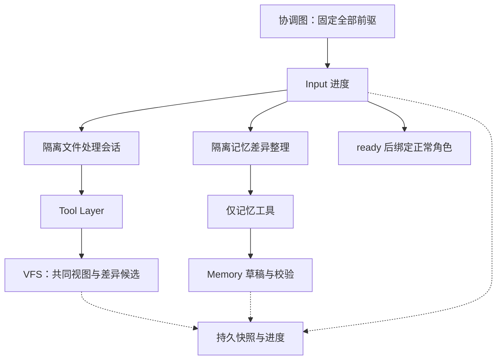
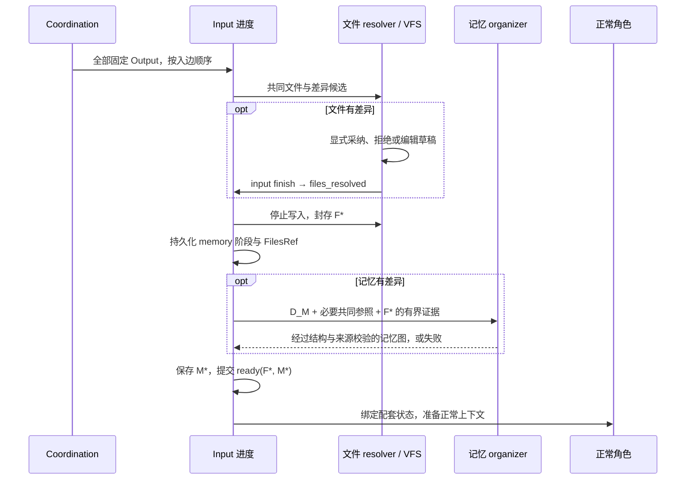

# Threadmill 统一边与文件优先合入设计

| 项目 | 内容 |
| --- | --- |
| 版本 / 状态 | v0.7 / 已实现，本地验证通过（范围见 §10） |
| 日期 | 2026-09-14 |
| 责任角色 / 读者 | Coordination、Tool、VFS、Memory、Manager 与 Agent 运行时维护者 |
| 形成方式 | 人类需求驱动；本版按实现增量维护设计与验证入口 |
| 历史基准 | `dbcd2a092d6a1bb76471c8fdcb672454afaf35ac` 为迁移前 `dev-native` 基线，仅用于 §2 的历史说明 |
| 实现基准 | 本文件与同一 PR 中的源码、测试共同定义当前实现；模块与验证入口见 §10 |
| 修订记录 | v0.1：统一入口与文件优先；v0.2：交集直接取、差异才处理；v0.3：取消 root，允许无合出边和持久线程；v0.4：同步实现、协议版本与恢复限制；v0.5：删除无生产调用的旧设计与专属状态；v0.6：VFS 输入原语统一命名并移除旧文件名；v0.7：新建真实目录 task 与现有文件来源合入 |

所有协调边都表达同一件事：**把全部入边 `from` 的完整记忆图和文件状态交给 `to` 的入口缓冲区。相同的部分直接取，差异才处理；先处理文件差异，再依据最终文件证据整理记忆差异。单入边直接继承，不整理记忆。**

协调图只有普通 task。没有 root 类别、root 队列、创建顺序继承或创建树等待。task 可以没有向其他 task 的出边；持久 task 完成一轮后保留身份和状态，明确继续时再创建一次激活。有限的模型、命令和文件资源仍由既有资源层管理。

## 1. 人类要求与实现边界

### Human Design

| 编号 | 人类明确要求 |
| --- | --- |
| H1 | 统一边，不再分别存在 fork、spawn、join 的边逻辑 |
| H2 | 把目标全部入边 `from` 的记忆与文件状态收集到缓冲区 |
| H3 | 单入边直接使用来源状态，不整理记忆 |
| H4 | 先处理文件，再整理记忆，避免把不符合文件事实的内容直接合入 |
| H5 | 最初先交付设计文档；后续由 H10 扩展到代码实施 |
| H6 | 比较所有来源，交集直接取，交集之外的差异才处理；不按相对历史基线的“增量”定义 |
| H7 | 允许 task 不 join 到任何地方，不阻塞没有依赖它的任务 |
| H8 | 日常任务可以使用持久线程 |
| H9 | 不需要 root，也不保留 root 串行规则 |
| H10 | 确定改动面后实施，使用 TDD，重构后的代码保持干净 |
| H11 | 核查旧设计是否清理，并继续减少无用代码 |
| H12 | 将发布改为新建 task 时指定真实目录，由 task 在真实目录运行与调试；已有 task 不切换目录 |
| H13 | 真实目录现有内容作为新合入源进入 pending，复用原有文件与记忆合入逻辑 |
| H14 | Manager 与真实目录持有 Agent 仅在运行中双向交流 |
| H15 | 新阶段开始就使用真实目录；阶段成果展示与阶段验收均在真实目录进行 |
| H16 | 用户要求运行当前工作区时创建新的 task 处理 |

### Agent Self-Claimed

不可变 `Output`、精确交集规则、激活编号、`input` 工具及阶段名称、Help 暂停/恢复节点、版本 1 格式、拒绝旧状态、具体证据边界和测试形状，都是 Agent 为落实上述要求选择的实现默认值。它们已经落到本分支代码，不代表人类逐项指定了这些名称或数据结构。

固定 Planner → Executor → Verifier 职责、Tool 统一入口、隔离写入、每项交付唯一 integration owner 继续适用；H12/H13 替代 Manager 手动发布。H7～H9 替代旧的 root 串行、同树依赖、helper 层专属并行和必须返回创建者的限制。helper 只描述用途，不是 task 类别。

本次覆盖协调图、入口文件/记忆处理、独立生命周期和恢复；不增加业务角色、自动文本合并器、外部服务或依赖，也不实现旧状态转换器和新的快照垃圾回收。

## 2. 迁移前基线：`dbcd2a0`

本节只描述迁移前代码，**不是当前运行规则**。所有旧符号与行号均应在固定基线中查看，不能套到已重构文件。

| 迁移前行为 | 固定版本证据 |
| --- | --- |
| `Edge.Kind` 区分 sequence/spawn/join；root 是 Planner 没有入向 spawn 边的 task | [旧 graph.go](https://github.com/KDZZZZZZ/threadmill/blob/dbcd2a092d6a1bb76471c8fdcb672454afaf35ac/internal/coordination/graph.go)、[旧 pending.go](https://github.com/KDZZZZZZ/threadmill/blob/dbcd2a092d6a1bb76471c8fdcb672454afaf35ac/internal/coordination/pending.go) |
| root 按顺序运行，后一个 root 的 Env.ParentID 指向前一个；held 可形成队头阻塞 | [旧 manager.go](https://github.com/KDZZZZZZ/threadmill/blob/dbcd2a092d6a1bb76471c8fdcb672454afaf35ac/internal/manager/manager.go)、旧 graph.go 的 `addRootLocked` |
| `joinTaskReports` 提前合入记忆，再开放文件候选；runner 等待并统一收尾子树 | [旧 run.go](https://github.com/KDZZZZZZ/threadmill/blob/dbcd2a092d6a1bb76471c8fdcb672454afaf35ac/internal/coordination/run.go)、[旧 join_tool.go](https://github.com/KDZZZZZZ/threadmill/blob/dbcd2a092d6a1bb76471c8fdcb672454afaf35ac/internal/coordination/join_tool.go) |
| 重新接纳变化的项目可能替换 floor 并删除旧环境 | [旧 floor.go](https://github.com/KDZZZZZZ/threadmill/blob/dbcd2a092d6a1bb76471c8fdcb672454afaf35ac/internal/vfs/floor.go) |

旧 root 和 VFS base 在概念上已经分开，但调度和环境继承仍有耦合。当前实现删除了 task 的祖先字段和 root 分类；VFS floor 只决定一个文件视图的底层，不决定任务优先级、等待或取消范围。

例如，A 记录“Foo 已实现”，而目标拒绝 A 的文件；旧的提前记忆 Merge 可能让该说法先成为目标事实。迁移同时改变了来源、文件决策、记忆可见性和完成边界，不能只把旧 `Kind` 字段删掉。

## 3. 普通边与完整输入

### 3.1 交集与差异

```text
incoming(v) = 本次执行点开始收集时锁定的全部入边
sources(v)  = 按图中顺序取得每个 from 的不可变 Output
source_i    = (完整文件状态 F_i, 完整记忆图 M_i)

C_F = 所有 F_i 的交集          D_F = 各来源中不属于 C_F 的状态
C_M = 所有 M_i 的交集          D_M = 各来源中不属于 C_M 的状态
F*  = 直接使用 C_F + 对 D_F 的文件决策
M*  = 直接使用 C_M + 依据 F* 证据处理 D_M
ready = 持久化后可绑定的配套 (F*, M*)
```

差异来自**本批所有完整来源之间的比较**。共同祖先或最外层 delta 可以帮助存储，但不是交集定义。只在部分来源出现、同路径不同内容、同 ID 不同语义值都属于差异。来源顺序不随完成顺序变化；某个来源失败或缺失，不会被当作空值删去以触发单来源快路。

单来源全部直接继承，文件和记忆写入仍彼此隔离。多来源中某个领域完全相同，也跳过该领域的差异处理。文件相同但记忆不同，只做文件完成封口后整理记忆；记忆相同但文件不同，处理文件后直接使用共同记忆。

交集直接继承不等于证明所有来源共同记住的旧内容都正确；本次协议不会重新整理整张共同图。遇到明确更正时，通过差异中的更正关系保留来源和旧记录。

| 拓扑 | 结果 |
| --- | --- |
| A → B，A → C | B/C 各自继承 A 的固定输出，各自写入隔离环境 |
| A → C，B → C | C 收齐 A/B，共同部分直接取，差异按文件→记忆处理 |
| 前序角色 → 当前角色，加一个帮助出口 → 当前角色 | 是两个来源，不能把“一个 helper”误判为单来源 |
| A → B，A → L，L 无跨 task 出边 | B 不因 L 尚未完成而等待；L 是否持久独立配置 |
| 无入边的初始 Planner | 使用独立的起始文件 floor 与空任务记忆，再准备受保护 task package；不继承上一个 task |

### 3.2 固定出口与身份

`Edge` 只有 `From`、`To`，JSON 字段为 `from`、`to`。`Task.ID` 是稳定身份，`Activation` 标识当前轮次；当前角色节点形如 `taskID:activation:role`，`Task.Env.ID` 标识该次激活的可写环境。`Env` 没有 task 父环境字段。Graph 另外保留历史角色和 checkpoint 节点。

`Output{Node, FilesRef, MemoryRef, Report}` 是不可变的成对出口。同一节点重复提交完全相同的出口可幂等返回，改变已有出口会被拒绝。消费者引用节点的固定输出，不读取可写环境的“最新值”；某个角色输出一旦提交，下游就可消费，不必等来源 task 的 verifier 或整个持久寿命结束。

开始收集的目标输入被冻结；重启后依据已保存的 Input 继续保护这批来源，即使本角色还没有 Output，也拒绝改接前驱或删除任务。新增消费者不修改来源。历史节点只有已有 Output 才能作为新依赖来源，不能等待一个已经过去且永远不会完成的节点。当前激活的普通角色节点可以先声明依赖，运行时等待其输出；held 来源只阻塞它的消费者，启用后继续，不阻塞无关任务。

## 4. 组件与文件优先流程

该视图展示入口协议，文件与记忆处理都使用隔离状态。文件 resolver 与记忆 organizer 是运行时调用的专用会话，不增加业务角色。



| 组件 | 当前职责 | 实现入口 |
| --- | --- | --- |
| Coordination | 普通 DAG、并发 runner、固定来源、成对出口与角色绑定 | [graph.go](../internal/coordination/graph.go)、[run.go](../internal/coordination/run.go) |
| Input 协议 | 阶段、固定引用、文件冻结、证据、记忆整理和 ready | [input.go](../internal/coordination/input.go)、[progress.go](../internal/coordination/progress.go) |
| 文件处理会话 | 只处理本批差异，调用文件/Bash/input 工具，使用 scratch 记忆 | [assemble.go](../internal/coordination/assemble.go) |
| VFS | 完整可见文件比较、隔离候选、safe/replace、archive 与旧 floor 保留 | [vfs/input.go](../internal/vfs/input.go)、[input_changes.go](../internal/vfs/input_changes.go)、[live.go](../internal/vfs/live.go)、[floor.go](../internal/vfs/floor.go) |
| Memory | 精确分区、差异版本和关系、共同部分保护、引用校验与不可变快照 | [context/input.go](../internal/context/input.go)、[store.go](../internal/context/store.go) |
| 记忆整理会话 | 只看差异及必要共同参照与最终文件证据；失败不修改 live 记忆 | [input_memory.go](../internal/agent/input_memory.go) |
| Manager / Help | 编排 tasks/edges、独立任务寿命、暂停/恢复和创建真实目录 task | [manager.go](../internal/manager/manager.go)、[help.go](../internal/coordination/help.go)、[graph_tools.go](../internal/coordination/graph_tools.go) |

运行时阶段为：

```text
collecting → files → files_resolved → memory → ready
```

1. `collecting`：保存本批全部固定来源引用。
2. `files`：共同文件已经使用；独立 resolver 处理差异。无文件差异时跳过 resolver。
3. `files_resolved`：文件候选的处置已完成；停止相关命令并封存最终文件。
4. `memory`：文件引用已固定；只在记忆有差异时调用 organizer。失败保留此阶段与文件结果。
5. `ready`：配套文件与记忆引用已经持久化，正常角色才可以绑定并开始/恢复。



文件阶段可以按需查看来源报告帮助选择，但这些材料不是目标已接受的当前记忆。文件 resolver 不继承正常角色会话；记忆 organizer 不继承调用方 hooks、工具或历史检查点，且没有文件、命令或协调工具。

## 5. 文件交集与候选

`VFS.PrepareInput(targetID, sourceIDs)` 返回按来源顺序排列的 `Candidates` 和排序后的差异 `Paths`。目标先具有共同可见状态；每个候选在共同视图上明确保存该来源对每条差异路径的值，包括缺失/删除。单来源或所有文件相同时不返回候选。

比较包含内容、类型、权限、目录与存在状态，不只比较历史 fork delta。只有 A 有 `a.go`、只有 B 有 `b.go` 时，两条路径都属于差异。目录权限不同而子项相同时，共同子项继续可读；中性目录容器不表示已接受任何来源的最终权限。

`safe` 应用遇到任一路径冲突时整次零写入；`replace`、部分采用、同路径人工组合和重写由 resolver 显式决定。候选不共享可写来源，也不自动文本合并。完成所有必要处置后 `input finish` 结束文件阶段；它返回文件完成，不表示记忆已整理、Input 已 ready 或验证 PASS。

最终文件证据包含固定引用、处置理由、差异路径存在状态、内容摘要/hash、可展示内容及截断/省略标记。证据有界，未展示部分不能被当作已经验证；仅有路径、hash 或“合并成功”一句话不证明自然语言结论。

## 6. 记忆交集、差异与可见性

`PartitionInputs` 对完整节点、边和子图的语义字段做精确比较，忽略集合排列和容器 revision。相同 ID 不同状态/陈述是差异，来源与适用范围不同也不能提前视为同一事实。单来源返回独立克隆；不同 ID 的相似文本是否能归并，由差异处理判断。

差异草稿保留各版本与来源，必要时同步重映射 ID、归属和关系。organizer 只得到差异及结构上必需的共同参照，不能因共用一个子图就重整全部共同节点。Compose 校验共同部分、受保护指令、重复身份和悬空关系；明确更正用 `SupersededBy` 关联，保留被更正的历史。

未经核实的差异事实先作为 disputed/hypothesis 材料。把新事实升为 accepted 需要最终文件证据与版本引用；被拒绝或覆盖实现上的结论、来源上的测试 PASS 不能自动成为组合结果的事实或验证。证据不足时保留待验证状态；结构与来源校验不替代真实验证，也不保证模型的自然语言判断总是正确。

只有 ready 后才恢复 task 记忆并组装正常订阅。正常投影不把已失效、争议或已被更正的陈述显示成当前 accepted 事实；候选与历史仍可按需以来源限定查看。共同部分直接继承，不声称已按最终文件重新核验整张图。

Planner/Verifier 的临时实验不成为持久实现，但经 Input/Help 明确选入的文件基线会保留。`InputProgress.ResumeFor` 记录 resume 所属原角色，运行时按最近 ready 且 started 的输入恢复基线。它们的 pause 和最终出口均投影到这份可保留基线；实验记忆分别关联各次观察的 `observed-files` 快照，不把临时实验说成持久实现。[Help 投影回归](../internal/coordination/help_scope_test.go)与[启动后恢复回归](../internal/coordination/runtime_review_test.go)覆盖这些具体场景，不代表 A13 所有组合已经验证。

## 7. 数据与工具协议

| 对象 | 当前字段或职责 |
| --- | --- |
| `Task` | ID、Info、Env.ID、三个当前角色节点、Outcome、RunPolicy、Persistent、Activation |
| `Graph` 持久状态 | Version=1、Revision、NextID、Tasks、全部 Nodes、Edges、不可变 Outputs、Help 请求、ProjectTaskID、ProjectMessages |
| `Output` | Node、FilesRef、MemoryRef、Report；图中的不可变成对出口 |
| `TaskProgress` | Version=1；以 activation 的 Env.ID 存储 Inputs、Pending 导出日志 |
| `InputProgress` | ID、NodeID、ResumeFor、TargetID、Sources、Paths、Phase、FilesRef、MemoryRef、Reason、Started |
| `InputSourceProgress` | 来源节点与配套引用、只读候选 EnvID、报告、采用路径/全部采用/丢弃状态和理由 |
| `ExportProgress` | 尚待提交的成对 Output 和暂存记忆；图提交后清除日志 |
| 真实目录归属 | ProjectTaskID 标识当前归属；Task.RealDirectory 只在创建时选择，旧 task 不可切换 |
| `helpState` | 请求/调用/原角色 ID，PauseID、ResumeID、Units、TaskIDs、Configured、Declined |

`coordination_orchestrate` 的动作是 `replace_pending`、`provide_help`、`continue_task`、`close_task`。前两个使用统一的 `tasks`/`edges`，不再接受 roots/spawns。`replace_pending` 替换可编辑部分并保留完成历史；`provide_help` 对当前图增补普通 task 与边，不替换无关工作。

```json
{
  "action": "replace_pending",
  "tasks": [
    {"id": "build", "info": "实现并验证所需改动"},
    {"id": "watch", "info": "记录后续调查，完成本轮后保留线程", "persistent": true}
  ],
  "edges": [{"from": "build:1:planner", "to": "watch:1:planner"}]
}
```

任务内部三个角色和两个普通顺序边自动建立。例中的 watch 没有跨 task 出边，不要求 build 等它完成。`run_policy` 可为 enabled 或 held；持久性和是否有消费者是独立属性。

`input` 仅对绑定的角色与工作区开放：`list/inspect` 查看批次与来源，`apply/discard` 处置文件差异，`finish` 完成文件决策。`inspect` 包含 summary/output/diff/file/compare，支持分页。正常角色能否继续由运行时 ready 守卫决定，不能靠模型自报或 `files_finished` 代替。

## 8. 恢复与存储限制

文件先封存，记忆随后封存，最后持久化 ready 引用。消费者只绑定固定配对记录；不分别读取两个存储的最新可写状态。角色导出另有 Pending 日志，能够在已保存的完成边界继续提交 Output；模型运行完成本身不是持久化证明。成功结果从已提交的 verifier Output 恢复，不另存 Result/RunResult 副本；任务报告保存失败后，也依据已有 Output 跳过已经提交的角色。

| 故障位置 | 当前恢复边界 |
| --- | --- |
| 来源未产生 Output | 本批不就绪，不删除来源；失败通过真实依赖影响消费者，不取消无关 task |
| 来源 held | 消费者等待启用或明确终止；无关任务继续运行 |
| 已保存 Input 后、尚无本角色 Output 时重启 | 恢复固定来源；图编辑拒绝改接这批前驱或删除该任务 |
| 文件 safe 冲突 | 本次应用零写入，继续文件决策 |
| 文件已固定、记忆整理失败/取消 | 保留 memory 阶段和固定文件引用，不暴露候选记忆，不重新选择文件 |
| 记忆快照保存后 ready 保存失败 | 按同一批次引用重试提交，不重新取来源最新值 |
| 角色 Pending/Output 已持久化后提交失败 | 恢复已记录出口，不重跑已被持久记录覆盖的角色 |
| ready 后工作区释放失败 | 配套快照仍是恢复依据；可能残留临时数据，不承诺后台自动清理 |

**兼容性：Graph 与目录 Progress 的版本 1 会拒绝旧版或未知版本；没有自动转换器。** 旧 Finished/Merged 没有配套文件与记忆证明，不能映射为 ready。切换前保留旧状态与匹配的程序：用旧版完成旧工作，或人工核对项目事实后建立全新图。没有完整快照/导出日志的中断，不承诺模型调用、命令或外部副作用恰好一次。新状态也不应交给旧程序写入。

VFS 接纳变化的项目时创建新的 `.floors/<digest>`，旧 overlay 保留自己的 lower 路径；归档/恢复不静默换成新 base。快照与 delta 减少逻辑分支复制，但完整可见状态比较会扫描文件；归档在 reflink 后端可能保留完整磁盘工作区，overlay 后端也保留需要的持久底层。

本次没有新增引用计数 GC、关闭后自动删除历史或 O(1) 成本保证。关闭 task 停止当前运行，历史 Output、记忆快照和 floor 可能继续占用磁盘。原生 OverlayFS 需要相应权限，本次非特权验证会跳过该后端；其他后端的测试不能代替它的验收。

## 9. Help、持久 task 与真实目录

### 9.1 Help 的因果关系

暂停和恢复是原角色的独立 checkpoint 节点，不是新业务角色。请求时封存 pause 输出；运行时把先前输入连到 pause、把 resume 连到原角色的最终完成点。Manager 的 Help 配置始终包含 pause → resume，只有显式列出的返回依赖才需要等待：

```text
先前输入 → pause → 帮助 task 的入口 → … → 帮助出口 → resume → 原角色完成
                └──────────────────────────────→ resume
```

没有返回边的帮助 task 独立运行，请求者只消费自己的 pause 状态。不是“未完成原角色 → helper → 同一原角色”的隐式等待树。显式 DAG 会拒绝把请求者未来后继反接到本次 resume 的环。

I1/I2/I3 按每项交付保持：唯一整合/验收 owner、隔离写入、依赖物化后独立可判定。owner 不意味着 root，也不产生隐式父子取消。创建者退出不决定独立 task 的寿命；活跃运行受 Manager 会话和本 task 的取消控制。

### 9.2 持久身份与激活

普通 task 成功后为 done，持久 task 成功后为 idle；失败和取消记录当前激活的结果，不等同于明确关闭。`continue_task` 只对 idle 的持久 task 创建下一激活，增加 Activation，分配新 Env 和角色节点，并连接上次 verifier → 新 planner。失败/取消的当前激活可按已有进度恢复，不假装已经完成了一轮。

不同 task 可并行，同一个 task 同时只有一个当前激活。并发调用共享该激活的运行与结果；idle 不保持模型调用或命令进程，新输入由明确编排触发。关闭只取消该 task 的当前 runner，保留历史输出。

消费者可以引用已提交的历史节点，不等待持久 task 关闭。VFS base 与任务身份解耦：新项目 floor 为新环境提供初始文件，旧 task 的成对出口继续引用其原来的文件和记忆。

### 9.3 真实目录 task

Manager 通过 `coordination_orchestrate` 创建带 `real_directory=true` 的新 task，使用显式边提供候选实现。已有 task 不能修改此模式。旧的 `coordination_publishTask` 工具与 publishing/published 记录已移除。

该 task 开始收集 Planner 输入时，在启动或等待上游之前，把真实目录现有内容捕获成不可变额外来源。它没有 Agent 结论，记忆源为空；文件与显式上游共同进入 pending，沿用交集、文件差异决策、记忆核对流程。重试复用固定来源，不重新采集。此捕获时点、来源命名及空记忆是 Agent 选择的实现细节。

只有 input ready 后，运行时才把已选择结果安装到真实目录并绑定角色工作区。被明确丢弃的真实目录新增文件也须移除。文件工具与沙箱命令直接作用于该目录，改动立即可见；Planner/Verifier 仍不修复实现，临时实验须自行清理。失败不回滚真实改动，Started 恢复不重装旧输入。各角色出口继续归档为不可变快照。

同一时刻只有一个 task 拥有真实目录。前一 task 已结束且 runner 清理完成后，可新建另一个真实目录 task；被替代的持久 task 不可继续激活。命令 Reap 失败不能释放目录绑定。其他 task 始终使用隔离工作区，无新增隐式等待边或全局串行规则。图版本仍为 1，旧 task 默认隔离，旧发布标记不赋予目录归属。

所有进入 dev-native 的代码仍通过 PR；文件可见不代表 Verifier PASS，也不代表已进入基线。

### 9.4 阶段与运行中通信

新阶段创建时就指定真实目录，由该 task 直接推进、调试和验收。隔离 task 的候选可通过普通输入/Help 合入；它们的 PASS 不能替代真实目录的阶段验收。用户要求运行当前工作区时创建新真实目录 task，若目录被占用，先与持有者协调收尾。

Manager 用 `coordination_orchestrate{action:"message_task",task_id,input}` 向运行中的真实目录角色发消息；角色用 `coordination_messageManager{message}` 向 Manager 发进展、问题或答复。后者复用 Manager 队列，不暂停，也不创建 Help、任务或依赖；完成仍通过原有角色出口与最终 task 报告。

消息保存于 Graph.ProjectMessages，包含工具调用 ID、真实角色 NodeID、由运行时确定的发送者和正文。Manager 的调用 ID 去重，同 ID 不同内容拒绝；Agent 通知重放保留同一 ID。接收发生在下一次模型请求前；消息与终态检查共用图锁，在最终答复期间被接收的消息会触发当前角色继续处理，然后才导出。准备输入、角色交接或结束后无接收角色时明确拒绝，不唤醒 task，不修改创建时目录模式。角色错误或取消时未处理消息仍保留在图中，接收成功不保证已完成处理或验收。

普通 task 不展示发送工具；运行时还校验当前归属及精确角色身份。消息是交流记录，不是用户授权、不可变文件来源或验收结论。上述工具/字段命名、异步投递方式、持久化结构与回归形状是 Agent 实现选择。

## 10. 当前落点与验证范围

旧 `coordination/join_tool.go` 已被 Input 协议与工具替代。VFS 只保留 `CreateEnvironment`、`InputChanges`、`ApplyInput` 这些文件输入原语，不定义协调边。协调层旧环境创建与候选报告投影入口已移除，单来源也经过统一 Input。图中祖先类型、单 runner 守卫、root 调度与旧进度 Merged/Joins 被移除；动态图提示同步使用普通依赖与输入状态。

v0.6 按全仓实际调用继续删除旧入口及其专属测试，没有保留同名兼容层：

| 已删除 | 保留的现行行为与验证入口 |
| --- | --- |
| 记忆 `Store.Fork/Merge`、历史 baselines、additive-only 合入和冲突改名 | 完整输入分区、不可变快照与精确恢复；[store_test.go](../internal/context/store_test.go)、[input_test.go](../internal/context/input_test.go) |
| 全局记忆 Clone/Update/GlobalView/SharedView 单例 | 各任务使用自己的 Store/View；工具写入、Bind 隔离等测试使用测试私有状态 |
| VFS `Handoff`、目录转移恢复分支及 handoffs 指标 | 固定输出可重复消费，工作区隔离与重启恢复；[live_test.go](../internal/vfs/live_test.go)、[overlay_test.go](../internal/vfs/overlay_test.go) |
| 协调图 Default/reset 单例、newGraph 别名、无生产调用的 Downstream、仅请求最新版本的 SnapshotAt 包装 | 独立 New、Snapshot/Incoming、请求取消和稳定提示投影；[graph_test.go](../internal/coordination/graph_test.go)、[graph_hook_test.go](../internal/coordination/graph_hook_test.go) |
| Roles.Prepare、TaskProgress.Prepared、无调用的 ProgressStore.Delete | 每个角色先完成统一 Input，保留 Inputs 和待提交导出日志；[run_test.go](../internal/coordination/run_test.go) |
| 无调用的 StateFingerprint/LiveStatHash 包装、整环境哈希和 epoch 缓存、floorHasPath/layerMasks 辅助函数 | 实际物化和吸收使用的 live 指纹扫描、同尺寸同 mtime 写入检测；[fingerprint_test.go](../internal/vfs/fingerprint_test.go) |
| VFS `Fork`、`JoinChanges`、`ApplyJoin` 及 `join.go` 文件名 | `CreateEnvironment`、`InputChanges`、`ApplyInput` 与 `input_changes.go`；[input_changes_test.go](../internal/vfs/input_changes_test.go) |

删除前先把仍有效的行为测试迁到现行入口并跑绿，再删除旧实现；纯粹验证被废弃 API 的测试随 API 删除。文件冲突处理、平台隔离、取消与持久检查点的保护不因代码清理而减少。

相对迁移前 `dev-native` 基线，最终生产 Go 文件增加 3,802 行、删除 3,531 行，净增加 271 行；测试增加 5,155 行、删除 6,074 行，净减少 919 行。Go 文件合计净减少 648 行，不含文档。新增实现承载完整状态比较、文件优先整理、持久激活和恢复协议；生产与测试分别统计，以呈现仍需维护的实现规模。

| 行为 | 源码 / 测试入口 |
| --- | --- |
| 普通边、激活历史、版本拒绝、待执行图边界 | [graph_model_test.go](../internal/coordination/graph_model_test.go)、[graph_store_test.go](../internal/coordination/graph_store_test.go)、[pending_test.go](../internal/coordination/pending_test.go) |
| 独立运行、提前消费角色输出、持久续跑、导出失败重试、文件→记忆恢复 | [unified_test.go](../internal/coordination/unified_test.go)、[run_test.go](../internal/coordination/run_test.go) |
| Help 显式返回、无返回独立工作、来源校验与恢复 | [help_test.go](../internal/coordination/help_test.go)、[help_scope_test.go](../internal/coordination/help_scope_test.go)、[runtime_review_test.go](../internal/coordination/runtime_review_test.go) |
| 真实目录输入合入、独占归属、恢复保留编辑；实验重试引用本次文件 | [project_test.go](../internal/coordination/project_test.go)、[help_scope_test.go](../internal/coordination/help_scope_test.go) |
| 文件处置、部分采用、权限与工作区绑定 | [input_tool_test.go](../internal/coordination/input_tool_test.go) |
| 完整文件交集/缺失/权限、重试、旧 floor 与归档恢复 | [vfs/input_test.go](../internal/vfs/input_test.go)、[live_test.go](../internal/vfs/live_test.go) |
| 记忆交集、版本保留、引用/指令/共同部分保护 | [context/input_test.go](../internal/context/input_test.go)、[store_test.go](../internal/context/store_test.go) |
| 无差异不调用模型、有界差异整理、最终文件证据、失败隔离 | [input_memory_test.go](../internal/agent/input_memory_test.go) |
| Manager 持久状态、held、Help 和独立调度 | [manager_test.go](../internal/manager/manager_test.go)、[manager_lifecycle_test.go](../internal/manager/manager_lifecycle_test.go) |

2026-09-09 的本地验证结果：

| 检查 | 结果与范围 |
| --- | --- |
| `go build ./...`、`go vet ./...`、`go test ./... -count=1` | 全部通过 |
| coordination、manager、context、vfs、agent、tool 的 `go test -race` | 清理后全部通过；覆盖独立运行、汇合前驱并发启动、报告与持久激活续跑 |
| `go test -tags=integration ./... -run '^$'` | 全包编译通过；未调用真实模型 |
| `go run ./cmd/tmfleet -tasks 8 -model-delay 10ms -slots 4 -files 10 -timeout 20s` | 统一边实现阶段通过：模拟 provider 完成全链路，18 次命令请求全部完成；这是功能冒烟，不是规模性能结论 |

TDD 切片先捕获失败再修复，包含初始环境串联、共享运行、提前消费固定出口、重启文件丢失、输出提交失败重跑、Help 文件投影、失败资源清理、held 等待、重启后输入改接、汇合来源串行化、持久激活延迟启动、真实目录合入删除与恢复及实验重试引用旧文件。回归直接使用图、存储、工具或 Manager 的行为入口。

这些结果不代表 §11 的全部故障组合已验证。原生 OverlayFS 用例受非特权环境限制而跳过；真实模型、所有平台与大规模持续运行未在本次验证中执行。§6、§8 的事实与存储边界继续适用。

## 11. 验收矩阵

以下保留需求追踪编号；它们是验收目标。已有测试只覆盖其中的具体分支，涉及所有故障窗口、资源回收或自然语言事实准确性的行不能凭单测存在判为全部通过。

| 编号 / 需求 | 场景 | 应观察到的结果 |
| --- | --- | --- |
| A1 / H1、H9 | 角色链、分支、汇合、显式任务继承 | 都只有 From/To 依赖；同一准备入口，无 Kind、root 类别或旧名分发 |
| A2 / H2 | 两个来源乱序完成，另一个失败/缺失 | 来源顺序固定、收齐才处理；失败不缩减为单来源 |
| A3 / H3 | 一个来源输出给两个目标 | 初始文件/记忆等价，各自后续写入隔离；不执行记忆整理、不调用整理模型 |
| A4 / H2、H3 | 原有前驱加一个 helper | 收集两个来源，目标已有改动保留为明确输入 |
| A5 / H4 | A 声称功能已实现，最终拒绝 A 文件 | 文件处理前候选记忆不可见；整理后不把该说法作为当前事实 |
| A6 / H4、H6 | A 部分采用后被 B 或目标覆盖；差异处理中明确更正旧结论 | 按最终 F* 核对差异及其更正，不以 applied 标记代替证据，不扩展为共同部分重整 |
| A7 / H4 | 来源报告 PASS，目标组合或重写文件 | 保留来源快照上的历史证据，不把它当作最终状态的验证结论 |
| A8 / H2、H4 | safe apply 冲突；新增、删除、目录遮蔽、权限位变更 | 冲突时零写入；最终文件及证据忠实反映所有文件操作 |
| A9 / H4 | memory 后整理失败、被取消或文件版本变化 | 不出现 ready，不泄漏候选/草稿；可按正确阶段重试 |
| A10 / H4 | 工件、完成记录、清理各边界中断 | 只绑定一致状态对；重试不重复应用已完成操作；不误放行目标 |
| A11 / H2、H3 | 来源后来继续写入；多个消费者先后完成 | 每个消费者读到约定出口；消费其他来源后仍能读取约定出口 |
| A12 / H1、H2 | 一次和多次 Help 暂停/恢复 | 统一普通边与缓冲，无等待环；每批只含锁定来源并包括请求者状态 |
| A13 / H4、H6 | Planner/Verifier 临时文件被清理；差异处理中已更正的旧记忆仍属订阅子图；入口处理触发消息压缩 | 临时实验不成为持久实现；候选和已更正的旧事实不经订阅、历史或自动记忆写回旁路冒充当前状态 |
| A14 / H1～H4 | 旧状态拒绝与运行时权限 | 旧 Finished 不冒充 ready；未声明的来源不可读，来源不可写，Manager/整理 Agent 权限不扩大 |
| A15 / H6 | 多入边具有大量相同记忆和少量不同记忆 | 交集直接取，只有并集减交集的差异进入整理；共同记忆只按需作为只读参照；重试使用相同来源 |
| A16 / H3、H6 | 单入边；多入边文件与记忆全部相同 | 差异为空，直接继承共同部分，无文件决策或记忆整理调用 |
| A17 / H6 | 同路径不同内容/一方缺失，同节点不同状态，只在部分来源出现的项 | 全部进入差异；不能按无冲突、创建时间或历史基线把它们归入共同部分 |
| A18 / H7、H9 | A 同时输出给 B 和无合出边的 L，L 一直运行或等待输入 | 在资源可用时 B 及其后继能启动、完成，请求能返回；不等待 L 或全图空闲 |
| A19 / H9 | 两个无依赖 task 先后创建；第一个被暂停 | 第二个可独立运行；不自动建立继承边，不按前一个环境 fork，不受队头阻塞 |
| A20 / H7、H8 | 创建者完成/取消/失败；独立 L 失败 | L 不随创建者退出或被整树清理；L 失败不取消无关任务，真实消费者收到依赖失败 |
| A21 / H8 | 持久 L 完成一轮后 idle，再接收新输入 | 同一 task 身份与配套状态可继续；idle 不占模型/命令槽位；单来源续跑不整理记忆，输入不丢失或重复执行 |
| A22 / H2、H8 | 消费者读取 L 的固定出口后 L 再次写入 | 消费者不等待 L 关闭，已绑定的文件/记忆不变；引入 L 新出口时重新建立显式输入批次 |
| A23 / H8 | L 无消费者；另一真实目录任务修改项目；项目变化后重启 | L 的状态和所需 floor 仍可恢复，文件与记忆不因重建 base 错配；关闭不改变旧出口；磁盘回收另行验收 |

A9 中的文件版本变化要求针对不可变快照与写入封口验证；不承诺任意宿主篡改都可自动修复。A10 的恰好一次范围限于已持久化检查点。A13 的 Planner/Verifier Input/Help 投影有专项回归，仍需保留跨阶段组合验证。A23 的跨 floor 恢复已有实现和测试入口，关闭后的自动磁盘回收不在本次范围。

## 12. 横向设计依据

前序设计记录了以下固定 commit 的相关设计、实现和测试；仅比较本次涉及的上下文继承、前驱收集、结果消费与持久续跑，没有把参考仓库当作 Threadmill 的依赖。

| 参考 | 实际行为与取舍 |
| --- | --- |
| Pi `c49906ec`：[session-manager.ts](https://github.com/badlogic/pi-mono/blob/c49906ec77788625aacbdc53ebca6fbe65bd20f5/packages/coding-agent/src/core/session-manager.ts)、[branch-summarization.ts](https://github.com/badlogic/pi-mono/blob/c49906ec77788625aacbdc53ebca6fbe65bd20f5/packages/coding-agent/src/core/compaction/branch-summarization.ts)、[tree-traversal.test.ts](https://github.com/badlogic/pi-mono/blob/c49906ec77788625aacbdc53ebca6fbe65bd20f5/packages/coding-agent/test/session-manager/tree-traversal.test.ts) | branch 移动叶指针并追加新路径，保留旧历史；离开分支可生成带来源的摘要。借鉴固定历史与来源追踪。所检查的摘要流程跟踪工具中的文件操作，不提供 Threadmill 所需的最终 VFS 状态核对，不能把分支摘要直接当当前文件事实。 |
| deepseek-harness `141eb6fe`：[fork 设计](https://github.com/deepseek-ai/deepseek-harness/blob/141eb6fef83422698aef7a981029e843e8161534/packages/subagent/subagent-fork-in-process/README.md)、[fork 实现](https://github.com/deepseek-ai/deepseek-harness/blob/141eb6fef83422698aef7a981029e843e8161534/packages/subagent/subagent-fork-in-process/src/index.ts)、[spawn 实现](https://github.com/deepseek-ai/deepseek-harness/blob/141eb6fef83422698aef7a981029e843e8161534/packages/subagent/subagent-spawn-in-process/src/index.ts)、[fork 测试](https://github.com/deepseek-ai/deepseek-harness/blob/141eb6fef83422698aef7a981029e843e8161534/packages/subagent/subagent-fork-in-process/tests/subagent-fork-in-process.spec.ts) | fork/spawn 共享 driver，差别是是否提供已完成回合的 seed；进行中的不完整回合不会继承。借鉴明确捕获边界与一次性 seed，避免重试读新来源。其仍区分两种 provider，且此 seed 是会话历史，不是文件/记忆配套快照；本设计遵循人类要求统一边。 |
| Eino `ebd616c8`：[dag.go](https://github.com/cloudwego/eino/blob/ebd616c8291e957684ea6ca99dd54225d04e0438/compose/dag.go)、[dag_test.go](https://github.com/cloudwego/eino/blob/ebd616c8291e957684ea6ca99dd54225d04e0438/compose/dag_test.go)、[graph_test.go](https://github.com/cloudwego/eino/blob/ebd616c8291e957684ea6ca99dd54225d04e0438/compose/graph_test.go) | DAG channel 收集前驱值，等待依赖就绪；一个值直接返回，多个值走 merge。测试覆盖 AllPredecessor 的多入边。这与统一缓冲最接近。Threadmill 采用该入口形状，但不能使用通用值合并替代文件选择与事实核对，也不照搬其控制/数据依赖分类。 |

外部先例支持固定来源和统一前驱收集；**文件优先、以最终文件核对记忆**来自本次人类要求，以上参考未提供可直接套用的完整实现。

持久续跑另核对了同一批固定 commit 的三处行为：

- Pi 的 `SessionManager.open` 从会话文件恢复相同身份，[file-operations.test.ts](https://github.com/badlogic/pi-mono/blob/c49906ec77788625aacbdc53ebca6fbe65bd20f5/packages/coding-agent/test/session-manager/file-operations.test.ts) 覆盖重新打开保持 ID；可借鉴持久身份，不代表同时恢复隔离文件状态。
- deepseek-harness 的 [continuation.ts](https://github.com/deepseek-ai/deepseek-harness/blob/141eb6fef83422698aef7a981029e843e8161534/packages/subagent/subagent/src/continuation.ts) 把持久 Session 与运行时 Activation 分开，后续消息可 cold-resume；[continuation.spec.ts](https://github.com/deepseek-ai/deepseek-harness/blob/141eb6fef83422698aef7a981029e843e8161534/packages/subagent/subagent/tests/continuation.spec.ts) 覆盖结束后的续跑与不重复 seed。其仍保留父子授权与 ownedChildren 等待树；Threadmill 不照搬这部分，以满足无 root、无合出边不阻塞的要求。
- Eino 的 [checkpoint.go](https://github.com/cloudwego/eino/blob/ebd616c8291e957684ea6ca99dd54225d04e0438/compose/checkpoint.go) 和 [checkpoint_test.go](https://github.com/cloudwego/eino/blob/ebd616c8291e957684ea6ca99dd54225d04e0438/compose/checkpoint_test.go) 用检查点 ID 恢复中断图执行；可借鉴执行进度独立持久化，不能据此认定图调用已具有长期 task 寿命与 VFS 基线保留能力。

## 13. 尚待完成的验证与已知代价

- Planner/Verifier 的 Input/Help 基线与临时实验已分开保留和投影；继续维护专项回归，不能以纯 Executor 路径代替其跨阶段恢复验证。
- 图与进度没有旧格式转换器；备份和从经核对状态重建是切换边界，不自动推断旧 ready。
- 文件证据和整理输入有界，模型可能无法证明所有差异事实；保留 disputed/hypothesis，不把不足证据升级为通过。
- floor、归档和历史记忆可能持续增长；没有新增 GC，也没有对所有后端和大规模完整状态比较作性能保证。
- held 等待与重启输入冻结已有[专项回归](../internal/coordination/runtime_review_test.go)：暂停来源只阻塞消费者，只有 durable Input 而没有本角色 Output 时仍拒绝改接或删除；继续维护这些跨重启边界。
- 全矩阵与所有平台验证分别记录；本版不把有测试入口等同于已经证明所有并发、崩溃和恢复组合。

### 真实目录工具绑定的横向参考

- [Pi SSH tools（0c7bb7c5）](https://github.com/badlogic/pi-mono/blob/0c7bb7c5c72118e4c71e4c04dfa2ad4a0a6a62f1/packages/coding-agent/examples/extensions/ssh.ts)：文件与命令后端共同绑定 cwd；只改命令 cwd 会留下文件工具不一致。Threadmill 同时绑定 VFS 与 Exec，保留快照出口。
- [deepseek-harness sandbox（c291e796）](https://github.com/deepseek-ai/deepseek-harness/blob/c291e7961a515f6d7af9304e7fd1d257929aef26/docs/subsystems/sandbox.md)及同版本 `packages/shell/bash-sandbox/tests/bwrap.e2e.ts`：工作目录映射与沙箱策略分离。Threadmill 复用现有沙箱，真实目录归属不增加 Manager 命令权限。
- [Eino filesystem backend（9d983b36）](https://github.com/cloudwego/eino/blob/9d983b36a5112a1c233056b1a099825298fafb8f/adk/filesystem/backend.go)及同版本 `adk/middlewares/filesystem/filesystem_test.go`：文件工具委托后端；不要求角色知道物理存储。Threadmill 复用 Tool/VFS 入口。单 task 真实目录归属和额外来源 pending 语义来自本项目人类要求，上述项目不提供这一协议。

### 运行中通信的横向参考

- [Pi agent loop（0c7bb7c5）](https://github.com/badlogic/pi-mono/blob/0c7bb7c5c72118e4c71e4c04dfa2ad4a0a6a62f1/packages/agent/src/agent-loop.ts) 与同版本 `packages/agent/test/agent-loop.test.ts`：在工具/模型边界接入 steering，退出前检查 follow-up。Threadmill 用既有请求 hook 和角色结束检查，避免消息在 final 期间丢失。
- [deepseek-harness 邻接通信设计（c291e796）](https://github.com/deepseek-ai/deepseek-harness/blob/c291e7961a515f6d7af9304e7fd1d257929aef26/.agents/notes/implemented/architecture/2026-08-27-adjacent-agent-steer-messaging.md)、同版本 `packages/subagent/subagent/src/continuation-messages.ts` 与 `tests/continuation.spec.ts`：服务端确定发送者，消息进入持久来源，再在运行边界交付。它支持唤醒和邻接 Agent；Threadmill 按 H14 限制为当前运行中的真实目录持有者与 Manager。
- [Eino interrupt（9d983b36）](https://github.com/cloudwego/eino/blob/9d983b36a5112a1c233056b1a099825298fafb8f/adk/interrupt.go) 与同版本 `adk/interrupt_test.go`：保存暂停状态并带恢复数据继续执行。Threadmill 已有 Help 暂停协议，本次普通交流复用模型边界而不增加暂停/恢复生命周期。
